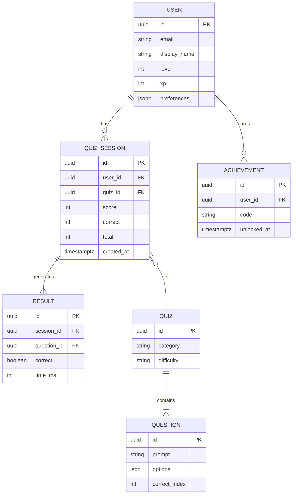
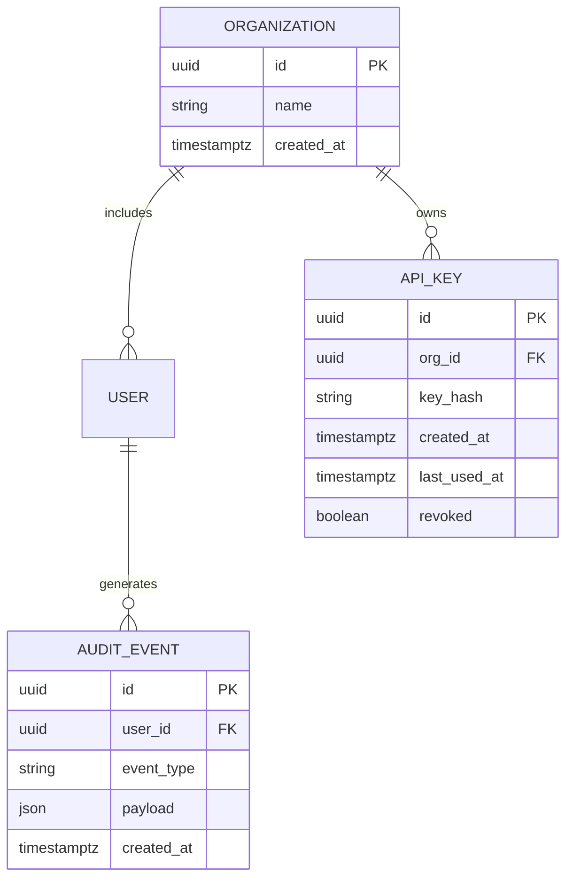

# Architecture

import { Meta } from '@storybook/blocks';
import { LastUpdated } from '../components/LastUpdated';
import { InlineTOC } from '../components/InlineTOC';
import { BackToTop } from '../components/BackToTop';

<Meta title="Overview/Architecture" />
<a id="top"></a>

A focused reference for the system’s architecture, mapped directly to what exists in this repository. No speculative features are presented as implemented; “concept” sections are clearly labeled.

### Table of Contents

- System Map & Dependencies (#system-map)
- Layered View (#layered-view)
- Data Model — Current ERD (#data-model-current)
- Data Model — Extended ERD (concept) (#data-model-extended)
- Pointers

<InlineTOC
  items={[
    { id: 'system-map', label: 'System Map' },
    { id: 'layered-view', label: 'Layered View' },
    { id: 'data-model-current', label: 'ERD — Current' },
    { id: 'data-model-extended', label: 'ERD — Extended (concept)' },
  ]}
/>

## System Map & Dependencies

<a id="system-map"></a>

```mermaid
flowchart LR
  subgraph Client
    App[Web App (React/Expo)]
    SB[Storybook (Docs+Demos)]
  end

  subgraph Backend/Services
    API[(API Gateway/Routes)]
    DB[(Supabase: Auth + Postgres + Realtime)]
    AI[(AI Assist Service)]
    OBS[(Observability/Events Sink)]
  end

  subgraph Dev Support
    MSW[(MSW: HTTP Mocks)]
    WS[(Mock WebSocket: Scenarios)]
    SSE[(SSE Demo Server)]
    SPEC[(OpenAPI Spec)]
    CI[(CI: Lint/Test/Build/Analysis)]
  end

  App <--> API
  API <--> DB
  App --> OBS
  App --> AI
  SB --> MSW
  SB --> WS
  SB --> SPEC
  SB --> SSE
  CI --> SB
```

Notes

- MSW handlers: src/mocks/handlers.ts, src/mocks/handlers.storybook.ts, src/mocks/msw/handlers.ts
- WebSocket mock: src/services/mockWebSocket.ts; socket abstraction: src/lib/socket.ts
- Express routes (stubs/enhanced): api/src/routes/\*.ts
- OpenAPI spec served by Swagger story: docs/api-specs/openapi/quizmentor-api-v1.yaml

## Layered View

<a id="layered-view"></a>

```mermaid
graph LR
  subgraph Layer: Client (UI)
    A[React/Expo App]
    SB[Storybook]
  end

  subgraph Layer: Platform (Dev/Middleware)
    MSW[(MSW Handlers)]
    WS[(Mock WebSocket)]
    SSE[(SSE Demo Server)]
    SPEC[(OpenAPI Spec)]
  end

  subgraph Layer: Backend Targets (Planned/Real)
    API[(API Routes)]
    SUPA[(Supabase Auth/Postgres/Realtime)]
    OBS[(Observability Sink)]
    AI[(AI Assist Service)]
  end

  A-->API
  API-->SUPA
  A-->OBS
  A-->AI

  SB-->MSW
  SB-->WS
  SB-->SPEC
  SB-->SSE
```

Layering

- Client: interactive stories and app views
- Platform: local developer middleware for mocks, specs, and streaming demos
- Backend Targets: actual or planned integrations reachable via API

## Data Model — Current ERD

<a id="data-model-current"></a>



## Data Model — Extended ERD (concept)

<a id="data-model-extended"></a>



## Pointers

- Service I/O inventory and journeys live in: Docs/Portfolio Overview (Service Inventory & I/O, End-to-End Journeys)
- API reference: API/Swagger
- Mock exploration: API/Playground, Dev/NetworkPlayground

<BackToTop />
<LastUpdated note="Architecture" />
