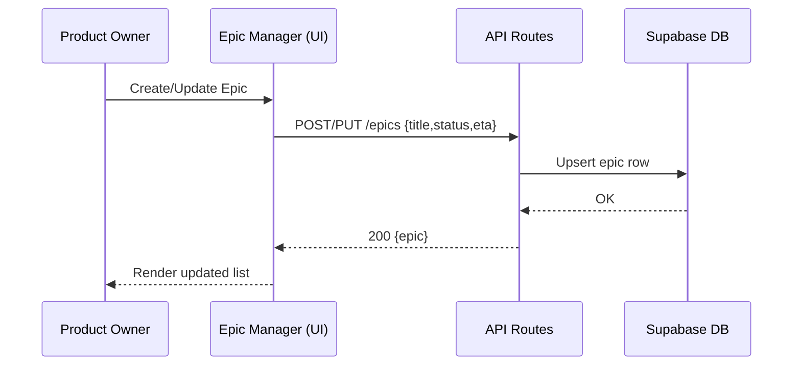
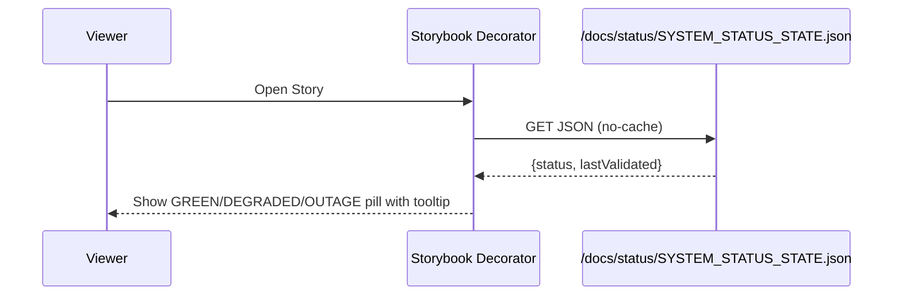
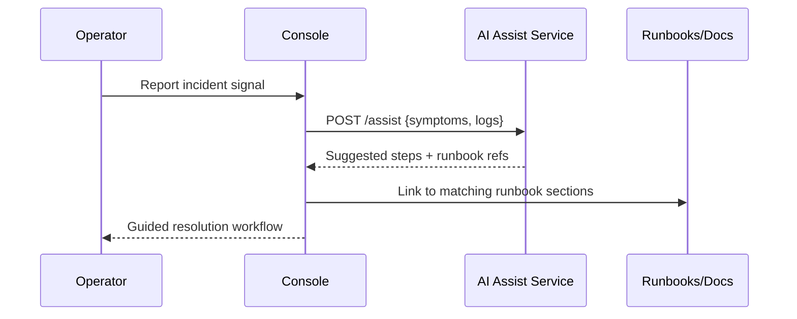
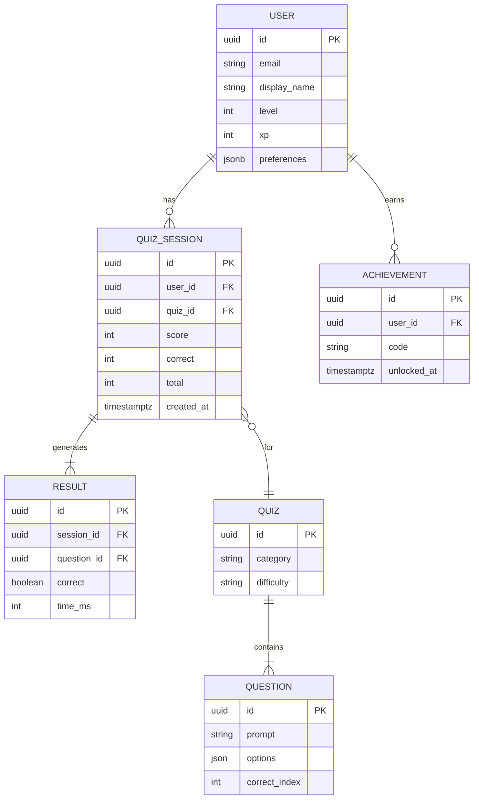
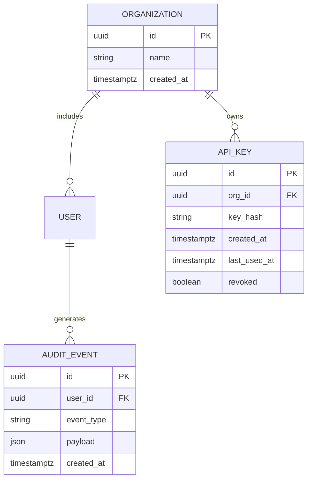
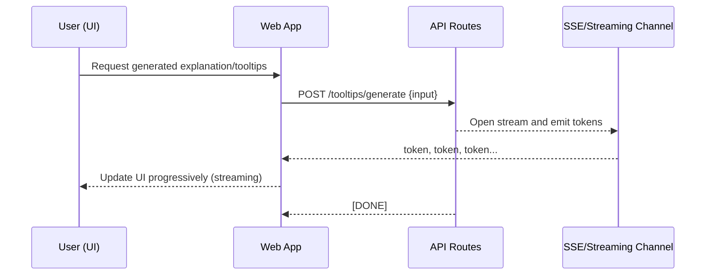
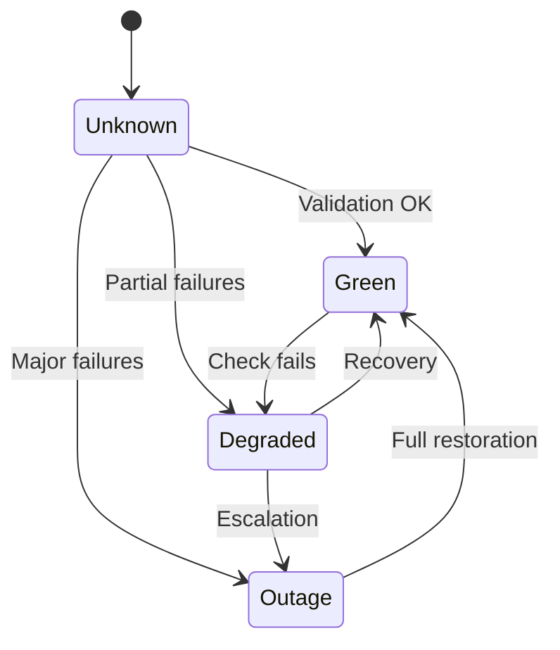
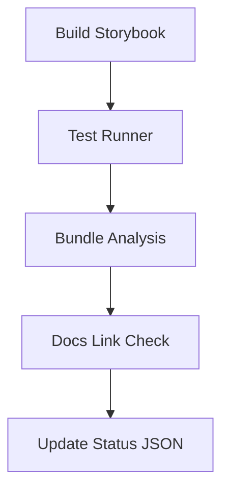
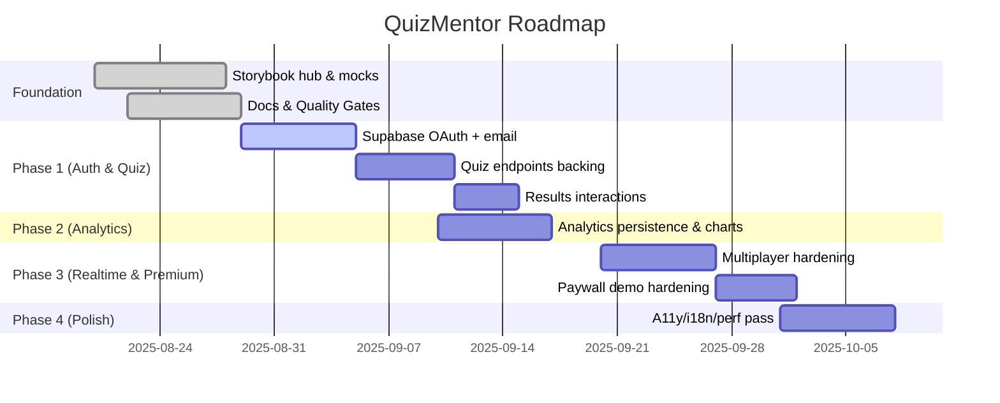

# QuizMentor: Portfolio Overview

import { Meta } from '@storybook/blocks';
import { LastUpdated } from '../components/LastUpdated';
import { BackToTop } from '../components/BackToTop';

<Meta title="Docs/Portfolio Overview" />
<a id="top"></a>

Welcome to the comprehensive, interview-ready overview of QuizMentor. This page is structured as a learning session you can read end‑to‑end, with live demos available elsewhere in Storybook.

### Table of Contents

- Vision & Product Pillars
- Feature Catalog
- Service Inventory & I/O
- Journeys
- Security & Privacy Model

## Vision and Product Pillars

<a id="vision"></a>

Vision

- Make technical upskilling effortless, trustworthy, and engaging through a gamified, resilient learning experience.

Product pillars

- Trust‑first UX: clear states, recoverable errors, transparent status, consistent visuals.
- Learn‑by‑doing: interactive quizzes, instant feedback, lightweight multiplayer collaboration.
- Quality gates by default: interaction tests, a11y checks, visual regression, coverage thresholds.
- Open‑box DX: Storybook as a learning hub (API Playground, Swagger, Network demos, Docs browser).
- Resilience & Observability: cache/ETag, rate‑limit handling, status signals, observability events.

## Product Framing: Goals, Success, Non‑Goals, Assumptions

Goals

- Ship a resilient, fun learning experience that teaches quickly and builds trust
- Maximize Weekly Learning Progress (WLp): sessions completed, streak adherence, accuracy gains
- Provide a developer‑first platform for rapid iteration and safe changes

Success metrics

- Activation rate (onboarding → first quiz within N minutes) > 70%
- Quiz completion rate > 85%; median sessions/week > 3
- Docs learning engagement (Start Here and API Playground usage) trending upward week over week

Non‑goals (for now)

- Full content authoring CMS inside the app (use curated content/fixtures)
- Complex paywall + billing flows (keep demo/simple for interviews)
- Deep offline persistence beyond light caching

Assumptions

- Supabase is the target backend for Auth/Postgres/Realtime
- Storybook is our primary learning and demo surface
- MSW/WS scenarios sufficiently model expected networking behaviors during early phases

## Personas and System Context

Personas

- Learner (primary): wants quick, reliable practice with clear progress and feedback.
- Team Lead (secondary): wants visible status, consistency, and quality gates.
- Content Author (secondary): wants stable contracts and predictable rendering.
- Platform Admin (secondary): wants observability, versioned docs, smooth rollout.

System context (Mermaid)

```mermaid
flowchart LR
  subgraph Client
    App[Web App (React/Expo)]
    SB[Storybook (Docs+Demos)]
  end

  subgraph Backend/Services
    API[(API Gateway/Routes)]
    DB[(Supabase: Auth + Postgres + Realtime)]
    AI[(AI Assist Service)]
    OBS[(Observability/Events Sink)]
  end

  subgraph Dev Support
    MSW[(MSW: HTTP Mocks)]
    WS[(Mock WebSocket: Scenarios)]
    SSE[(SSE Demo Server)]
    SPEC[(OpenAPI Spec)]
    CI[(CI: Lint/Test/Build/Analysis)]
  end

  App <--> API
  API <--> DB
  App --> OBS
  App --> AI
  SB --> MSW
  SB --> WS
  SB --> SPEC
  SB --> SSE
  CI --> SB
```

## High‑Level Sequence Diagrams

Epic CRUD (Product/Epics)



System Status refresh



Incident + AI Assist (concept)



## Feature Catalog

<a id="feature-catalog"></a>

- Capability map (what we ship and why)
  - Learn: Quiz engine, instant feedback, results analytics
  - Collaborate: Multiplayer demo, shared status, resilient sessions
  - Understand: Docs/Help hub in Storybook (Start Here, Quick Index, Repo Docs Browser)
  - Assure: Quality gates (play(), a11y, coverage, visual checks), CI insights
  - Observe: Status pill, event naming, SSE demo, bundle analysis

## Service Dependency Graph (Mermaid)

```mermaid
graph LR
  subgraph Frontend
    A[React/Expo App]
    SB[Storybook]
  end

  subgraph Platform
    MSW[(MSW Handlers)]
    WS[(Mock WebSocket)]
    SSE[(SSE Demo Server)]
    SPEC[(OpenAPI Spec)]
  end

  subgraph Backend Targets (Planned)
    API[(API Routes)]
    SUPA[(Supabase Auth/Postgres/Realtime)]
    AI[(AI Assist Service)]
    OBS[(Observability Sink)]
  end

  A-->API
  API-->SUPA
  A-->OBS
  A-->AI

  SB-->MSW
  SB-->WS
  SB-->SPEC
  SB-->SSE
```

## Service Inventory and I/O

<a id="service-inventory-io"></a>

This section enumerates what exists in this repository today and how to exercise it. Nothing listed here is hypothetical; it’s backed by code and/or stories in this project.

- HTTP mocks (MSW) — src/mocks/handlers.ts
  - Global controls
    - GET /**msw**/defaults → `{ latencyMs: number, errorRate: number }`
    - POST /**msw**/defaults `{ latencyMs?: number, errorRate?: number }` → same shape
    - Per-request opt-out header: x-msw-no-defaults: 1
  - Lessons
    - GET /api/lessons
    - In: optional headers (x-client-id, x-msw-no-defaults)
    - Out: 200 `{ lessons: [{ id, title, progress }] }`
  - Quizzes
    - GET /api/quizzes
    - Out: 200 `{ quizzes: [{ id, category, difficulty }] }`
  - Login
    - POST /api/login `{ email }`
    - Out: 200 `{ token, user: { id, email } }` with Cache-Control: no-store
  - Cache demo (ETag)
    - GET /api/cache with optional If-None-Match
    - Out: 200 `{ ts, value }` with ETag: "demo-etag-abc123" and Cache-Control: public, max-age=60; or 304 Not Modified with ETag
  - Rate limiting demo
    - GET /api/ratelimit
    - In: header x-client-id (default 'anon')
    - Window: 10s; Limit: 3
    - Out: 200 `{ ok, remaining }` with X-RateLimit-\* headers; or 429 `{ error: 'rate_limited' }` with Retry-After

- Tooltip generation mock — src/mocks/handlers.storybook.ts
  - POST /api/tooltips/generate `{ input: string }`
  - Special triggers inside input
    - TRIGGER_RATE_LIMIT → 429 with Retry-After: 3
    - TRIGGER_ERROR → 500 text/plain
    - TRIGGER_CACHED → 200 JSON with ETag: "tooltips-etag-v1"; subsequent call with If-None-Match returns 304
  - Default success: 200 `{ input, html }`
  - Honors x-msw-no-defaults to skip latency/error injection

- Supabase-style REST mocks — src/mocks/msw/handlers.ts
  - Auth
    - POST /auth/v1/token body grant_type=password → 200 `{ access_token, token_type, expires_in, refresh_token, user }`
    - POST /auth/v1/signup → 200 `{ user }`
    - GET /auth/v1/user → 200 `{ user }`
    - POST /auth/v1/logout → 200 `{}`
  - Domain tables
    - GET /rest/v1/question_categories → 200 array of rows with nested questions count
- `GET /rest/v1/questions?category_id=eq.<id>` → 200 array of `{ id, category_id, text, options, correct_answer, difficulty, explanation, points, order_index, metadata }`
  - GET /rest/v1/remote_config → 200 `{ questions_version }`
- `GET /rest/v1/profiles?id=eq.<userId>` → 200 profile row; `POST /rest/v1/profiles` → 201 created row

- Express API (stubs and enhanced) — api/src/routes/\*.ts
  - Quiz
    - POST /api/quiz/session → 200 `{ sessionId, categoryId, difficulty, createdAt }` (enhanced: 201 DB row via Supabase; auth required)
    - GET /api/quiz/questions → 200 `{ questions: [{ id, text, options, correct_answer, difficulty, explanation, points, order_index }] }` (enhanced: requires sessionId, returns sanitized questions)
    - POST /api/quiz/answer → 200 `{ correct, xp, streak, bonuses }` (enhanced: records answer, returns explanation, nextQuestion flag)
    - GET /api/quiz/leaderboard → 200 `{ leaders }` (enhanced: paginated profiles-based leaderboard)
  - Users
    - GET /api/users/me → 200 `{ userId, name, level, xp, streak, premium }`
    - POST /api/users/export → 200 `{ status: 'queued', jobId }`
    - DELETE /api/users/me → 200 `{ deleted: true, at }`
  - Analytics
    - POST /api/analytics/event → 200 `{ received, event, userId, ts }`

- WebSocket mock & abstraction
  - src/services/mockWebSocket.ts enumerates events (e.g., connect, lobby:_, game:_, scores:updated, message:\*, task:update). Used by Live/TaskBoard and multiplayer demos.
  - src/lib/socket.ts provides a socket factory that swaps to a MockSocket when USE_WS_MOCKS (env flags) are set.

- Status JSON — docs/status/SYSTEM_STATUS_STATE.json
  - Shape: `{ status: 'green' | 'degraded' | 'outage' | 'unknown', lastValidated: ISO8601 }`

- Interactive stories (discoverability)
  - API/Playground — exercise mocked endpoints; supports MSW presets and per-story overrides
  - Dev/NetworkPlayground — set MSW global defaults and view a live request timeline
  - API/Swagger — renders docs/api-specs/openapi/quizmentor-api-v1.yaml
  - Docs/Epics/Epic Manager — interactive epics filtering; Empty/Loading/Error variants
  - Live/TaskBoard — WebSocket scenario demo (select with WS Scenario toolbar)
  - Docs/Repo Docs Browser, Docs/Quick Index — navigate repo docs within Storybook

## End-to-End Journeys (interactive, inside Storybook)

<a id="journeys"></a>

- Epic review and filtering
  - Open Docs/Epics/Epic Manager → toggle Status/Priority → observe chips and list updates
  - Variant drill-down: switch to Empty/Loading/Error stories
- API exploration and resilience
  - Open API/Playground → call GET /api/lessons → see JSON
  - Switch to GET /api/cache → call twice: 200 then 304 with ETag
  - Switch to GET /api/ratelimit → call 4x: observe 429 + Retry-After
  - Switch to POST /api/tooltips/generate → type TRIGGER\_\* words → observe 429/500/304 behavior
- Network conditions at scale
  - Open Dev/NetworkPlayground → set latency/error → Run Scenario (sequential) or Run Concurrent → inspect timeline rows
- API contract reading
  - Open API/Swagger → adjust doc expansion and TryItOut → browse operations from docs/api-specs/openapi/quizmentor-api-v1.yaml
- Realtime awareness
  - Open Live/TaskBoard → change WS Scenario toolbar to taskBoardLive / disconnectRecovery → observe event updates

## Data Model ERD (Mermaid)



## Concept: Extended ERD (future, not implemented)



## Concept: Generation Streaming Sequence (future)



## Security & Privacy Model

<a id="security-privacy"></a>

- Authentication & session
  - Supabase OAuth (GitHub) + email/password; short‑lived access tokens and refresh rotation
  - Native secure storage on device; memory + refresh strategy on web
- Authorization & data access
  - Principle of least privilege; server‑side checks; per‑org API keys for backend integrations (hash at rest)
- Data protection
  - PII classification; no secrets in client logs; redact sensitive fields in observability events
  - HTTPS everywhere; CORS configured for Storybook dev
- Supply chain & CI
  - Dependency vigilance via bundle analysis; mdx/eslint; docs link‑check
  - Gates: coverage thresholds, a11y scans; optional Chromatic visual approvals

## North Star Metrics & KPIs

- North Star: Weekly Learning Progress (WLp) — weighted composite of sessions completed, streak adherence, and accuracy improvements
- KPIs
  - Activation rate (onboarding → first quiz within N minutes)
  - Weekly active learners; median sessions/week
  - Quiz completion rate; average correct per session
  - Time to first correct; retry rates; streak distribution
  - Docs learning engagement (Start Here views, API Playground usage)

## Risks & Mitigations

- Auth complexity (OAuth + email)
  - Mitigation: Spec-first plan, Storybook Auth Smoke, unit/E2E on flows
- Test brittleness (RN/Expo)
  - Mitigation: Stabilize jest-expo config, limit flakiness surface, add quarantined label
- Overweight bundles
  - Mitigation: analyze-storybook, code splitting for heavy widgets, subpath imports
- Docs drift
  - Mitigation: helpDoc pill, link-check in CI, docs manifest + Quick Index

- Epics (Roadmap/Epics)
  - Epic Manager demo; links to EPIC_MANAGEMENT_CURRENT.md
- Status (System visibility)
  - Storybook status pill (GREEN/DEGRADED/OUTAGE); current status doc and validation record
- AI Assist (Concept)
  - Prompt→suggestions→runbook links; planned integration
- Docs/Help
  - Start Here, Quick Index, Repo Docs Browser, Mocking & Scenarios, Bundling & Performance
- Quality Gates
  - Storybook Test Runner (play functions), a11y scans, coverage thresholds, docs link‑check, Chromatic ready
- Observability
  - Event naming in user stories, SSE demo, status JSON, bundle analysis artifact in CI

## 30 Detailed User Stories

Notation: AC = Acceptance Criteria; Alt = Alternate/Failure path; Obs = Observability events

Onboarding & Auth

1. US‑001: As a new user, I want a first‑run onboarding so I can set preferences fast.

- AC: Sees categories; can skip; lands on Home in &lt; 2 clicks; choices persisted.
- Alt: Offline → defaults applied and queued persistence; banner shown.
- Obs: onboarding_started, onboarding_completed, onboarding_skipped.

2. US‑002: As a user, I can sign in via GitHub OAuth.

- AC: Redirect to provider; callback sets session; see user initials; secure storage.
- Alt: Provider error → clear message; retry or fallback to email.
- Obs: auth_start, auth_success, auth_error `{provider}`.

3. US‑003: As a user, I can create an account with email/password.

- AC: Validation; verification email (if configured); sign‑in; profile scaffold.
- Alt: Existing email → suggestion to sign in; rate limit on repeated attempts.
- Obs: signup_start, signup_success, signup_error `{reason}`.

Quiz & Learning 4) US‑004: As a learner, I can start a quiz from Home by category.

- AC: Loads 10 questions; progress visible; timer optional; back is safe.
- Alt: Network fail → fallback to cached/fixtures; banner; retry works.
- Obs: quiz_start `{category}`, question_shown `{id}`.

5. US‑005: As a learner, I receive instant feedback per answer.

- AC: Correct/incorrect animation; streak/XP updates; explanation visible.
- Alt: Animation disabled setting respected; reduced motion supported.
- Obs: answer_submitted `{correct}`, xp_updated, streak_updated.

6. US‑006: As a learner, I can finish and view detailed results.

- AC: Score, grade, accuracy, time; Retry/Share/Next actions.
- Alt: Share blocked (permissions) → graceful fallback.
- Obs: quiz_completed `{score}`, results_viewed.

Results & Analytics 7) US‑007: As a learner, I can review past results.

- AC: Results list; filters by category/date; detail page.
- Alt: No data → empty state guidance.
- Obs: results_history_viewed.

8. US‑008: As a learner, I can see analytics over time.

- AC: Charts/metrics with period filters; performance by category.
- Alt: Loading skeletons; no data states.
- Obs: analytics_viewed `{range}`.

Multiplayer (demo) 9) US‑009: As a user, I can create a lobby and share a code.

- AC: Code generated; copy friendly; players join.
- Alt: Lobby full → clear error; rate‑limit join attempts.
- Obs: lobby_created, lobby_joined, lobby_error.

10. US‑010: As a user, I can start a synchronized quiz.

- AC: Countdown; same questions; live score updates.
- Alt: Disconnection → rejoin; minimal drift.
- Obs: match_started, question_broadcast, scores_updated.

Settings & Profile 11) US‑011: As a user, I can update profile (avatar, username, bio).

- AC: Validation; preview; persisted; immediate UI refresh.
- Alt: Username taken → try another; avatar upload fail → retry.
- Obs: profile_updated `{fields}`.

12. US‑012: As a user, I can change app settings (theme, language, notifications).

- AC: Instant theme switch; i18n strings updated; persisted.
- Alt: Unsupported language → default fallback with notice.
- Obs: settings_changed `{keys}`.

Premium & Monetization 13) US‑013: As a user, I see a paywall when accessing premium features.

- AC: Benefits listed; plan chooser; CTA leads to payment.
- Alt: Dismiss path; intent capture for later follow‑up.
- Obs: paywall_viewed, paywall_cta_clicked.

14. US‑014: As a user, I can complete a premium upgrade (mock/demo).

- AC: Payment success simulated; features unlocked state.
- Alt: Payment error → retry/backoff.
- Obs: upgrade_started, upgrade_success, upgrade_error.

Error Recovery & Status 15) US‑015: As a user, I see network errors and recover quickly.

- AC: Timeouts show banner; retry works; cached data used.
- Alt: Persistent errors → helpful link to troubleshooting.
- Obs: network_error `{type}`, retry_clicked.

16. US‑016: As a user, I see a visible system status indicator.

- AC: GREEN/DEGRADED/OUTAGE pill; tooltip includes last validated.
- Alt: Status JSON missing → fallback gray state.
- Obs: status_viewed.

Docs & Learning (Storybook) 17) US‑017: As a developer, I find a Start Here page with curated links.

- AC: Links to Quick Index, Swagger, API Playground, Demos.
- Alt: Link check in CI prevents dead links.
- Obs: docs_landing_viewed.

18. US‑018: As a developer, I can browse repo docs inside Storybook.

- AC: MD view with link list; search/filter panel; custom path support.
- Alt: 404 shows helpful message.
- Obs: repo_docs_opened `{path}`.

API & Mocks 19) US‑019: As a developer, I can view the API spec inside Storybook.

- AC: Swagger story; TryItOut toggle; doc/model expansion controls.
- Alt: Spec not found → helpful instructions.
- Obs: swagger_viewed `{options}`.

20. US‑020: As a developer, I can exercise endpoints with realistic conditions.

- AC: API Playground with MSW latency/error presets; opt‑out header; timeline in Network Playground.
- Alt: Unhandled routes logged; docs link provided.
- Obs: api_call_made `{endpoint,status,ms}`.

Epics & Roadmap 21) US‑021: As a PM, I can filter epics by State/Priority.

- AC: Inline filters; search; empty state; quick detail view.
- Alt: API error → banner; cached last success state.
- Obs: epics_filtered `{status,priority}`.

22. US‑022: As a PM, I can update epic details.

- AC: Save in place; optimistic UI; rollback on error.
- Alt: Conflicts → merge suggestion; retry.
- Obs: epic_updated `{fields}`.

AI Assist (concept) 23) US‑023: As an operator, I want AI to summarize an incident and propose steps.

- AC: Prompt; suggested steps; runbook links; confidence score.
- Alt: Low confidence → ask for more signals.
- Obs: ai_assist_requested `{context}`, ai_assist_proposed.

Observability & Quality Gates 24) US‑024: As an engineer, I want coverage to block regressions.

- AC: src/components ≥ 60%; global ≥ 50%; reported in PR.
- Alt: Flaky UI tests quarantined with visibility.
- Obs: coverage_reported `{thresholds}`.

25. US‑025: As an engineer, I want a11y checks on core docs/pages.

- AC: Axe scan runs in Storybook Test Runner; violations fail CI.
- Alt: Ignored rules documented (e.g., color contrast tokens).
- Obs: a11y_scan_completed `{count}`.

Performance & Bundling 26) US‑026: As an engineer, I can analyze bundles easily.

- AC: analyze:storybook produces HTML artifact in CI.
- Alt: Missing plugin → docs pointer to fix.
- Obs: bundle_analysis_uploaded.

27. US‑027: As an engineer, I can lazy‑load heavy components.

- AC: React.lazy + Suspense demo; verified new chunk loads.
- Alt: Network fail → fallback UI.
- Obs: lazy_chunk_loaded `{name}`.

Internationalization & Accessibility 28) US‑028: As a global user, I can switch language/theme.

- AC: Strings update; RTL support (planned); persisted.
- Alt: Language not fully translated → fallbacks flagged.
- Obs: locale_changed `{lang}`, theme_changed.

29. US‑029: As an a11y‑conscious user, the app meets WCAG 2.1 AA.

- AC: Roles/labels; focus order; reduced motion; color contrast.
- Alt: Non‑compliant element flagged in CI.
- Obs: a11y_violation_detected.

Security & Privacy 30) US‑030: As a user, my session is secure and revocable.

- AC: Short‑lived tokens; refresh; logout clears storage; no secrets in logs.
- Alt: Token invalid → re‑auth prompt; safe redirect.
- Obs: auth_logout, token_refresh.

## System Status Diagrams (Mermaid)

State transitions



Validation record



## Non‑Functional Requirements

Performance

- Fast TTI in Storybook docs (&lt;1s on local dev); quiz flow snappy; lazy‑load heavy bits.
  Accessibility
- WCAG 2.1 AA; play() and axe scans in CI on key pages.
  Security
- Supabase auth; short‑lived tokens; secure storage; no plaintext secrets.
  Observability
- Structured client events for flows, errors, and retries; SSE demo for live education.
  Internationalization
- Language switch scaffolding; plan for RTL; theme tokens for consistent visuals.

## Testing Strategy & Learning Demos

- Unit/Integration: Jest + Testing Library; coverage gates per path.
- Interaction: Storybook Test Runner play(); per‑story MSW overrides.
- E2E: Playwright targeting Storybook/app; multiplayer and auth planned.
- Visual: Chromatic (optional); prefer deterministic stories.
- Learning via Storybook: Start Here, Quick Index, API Playground, Swagger, Network Playground, Live Task Board, Code Split Demo.

## Phased Roadmap (high‑level)



- Phase 0 (Foundation): Storybook hub, mocks, flows, CI gates, status (DONE)
- Phase 1 (Auth & Quiz Backing): Supabase OAuth/email; quiz endpoints; results interactions
- Phase 2 (Analytics & Reporting): Persistence and charts; results history; export
- Phase 3 (Multiplayer & Premium): Real‑time match; paywall demo hardening; invoices
- Phase 4 (Polish & Rollout): A11y audits, i18n pass, perf tuning, docs freeze

## Quick Instructions (Storybook)

- Run: `npm run storybook`
- Open: http://localhost:7007
- Suggested order: Docs/00 Start Here → Docs/Portfolio Overview (this page) → API/Playground → API/Swagger → Dev/NetworkPlayground → Live/TaskBoard → Docs/Bundling & Performance → Auth/Smoke.

---

## Where to go next

<BackToTop />

<LastUpdated note="Portfolio Overview" />- Docs/00 Start Here — the curated entry point - Docs/Quick
Index — quick links to the most‑used docs and key stories - Docs/Mocking & Scenarios — how MSW and
WS scenarios are wired, with interactive drills - API/Playground — exercise endpoints and try
presets (Default/Slower/Flaky/Chaos) - Dev/NetworkPlayground — set global latency/error and view a
live timeline - API/Swagger — browse the OpenAPI spec from
docs/api-specs/openapi/quizmentor-api-v1.yaml - Docs/Epics & Roadmap — links to
EPIC_MANAGEMENT_CURRENT.md - Docs/System Status — links to SYSTEM_STATUS_CURRENT.md
