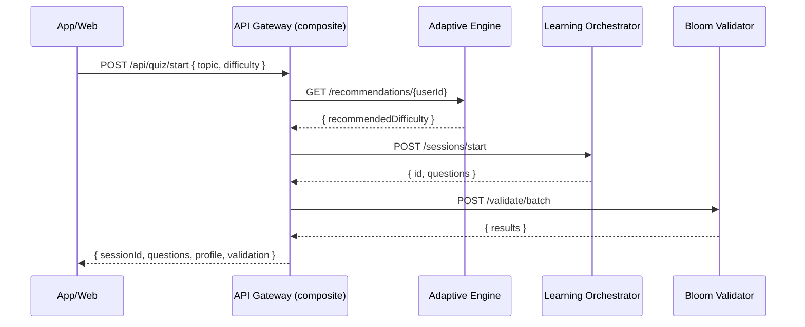

# Quiz Flows — End-to-End Specifications

import { Meta, Canvas, Story } from '@storybook/blocks';
import { InlineTOC } from '../components/InlineTOC';
import { BackToTop } from '../components/BackToTop';

<Meta title="Specs/Quiz Flows — End-to-End" />

This page documents end-to-end quiz flows with service-to-service (S2S) interactions, data writes, and observability notes.

### Table of Contents

- Login & Start Quiz (#login-start)
- Timed Quiz Q&A (#timed-qa)
- Results & Analytics (#results)
- Practice Mode (#practice)
- Offline Flow (#offline)
- Rate Limit & Caching (#rate-cache)
- Leaderboard Submission (#leaderboard)
- Achievements Unlock (#achievements)
- Data Export & Account Deletion (#data-privacy)
- Related Stories (#stories)

<InlineTOC
  items={[
    { id: 'login-start', label: 'Login & Start Quiz' },
    { id: 'timed-qa', label: 'Timed Quiz Q&A' },
    { id: 'results', label: 'Results & Analytics' },
    { id: 'practice', label: 'Practice Mode' },
    { id: 'offline', label: 'Offline Flow' },
    { id: 'rate-cache', label: 'Rate Limit & Caching' },
    { id: 'leaderboard', label: 'Leaderboard Submission' },
    { id: 'achievements', label: 'Achievements Unlock' },
    { id: 'data-privacy', label: 'Data Export & Deletion' },
    { id: 'stories', label: 'Related Stories' },
  ]}
/>

## Login & Start Quiz

- Trigger: User logs in and starts quiz session (topic + difficulty) - S2S:
POST /api/quiz/start → recommendations → session:start → validate:batch - DB Writes: - sessions:
insert (userId, topic, difficulty, createdAt) - session_events: insert (type='start', sessionId) -
Observability: - Logs: requestId propagation; userId redacted policy - Metrics: s2s.latency,
s2s.errors

## Timed Quiz Q&A

- Trigger: User answers timed questions - DB Writes: - session_answers: insert
(sessionId, questionId, selectedIndex, correct, elapsedMs) - streaks: update (increment/reset) -
xp_events: insert (base, multiplier) - Observability: - Events: question_viewed, answer_submitted,
answer_correct/incorrect - Metrics: question.time_to_answer, accuracy

## Results & Analytics

- Trigger: User completes quiz - DB Writes: - sessions: update (completedAt,
score, timeTaken) - analytics_events: insert (category_accuracy, time_series) - Observability: -
Events: quiz_completed, results_viewed - Metrics: quiz.completion_rate, quiz.avg_score

## Practice Mode

- Trigger: User selects Practice - Behavior: No timer, instant feedback, no XP
- DB Writes: - practice_sessions: insert - practice_feedback: insert (questionId, hintUsed)

## Offline Flow

- Trigger: No connectivity - Behavior: Local cache of questions; defer writes -
DB Writes: - local cache; sync queue; upon reconnect → sessions & answers upsert

## Rate Limit & Caching

- Trigger: Burst traffic or repeat fetch - Behavior: Respect 429 Retry-After;
ETag 304 path - Observability: rate_limited, cached_hit

## Leaderboard Submission

- Trigger: Post-results XP/level changes - DB Writes: - leaderboard_scores:
upsert (userId, weekly/monthly/allTime) - Observability: leaderboard.updated

## Achievements Unlock

- Trigger: Threshold met (streaks, accuracy, volume) - DB Writes: -
achievements: insert (userId, badgeId) - xp_events: insert (bonus) - Observability:
achievement_unlocked (rarity)

## Data Export & Account Deletion

- Export: enqueue job → deliver via email link - Delete: purge PII, retain
aggregated analytics where policy allows

## Related Stories

- S2S Orchestration:
<Canvas>
  <Story id="dev-s2s-orchestration--default" />
</Canvas>
- API Playground:
<Canvas>
  <Story id="api-playground--default" />
</Canvas>
- Network Playground:
<Canvas>
  <Story id="dev-networkplayground--default" />
</Canvas>

<BackToTop />
