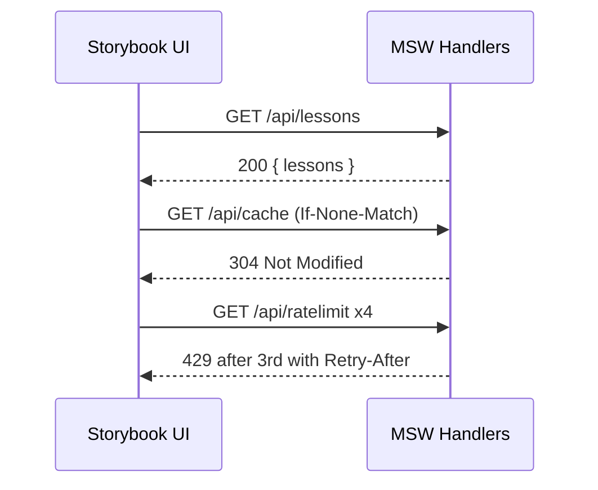
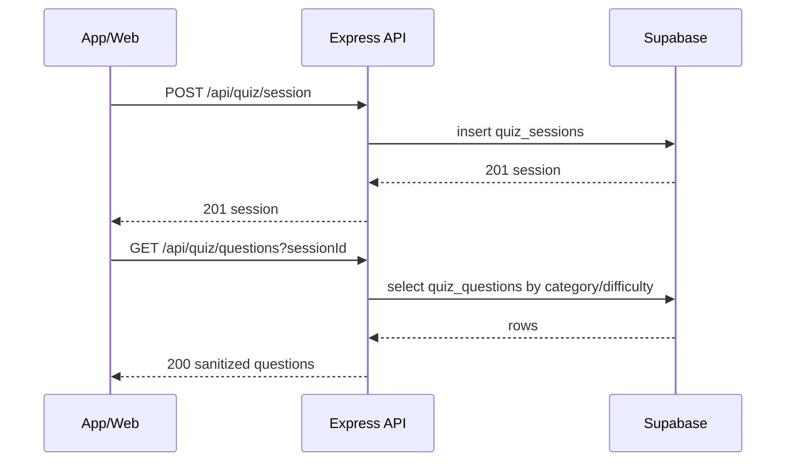

# Service Catalog

import { Meta, Canvas, Story } from '@storybook/blocks';
import { LastUpdated } from '../components/LastUpdated';
import { BackToTop } from '../components/BackToTop';

<Meta title="Specs/Service Catalog" />
<a id="top"></a>

Authoritative reference for services present in this repo and how to exercise them. All endpoints and shapes listed here map to real code unless marked concept.

### Table of Contents

- HTTP Mocks (MSW)
- Supabase-style REST Mocks
- Express API (stubs/enhanced)
- WebSocket Mock
- Status JSON
- Service-to-Service Flows

## HTTP Mocks (MSW)

<a id="msw"></a>

Global defaults

- GET /**msw**/defaults → `{ latencyMs: number, errorRate: number }`
- POST /**msw**/defaults `{ latencyMs?: number, errorRate?: number }` → same
- Skip defaults per-request: header x-msw-no-defaults: 1

Lessons

- GET /api/lessons
- Out 200:

```
{
  "lessons": [ { "id": "js-basics", "title": "JavaScript Basics", "progress": 0.2 }, ... ]
}
```

Quizzes

- GET /api/quizzes
- Out 200:

```
{ "quizzes": [ { "id": "q1", "category": "javascript", "difficulty": "easy" }, ... ] }
```

Login

- POST /api/login `{ email }`
- Out 200:

```
{ "token": "mock-token-123", "user": { "id": "demo", "email": "demo@quizmentor.app" } }
```

Cache demo (ETag)

- GET /api/cache (optionally with If-None-Match)
- Out 200 with headers ETag: "demo-etag-abc123", Cache-Control: public, max-age=60:

```
{ "ts": "2024-01-01T00:00:00Z", "value": 42 }
```

- Out 304 Not Modified with same ETag

Rate limiting demo

- GET /api/ratelimit
- Window: 10s; Limit: 3 per x-client-id (default anon)
- Out 200:

```
{ "ok": true, "remaining": 2 }
```

- Out 429 with headers Retry-After, X-RateLimit-\*:

```
{ "error": "rate_limited" }
```

Tooltip generation (Storybook-only)

- POST /api/tooltips/generate `{ input: string }`
- Triggers inside input:
  - TRIGGER_RATE_LIMIT → 429 + Retry-After: 3
  - TRIGGER_ERROR → 500 text/plain
  - TRIGGER_CACHED → 200 with ETag "tooltips-etag-v1", next call with If-None-Match → 304
- Default 200:

```
{ "input": "text", "html": "<p>Tooltip for: <em>text</em></p>" }
```

## Supabase-style REST Mocks

<a id="supabase-rest"></a>
- POST /auth/v1/token (password) → 200 `{ access_token, refresh_token, user }`
- POST /auth/v1/signup → 200 `{ user }`
- GET /auth/v1/user → 200 `{ user }`
- POST /auth/v1/logout → 200 `{}`
- GET /rest/v1/question_categories → array rows with nested questions count
- `GET /rest/v1/questions?category_id=eq.<id>` → array of question rows
- GET /rest/v1/remote_config → `{ questions_version }`
- GET/POST /rest/v1/profiles → profile row CRUD

## Express API (stubs/enhanced)

<a id="express-api"></a>
Quiz
- POST /api/quiz/session → 200 `{ sessionId, categoryId, difficulty, createdAt }`
- GET /api/quiz/questions → 200 `{ questions: [...] }`
- POST /api/quiz/answer → 200 `{ correct, xp, streak, bonuses }`
- GET /api/quiz/leaderboard → 200 `{ leaders }`

Users

- GET /api/users/me → 200 `{ userId, name, level, xp, streak, premium }`
- POST /api/users/export → 200 `{ status: 'queued', jobId }`
- DELETE /api/users/me → 200 `{ deleted: true, at }`

Analytics

- POST /api/analytics/event → 200 `{ received, event, userId, ts }`

## WebSocket Mock

<a id="websocket"></a>- Events include connect/disconnect, lobby:created|joined|updated,
game:starting|started|ended, question:start|end, scores:updated, message:*, task:update. - Source:
src/services/mockWebSocket.ts - Abstraction (mock vs real): src/lib/socket.ts

## Status JSON

<a id="status-json"></a>
- docs/status/SYSTEM_STATUS_STATE.json
- Shape: `{ status: 'green'|'degraded'|'outage'|'unknown', lastValidated: ISO8601 }`

## Service-to-Service Flows

<a id="flows"></a>

- See also: Specs/Service-to-Service Orchestration for a focused playground.

Storybook Dev (UI ⇄ MSW)



Conceptual Production (UI → API → Supabase)



## Quick Links

<BackToTop />
<LastUpdated note="Service Catalog" />
- API Playground: <Story id="api-playground--default" />
- Network Playground: <Story id="dev-networkplayground--default" />
- Swagger: <Story id="api-swagger--default" />
