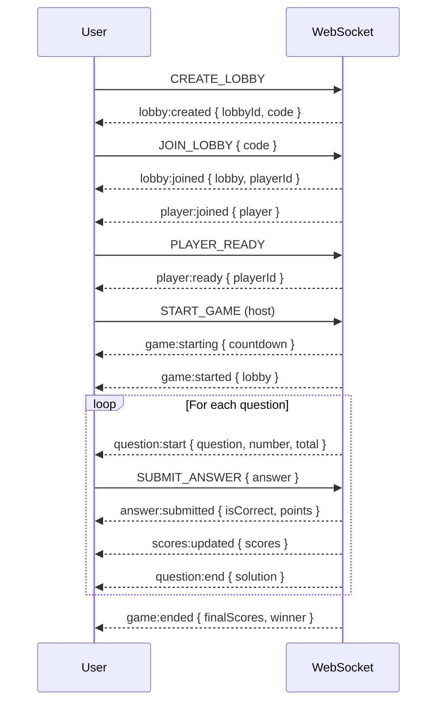

# Multiplayer Flow (Realtime)

> Status: Complete | Last Updated: 2025-08-28 | Author: Docs Team | Version: 1.0
>
> Current Implementation (2025-08-28)
>
> - Mock WebSocket provides lobby/join/start/question/results flows for demos/tests.
> - Scenario selection via WS_MOCK_SCENARIO: lobbyBasic | matchHappyPath | disconnectRecovery | taskBoardLive (demo feed).
> - Real server TBD; contract defined in WEBSOCKET_API.md.
>
> Related docs: ../../WEBSOCKET_API.md, ../../mocks/WEBSOCKET_MOCKS.md, ../../MOCKS_OVERVIEW.md

## Overview

End-to-end multiplayer flow from lobby creation/join to match results, supporting deterministic demo scenarios.

## Flow Diagram

## Scenarios

- lobbyBasic: standard pacing
- matchHappyPath: fast countdown and questions; auto-ready players for demos
- disconnectRecovery: brief disconnect/reconnect during match
- Storybook demo: Live/TaskBoard story defaults to wsScenario=taskBoardLive for a live task feed showcase

## Storybook Demos (web)

- Live/TaskBoard: realtime task:update feed demonstrating `wsScenario=taskBoardLive`
- Docs/Mocking & Scenarios: MDX docs page with embedded Live WS → SSE Fallback demo
- Live/WS SSE Fallback: demonstration of fetch-based SSE fallback; start server with `npm run sse:demo`
- Dev/NetworkPlayground: adjust MSW latency/error presets and observe impacts on any related HTTP calls in multiplayer flows

## Mock vs Real

- Mock: All events generated by MockWebSocket
- Real: Socket.io/WebSocket server follows WEBSOCKET_API.md contract

## Testing

- E2E: create/join/start flows with deterministic answers
- Integration: message handlers and state updates in client store
