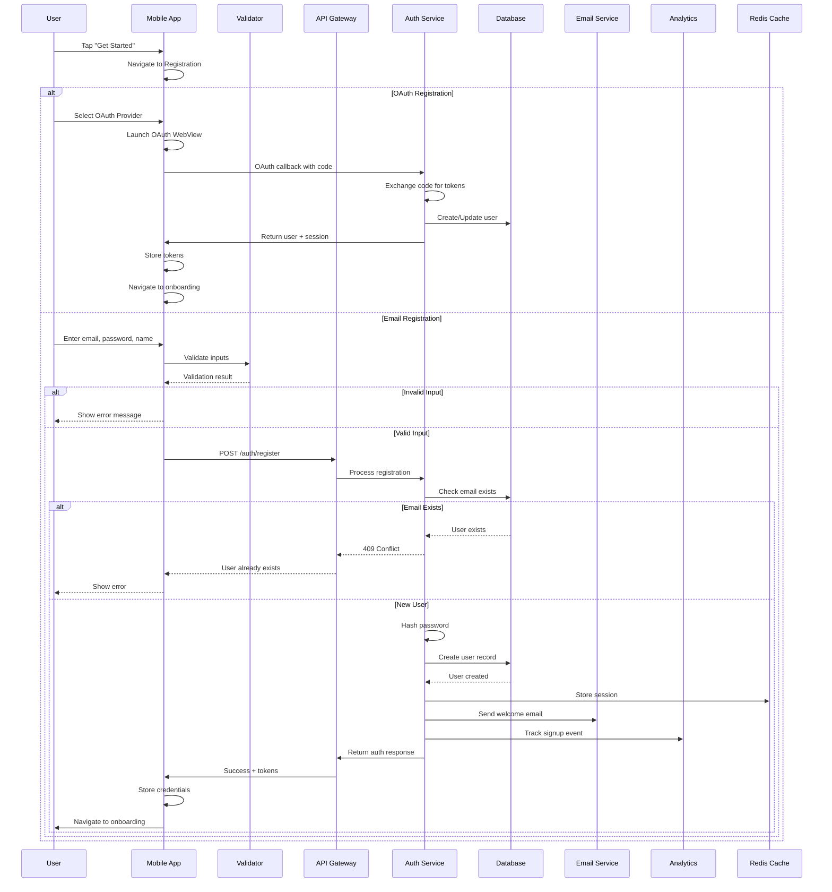

# User Registration Flow

> Status: Complete | Last Updated: 2025-08-28 | Author: Docs Team | Version: 1.1
>
> Current Implementation (2025-08-28)
>
> - Preferred backend: Supabase Auth; email/password and GitHub OAuth supported in app.
> - In mock mode: AuthService short-circuits (RN) and MSW can mock Supabase auth endpoints (web/tests).
> - See: docs/OAUTH_MOCK_GUIDE.md, docs/MSW_SETUP.md, runbooks/DEVELOPER_MOCK_RUNBOOK.md

## Overview

Complete documentation of the user registration process including all system interactions, API calls, data validation, error handling, and success paths.

## Flow Diagram



### Mocking & Testing

- Environment flags quick ref:
  - USE_MOCKS=true (RN MockEngine)
  - EXPO_PUBLIC_USE_MSW=1 (web MSW)
  - EXPO_PUBLIC_USE_WS_MOCKS=1 (WS mock)
  - EXPO_PUBLIC_USE_ALL_MOCKS=1 (web convenience)
  - WS_MOCK_SCENARIO=lobbyBasic|matchHappyPath|disconnectRecovery|taskBoardLive
- MSW defaults and overrides:
  - Use the “MSW Profile” toolbar (default | slower | flaky | chaos) to set global latency/error defaults; a small Defaults chip shows current values in many stories
  - Per-request opt-out: send header `x-msw-no-defaults: 1` (API/Playground and NetworkPlayground have a toggle)
- Web (MSW): enable EXPO_PUBLIC_USE_MSW=1; login is mocked at POST /api/login for demos and tests
- React Native (MockEngine): USE_MOCKS=true short-circuits email/password; OAuth flows can be simulated per internal OAuth mock guide
- Storybook:
  - API/Playground: practice login behavior (POST /api/login), network error simulation, caching (304), and rate limiting (429)
  - API/Swagger: browse the OpenAPI spec rendered inside Storybook
  - Docs/Mocking & Scenarios, Docs/Tech Stack + API, Docs/Quick Index for fast navigation inside Storybook

## Detailed Steps

### 1. Registration Initiation

**Component:** `AuthChoiceEpic.tsx`
**Trigger:** User taps "Get Started" on welcome screen

```typescript
// Frontend trigger
const handleGetStarted = () => {
  analytics.track('registration_started', {
    source: 'welcome_screen',
    timestamp: Date.now(),
  });
  navigation.navigate('Registration');
};
```

### 2. Registration Method Selection

**Component:** `AuthChoiceEpic.tsx`
**Options:**

- Email/Password
- Google OAuth
- GitHub OAuth
- Apple Sign In (iOS only)

### 3. Input Validation (Email Path)

#### Frontend Validation

```typescript
interface RegistrationData {
  email: string;
  password: string;
  confirmPassword: string;
  displayName: string;
  acceptTerms: boolean;
}

const validateRegistration = (data: RegistrationData): ValidationResult => {
  const errors: ValidationErrors = {};

  // Email validation
  if (!data.email) {
    errors.email = 'Email is required';
  } else if (!EMAIL_REGEX.test(data.email)) {
    errors.email = 'Invalid email format';
  }

  // Password validation
  if (!data.password) {
    errors.password = 'Password is required';
  } else if (data.password.length < 8) {
    errors.password = 'Password must be at least 8 characters';
  } else if (!PASSWORD_STRENGTH_REGEX.test(data.password)) {
    errors.password = 'Password must contain uppercase, lowercase, and number';
  }

  // Confirm password
  if (data.password !== data.confirmPassword) {
    errors.confirmPassword = 'Passwords do not match';
  }

  // Display name
  if (!data.displayName) {
    errors.displayName = 'Display name is required';
  } else if (data.displayName.length < 3) {
    errors.displayName = 'Display name must be at least 3 characters';
  } else if (data.displayName.length > 50) {
    errors.displayName = 'Display name must be less than 50 characters';
  }

  // Terms acceptance
  if (!data.acceptTerms) {
    errors.acceptTerms = 'You must accept the terms and conditions';
  }

  return {
    valid: Object.keys(errors).length === 0,
    errors,
  };
};
```

### 4. API Request

#### Request Format

```http
POST /api/auth/register
Content-Type: application/json

{
  "email": "user@example.com",
  "password": "SecureP@ss123",
  "display_name": "John Doe",
  "avatar_url": null,
  "preferences": {
    "categories": ["javascript", "react"],
    "difficulty": "intermediate"
  }
}
```

#### Frontend Implementation

```typescript
const registerUser = async (data: RegistrationData): Promise<AuthResponse> => {
  try {
    setLoading(true);
    setError(null);

    const response = await fetch(`${API_BASE_URL}/auth/register`, {
      method: 'POST',
      headers: {
        'Content-Type': 'application/json',
        'X-App-Version': APP_VERSION,
        'X-Device-ID': await getDeviceId(),
      },
      body: JSON.stringify({
        email: data.email.toLowerCase().trim(),
        password: data.password,
        display_name: data.displayName.trim(),
        preferences: {
          categories: selectedCategories,
          difficulty: selectedDifficulty,
        },
      }),
    });

    if (!response.ok) {
      const error = await response.json();
      throw new ApiError(error.error.message, error.error.code);
    }

    const authResponse: AuthResponse = await response.json();

    // Store tokens securely
    await SecureStore.setItemAsync('access_token', authResponse.session.access_token);
    await SecureStore.setItemAsync('refresh_token', authResponse.session.refresh_token);

    // Store user data
    await AsyncStorage.setItem('user', JSON.stringify(authResponse.user));

    // Track successful registration
    analytics.track('registration_completed', {
      user_id: authResponse.user.id,
      method: 'email',
      categories_selected: selectedCategories.length,
    });

    return authResponse;
  } catch (error) {
    setError(error.message);
    analytics.track('registration_failed', {
      error: error.message,
      method: 'email',
    });
    throw error;
  } finally {
    setLoading(false);
  }
};
```

### 5. Backend Processing

#### Auth Service Handler

```typescript
// Backend: src/services/auth/register.ts
export const registerUser = async (req: RegisterRequest): Promise<AuthResponse> => {
  const transaction = await db.transaction();

  try {
    // 1. Validate input
    const validationResult = validateRegistrationInput(req);
    if (!validationResult.valid) {
      throw new ValidationError(validationResult.errors);
    }

    // 2. Check if user exists
    const existingUser = await UserRepository.findByEmail(req.email);
    if (existingUser) {
      throw new ConflictError('User with this email already exists');
    }

    // 3. Hash password
    const hashedPassword = await bcrypt.hash(req.password, 12);

    // 4. Create user record
    const user = await UserRepository.create(
      {
        email: req.email.toLowerCase(),
        password: hashedPassword,
        display_name: req.display_name,
        avatar_url: req.avatar_url || generateDefaultAvatar(req.display_name),
        level: 1,
        xp: 0,
        trust_score: 0.5,
        streak: 0,
        preferences: req.preferences || {},
      },
      transaction,
    );

    // 5. Create profile
    await ProfileRepository.create(
      {
        user_id: user.id,
        bio: null,
        location: null,
        skills: [],
        interests: req.preferences?.categories || [],
      },
      transaction,
    );

    // 6. Initialize gamification
    await GamificationService.initializeUser(user.id, transaction);

    // 7. Generate tokens
    const tokens = await TokenService.generateTokenPair(user);

    // 8. Create session
    await SessionRepository.create(
      {
        user_id: user.id,
        access_token_hash: hashToken(tokens.access_token),
        refresh_token_hash: hashToken(tokens.refresh_token),
        expires_at: tokens.expires_at,
        device_info: req.device_info,
      },
      transaction,
    );

    // 9. Commit transaction
    await transaction.commit();

    // 10. Async operations (non-blocking)
    setImmediate(() => {
      // Send welcome email
      EmailService.sendWelcomeEmail(user);

      // Track analytics
      Analytics.track('user_registered', {
        user_id: user.id,
        method: 'email',
        timestamp: new Date(),
      });

      // Cache user data
      CacheService.set(`user:${user.id}`, user, 3600);
    });

    return {
      user: sanitizeUser(user),
      session: tokens,
    };
  } catch (error) {
    await transaction.rollback();
    throw error;
  }
};
```

### 6. Database Operations

#### User Table Schema

```sql
CREATE TABLE users (
  id UUID PRIMARY KEY DEFAULT gen_random_uuid(),
  email VARCHAR(255) UNIQUE NOT NULL,
  password VARCHAR(255) NOT NULL,
  display_name VARCHAR(50) NOT NULL,
  avatar_url TEXT,
  level INTEGER DEFAULT 1,
  xp INTEGER DEFAULT 0,
  trust_score DECIMAL(3,2) DEFAULT 0.50,
  streak INTEGER DEFAULT 0,
  preferences JSONB DEFAULT '{}',
  created_at TIMESTAMPTZ DEFAULT NOW(),
  updated_at TIMESTAMPTZ DEFAULT NOW(),
  deleted_at TIMESTAMPTZ,

  CONSTRAINT email_format CHECK (email ~* '^[A-Za-z0-9._%+-]+@[A-Za-z0-9.-]+\.[A-Za-z]{2,}$'),
  CONSTRAINT level_range CHECK (level >= 1),
  CONSTRAINT xp_range CHECK (xp >= 0),
  CONSTRAINT trust_score_range CHECK (trust_score >= 0 AND trust_score <= 1)
);

CREATE INDEX idx_users_email ON users(email);
CREATE INDEX idx_users_created_at ON users(created_at);
```

### 7. Error Handling

#### Error Scenarios

1. **Email Already Exists** (409)

   ```json
   {
     "error": {
       "code": "USER_EXISTS",
       "message": "An account with this email already exists",
       "suggestion": "Try logging in or use a different email"
     }
   }
   ```

2. **Invalid Input** (400)

   ```json
   {
     "error": {
       "code": "VALIDATION_ERROR",
       "message": "Invalid registration data",
       "details": {
         "email": "Invalid email format",
         "password": "Password too weak"
       }
     }
   }
   ```

3. **Rate Limiting** (429)

   ```json
   {
     "error": {
       "code": "RATE_LIMIT_EXCEEDED",
       "message": "Too many registration attempts",
       "retry_after": 3600
     }
   }
   ```

4. **Server Error** (500)
   ```json
   {
     "error": {
       "code": "INTERNAL_ERROR",
       "message": "Registration failed. Please try again later",
       "request_id": "req_abc123"
     }
   }
   ```

### 8. Success Response

```json
{
  "user": {
    "id": "550e8400-e29b-41d4-a716-446655440000",
    "email": "user@example.com",
    "display_name": "John Doe",
    "avatar_url": "https://api.quizmentor.com/avatars/default_1.png",
    "level": 1,
    "xp": 0,
    "trust_score": 0.5,
    "streak": 0,
    "created_at": "2024-01-15T10:30:00Z",
    "updated_at": "2024-01-15T10:30:00Z"
  },
  "session": {
    "access_token": "eyJhbGciOiJIUzI1NiIs...",
    "refresh_token": "eyJhbGciOiJIUzI1NiIs...",
    "expires_at": "2024-01-15T11:30:00Z"
  }
}
```

### 9. Post-Registration Actions

#### Frontend

```typescript
const onRegistrationSuccess = async (authResponse: AuthResponse) => {
  // 1. Store user context
  userContext.setUser(authResponse.user);

  // 2. Initialize local storage
  await initializeUserStorage(authResponse.user.id);

  // 3. Set up push notifications
  await registerForPushNotifications(authResponse.user.id);

  // 4. Prefetch initial data
  await Promise.all([prefetchCategories(), prefetchAchievements(), prefetchLeaderboard()]);

  // 5. Navigate to onboarding
  navigation.reset({
    index: 0,
    routes: [{ name: 'Onboarding' }],
  });
};
```

#### Backend Async Tasks

```typescript
// Email Service
await emailQueue.add('welcome_email', {
  to: user.email,
  name: user.display_name,
  template: 'welcome',
  variables: {
    name: user.display_name,
    verification_link: generateVerificationLink(user.id),
  },
});

// Analytics
await analyticsQueue.add('user_registered', {
  user_id: user.id,
  properties: {
    registration_method: 'email',
    source: req.headers['x-referrer'],
    device_type: req.device_info?.type,
    app_version: req.headers['x-app-version'],
  },
});

// Gamification initialization
await gamificationQueue.add('initialize_user', {
  user_id: user.id,
  achievements: ['first_steps', 'welcome_aboard'],
  initial_xp: 10,
});
```

## Security Considerations

### Password Security

- Minimum 8 characters
- Must contain uppercase, lowercase, number
- Hashed using bcrypt with cost factor 12
- Never logged or stored in plain text

### Rate Limiting

- Max 5 registration attempts per IP per hour
- Max 3 registration attempts per email per day
- Exponential backoff on repeated failures

### Data Validation

- Email verification via regex and DNS lookup
- SQL injection prevention via parameterized queries
- XSS prevention via input sanitization
- CSRF protection via tokens

### Token Security

- JWT tokens with short expiration (1 hour)
- Refresh tokens with longer expiration (30 days)
- Tokens stored in secure storage on mobile
- Token rotation on refresh

## Monitoring & Analytics

### Key Metrics

- Registration conversion rate
- Time to complete registration
- Drop-off points in flow
- OAuth vs email registration ratio
- Registration errors by type

### Events to Track

```typescript
// Registration started
{
  event: 'registration_started',
  properties: {
    source: 'welcome_screen',
    method: null
  }
}

// Method selected
{
  event: 'registration_method_selected',
  properties: {
    method: 'email' | 'google' | 'github' | 'apple'
  }
}

// Form submitted
{
  event: 'registration_form_submitted',
  properties: {
    has_preferences: boolean,
    categories_count: number
  }
}

// Registration completed
{
  event: 'registration_completed',
  properties: {
    user_id: string,
    method: string,
    time_to_complete: number
  }
}

// Registration failed
{
  event: 'registration_failed',
  properties: {
    error_code: string,
    error_message: string,
    method: string
  }
}
```

## Testing Checklist

### Unit Tests

- [ ] Email validation logic
- [ ] Password strength validation
- [ ] Display name validation
- [ ] Token generation
- [ ] Password hashing

### Integration Tests

- [ ] Full registration flow
- [ ] Database transaction rollback
- [ ] Email service integration
- [ ] Cache operations
- [ ] Analytics tracking

### E2E Tests

- [ ] Email registration flow
- [ ] OAuth registration flow
- [ ] Error handling scenarios
- [ ] Rate limiting behavior
- [ ] Post-registration navigation

### Security Tests

- [ ] SQL injection attempts
- [ ] XSS injection attempts
- [ ] Rate limiting effectiveness
- [ ] Token security
- [ ] Password security

## Troubleshooting

### Common Issues

1. **"User already exists" error**
   - Check if user previously registered
   - Offer password reset option
   - Check for case sensitivity in email

2. **OAuth callback failure**
   - Verify redirect URI configuration
   - Check OAuth app credentials
   - Ensure proper deep linking setup

3. **Token storage failure**
   - Check secure storage availability
   - Verify app permissions
   - Fall back to encrypted AsyncStorage

4. **Network timeout**
   - Implement retry logic
   - Show appropriate error message
   - Save form data for retry

## Related Documentation

- [Authentication Flow](./AUTHENTICATION_FLOW.md)
- [Onboarding Flow](../sub-flows/ONBOARDING_FLOW.md)
- [OpenAPI Spec](/api-specs/openapi/quizmentor-api-v1.yaml)
- [User Service API](../../api-specs/openapi/auth-service.yaml)
