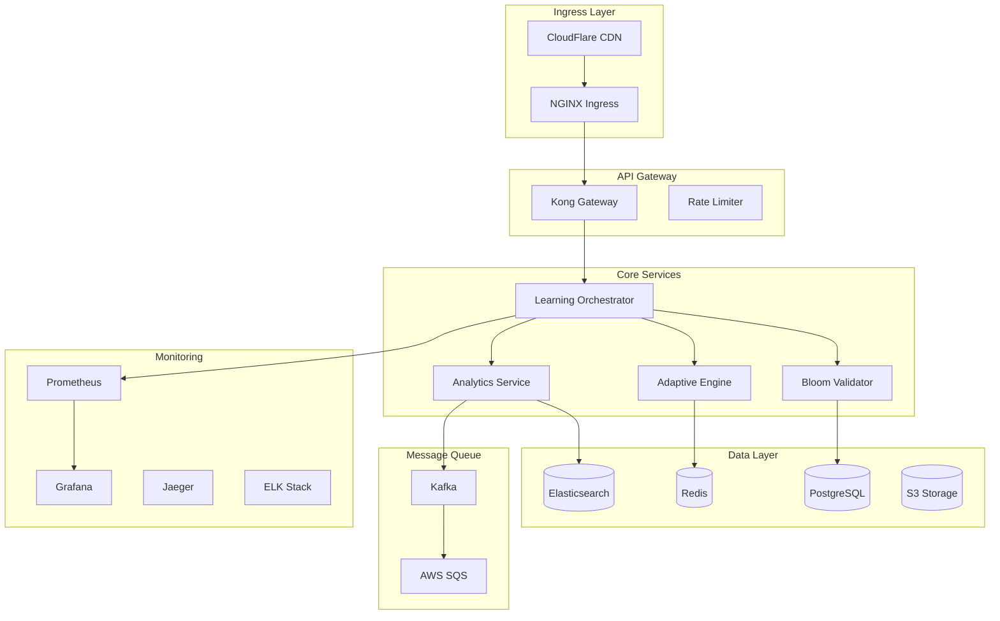

# 🚀 Kubernetes Deployment & SRE Guide for Self-Learning System

## Table of Contents

1. [Architecture Overview](#architecture-overview)
2. [Kubernetes Deployment](#kubernetes-deployment)
3. [Infrastructure as Code](#infrastructure-as-code)
4. [SRE Practices](#sre-practices)
5. [Monitoring & Observability](#monitoring--observability)
6. [CI/CD Pipeline](#cicd-pipeline)
7. [Disaster Recovery](#disaster-recovery)
8. [Cost Optimization](#cost-optimization)
9. [Security Hardening](#security-hardening)
10. [Runbooks](#runbooks)

---

# 🏗️ Architecture Overview

## Microservices Architecture



## Target Infrastructure

- **Cloud Provider**: AWS/GCP/Azure (multi-cloud capable)
- **Orchestration**: Kubernetes 1.28+
- **Service Mesh**: Istio
- **Ingress**: NGINX Ingress Controller
- **Storage**: EBS/PersistentVolumes
- **Database**: RDS/CloudSQL with Read Replicas
- **Cache**: ElastiCache/Redis Cluster
- **CDN**: CloudFlare/CloudFront

---

# 🎯 Kubernetes Deployment

## 1. Namespace Configuration

```yaml
# namespaces.yaml
apiVersion: v1
kind: Namespace
metadata:
  name: quizmentor-prod
  labels:
    name: quizmentor-prod
    istio-injection: enabled
---
apiVersion: v1
kind: Namespace
metadata:
  name: quizmentor-staging
  labels:
    name: quizmentor-staging
    istio-injection: enabled
---
apiVersion: v1
kind: ResourceQuota
metadata:
  name: compute-quota
  namespace: quizmentor-prod
spec:
  hard:
    requests.cpu: '100'
    requests.memory: 200Gi
    limits.cpu: '200'
    limits.memory: 400Gi
    persistentvolumeclaims: '10'
```

## 2. Core Service Deployments

### Learning Orchestrator Service

```yaml
# deployments/orchestrator.yaml
apiVersion: apps/v1
kind: Deployment
metadata:
  name: learning-orchestrator
  namespace: quizmentor-prod
  labels:
    app: learning-orchestrator
    version: v1
spec:
  replicas: 3
  strategy:
    type: RollingUpdate
    rollingUpdate:
      maxSurge: 1
      maxUnavailable: 0
  selector:
    matchLabels:
      app: learning-orchestrator
  template:
    metadata:
      labels:
        app: learning-orchestrator
        version: v1
      annotations:
        prometheus.io/scrape: 'true'
        prometheus.io/port: '9090'
        prometheus.io/path: '/metrics'
    spec:
      serviceAccountName: learning-orchestrator

      # Anti-affinity for HA
      affinity:
        podAntiAffinity:
          preferredDuringSchedulingIgnoredDuringExecution:
            - weight: 100
              podAffinityTerm:
                labelSelector:
                  matchExpressions:
                    - key: app
                      operator: In
                      values:
                        - learning-orchestrator
                topologyKey: kubernetes.io/hostname

      # Init container for migrations
      initContainers:
        - name: migrations
          image: quizmentor/migrations:latest
          command: ['npm', 'run', 'migrate:prod']
          env:
            - name: DATABASE_URL
              valueFrom:
                secretKeyRef:
                  name: database-credentials
                  key: url

      containers:
        - name: orchestrator
          image: quizmentor/learning-orchestrator:latest
          imagePullPolicy: Always

          ports:
            - containerPort: 3000
              name: http
              protocol: TCP
            - containerPort: 9090
              name: metrics
              protocol: TCP

          env:
            - name: NODE_ENV
              value: 'production'
            - name: PORT
              value: '3000'
            - name: LOG_LEVEL
              value: 'info'
            - name: DATABASE_URL
              valueFrom:
                secretKeyRef:
                  name: database-credentials
                  key: url
            - name: REDIS_URL
              valueFrom:
                secretKeyRef:
                  name: redis-credentials
                  key: url
            - name: JWT_SECRET
              valueFrom:
                secretKeyRef:
                  name: jwt-secret
                  key: secret

          # Resource limits
          resources:
            requests:
              memory: '512Mi'
              cpu: '250m'
            limits:
              memory: '1Gi'
              cpu: '500m'

          # Health checks
          livenessProbe:
            httpGet:
              path: /health/live
              port: 3000
            initialDelaySeconds: 30
            periodSeconds: 10
            timeoutSeconds: 5
            failureThreshold: 3

          readinessProbe:
            httpGet:
              path: /health/ready
              port: 3000
            initialDelaySeconds: 10
            periodSeconds: 5
            timeoutSeconds: 3
            failureThreshold: 3

          # Startup probe for slow starts
          startupProbe:
            httpGet:
              path: /health/startup
              port: 3000
            initialDelaySeconds: 0
            periodSeconds: 10
            timeoutSeconds: 3
            failureThreshold: 30

          # Security context
          securityContext:
            runAsNonRoot: true
            runAsUser: 1000
            allowPrivilegeEscalation: false
            readOnlyRootFilesystem: true
            capabilities:
              drop:
                - ALL

          # Volume mounts
          volumeMounts:
            - name: tmp
              mountPath: /tmp
            - name: cache
              mountPath: /app/.cache

      volumes:
        - name: tmp
          emptyDir: {}
        - name: cache
          emptyDir: {}
---
apiVersion: v1
kind: Service
metadata:
  name: learning-orchestrator
  namespace: quizmentor-prod
  labels:
    app: learning-orchestrator
spec:
  type: ClusterIP
  ports:
    - port: 80
      targetPort: 3000
      protocol: TCP
      name: http
    - port: 9090
      targetPort: 9090
      protocol: TCP
      name: metrics
  selector:
    app: learning-orchestrator
```

### Bloom Validator Service

```yaml
# deployments/bloom-validator.yaml
apiVersion: apps/v1
kind: Deployment
metadata:
  name: bloom-validator
  namespace: quizmentor-prod
spec:
  replicas: 2
  selector:
    matchLabels:
      app: bloom-validator
  template:
    metadata:
      labels:
        app: bloom-validator
    spec:
      containers:
        - name: validator
          image: quizmentor/bloom-validator:latest

          resources:
            requests:
              memory: '256Mi'
              cpu: '100m'
            limits:
              memory: '512Mi'
              cpu: '250m'

          # Horizontal Pod Autoscaler target
          env:
            - name: WORKERS
              value: '4'
            - name: MAX_REQUESTS_PER_WORKER
              value: '1000'
---
apiVersion: autoscaling/v2
kind: HorizontalPodAutoscaler
metadata:
  name: bloom-validator-hpa
  namespace: quizmentor-prod
spec:
  scaleTargetRef:
    apiVersion: apps/v1
    kind: Deployment
    name: bloom-validator
  minReplicas: 2
  maxReplicas: 10
  metrics:
    - type: Resource
      resource:
        name: cpu
        target:
          type: Utilization
          averageUtilization: 70
    - type: Resource
      resource:
        name: memory
        target:
          type: Utilization
          averageUtilization: 80
  behavior:
    scaleDown:
      stabilizationWindowSeconds: 300
      policies:
        - type: Percent
          value: 50
          periodSeconds: 60
    scaleUp:
      stabilizationWindowSeconds: 0
      policies:
        - type: Percent
          value: 100
          periodSeconds: 30
```

## 3. Database Configuration

```yaml
# statefulsets/postgres.yaml
apiVersion: v1
kind: Service
metadata:
  name: postgres-primary
  namespace: quizmentor-prod
spec:
  type: ClusterIP
  ports:
    - port: 5432
      targetPort: 5432
  selector:
    app: postgres
    role: primary
---
apiVersion: v1
kind: Service
metadata:
  name: postgres-replica
  namespace: quizmentor-prod
spec:
  type: ClusterIP
  ports:
    - port: 5432
      targetPort: 5432
  selector:
    app: postgres
    role: replica
---
apiVersion: apps/v1
kind: StatefulSet
metadata:
  name: postgres-primary
  namespace: quizmentor-prod
spec:
  serviceName: postgres-primary
  replicas: 1
  selector:
    matchLabels:
      app: postgres
      role: primary
  template:
    metadata:
      labels:
        app: postgres
        role: primary
    spec:
      containers:
        - name: postgres
          image: postgres:15-alpine
          ports:
            - containerPort: 5432
          env:
            - name: POSTGRES_DB
              value: quizmentor
            - name: POSTGRES_USER
              valueFrom:
                secretKeyRef:
                  name: postgres-secret
                  key: username
            - name: POSTGRES_PASSWORD
              valueFrom:
                secretKeyRef:
                  name: postgres-secret
                  key: password
            - name: POSTGRES_REPLICATION_MODE
              value: master
            - name: POSTGRES_REPLICATION_USER
              value: replicator
            - name: POSTGRES_REPLICATION_PASSWORD
              valueFrom:
                secretKeyRef:
                  name: postgres-secret
                  key: replication-password

          resources:
            requests:
              memory: '2Gi'
              cpu: '1'
            limits:
              memory: '4Gi'
              cpu: '2'

          volumeMounts:
            - name: postgres-storage
              mountPath: /var/lib/postgresql/data
              subPath: postgres
            - name: postgres-config
              mountPath: /etc/postgresql/postgresql.conf
              subPath: postgresql.conf

          livenessProbe:
            exec:
              command:
                - pg_isready
                - -U
                - postgres
            initialDelaySeconds: 30
            periodSeconds: 10

          readinessProbe:
            exec:
              command:
                - pg_isready
                - -U
                - postgres
            initialDelaySeconds: 5
            periodSeconds: 5

      volumes:
        - name: postgres-config
          configMap:
            name: postgres-config

  volumeClaimTemplates:
    - metadata:
        name: postgres-storage
      spec:
        accessModes: ['ReadWriteOnce']
        storageClassName: 'gp3-encrypted'
        resources:
          requests:
            storage: 100Gi
```

## 4. Redis Cluster

```yaml
# deployments/redis.yaml
apiVersion: v1
kind: ConfigMap
metadata:
  name: redis-config
  namespace: quizmentor-prod
data:
  redis.conf: |
    maxmemory 2gb
    maxmemory-policy allkeys-lru
    save 900 1
    save 300 10
    save 60 10000
    appendonly yes
    appendfilename "appendonly.aof"
---
apiVersion: apps/v1
kind: StatefulSet
metadata:
  name: redis-cluster
  namespace: quizmentor-prod
spec:
  serviceName: redis-cluster
  replicas: 3
  selector:
    matchLabels:
      app: redis-cluster
  template:
    metadata:
      labels:
        app: redis-cluster
    spec:
      containers:
        - name: redis
          image: redis:7-alpine
          command: ['redis-server']
          args:
            [
              '/etc/redis/redis.conf',
              '--cluster-enabled',
              'yes',
              '--cluster-config-file',
              '/data/nodes.conf',
            ]

          ports:
            - containerPort: 6379
              name: client
            - containerPort: 16379
              name: gossip

          resources:
            requests:
              memory: '1Gi'
              cpu: '500m'
            limits:
              memory: '2Gi'
              cpu: '1'

          volumeMounts:
            - name: data
              mountPath: /data
            - name: config
              mountPath: /etc/redis

      volumes:
        - name: config
          configMap:
            name: redis-config

  volumeClaimTemplates:
    - metadata:
        name: data
      spec:
        accessModes: ['ReadWriteOnce']
        resources:
          requests:
            storage: 10Gi
```

## 5. Ingress Configuration

```yaml
# ingress/ingress.yaml
apiVersion: networking.k8s.io/v1
kind: Ingress
metadata:
  name: quizmentor-ingress
  namespace: quizmentor-prod
  annotations:
    kubernetes.io/ingress.class: nginx
    cert-manager.io/cluster-issuer: letsencrypt-prod
    nginx.ingress.kubernetes.io/rate-limit: '100'
    nginx.ingress.kubernetes.io/limit-rps: '10'
    nginx.ingress.kubernetes.io/proxy-body-size: '10m'
    nginx.ingress.kubernetes.io/proxy-read-timeout: '60'
    nginx.ingress.kubernetes.io/proxy-send-timeout: '60'
    nginx.ingress.kubernetes.io/enable-cors: 'true'
    nginx.ingress.kubernetes.io/cors-allow-methods: 'GET, POST, PUT, DELETE, OPTIONS'
    nginx.ingress.kubernetes.io/cors-allow-origin: 'https://quizmentor.com'
    nginx.ingress.kubernetes.io/ssl-redirect: 'true'
    nginx.ingress.kubernetes.io/force-ssl-redirect: 'true'
spec:
  tls:
    - hosts:
        - api.quizmentor.com
      secretName: quizmentor-tls
  rules:
    - host: api.quizmentor.com
      http:
        paths:
          - path: /api/learning
            pathType: Prefix
            backend:
              service:
                name: learning-orchestrator
                port:
                  number: 80
          - path: /api/validate
            pathType: Prefix
            backend:
              service:
                name: bloom-validator
                port:
                  number: 80
          - path: /api/adaptive
            pathType: Prefix
            backend:
              service:
                name: adaptive-engine
                port:
                  number: 80
```

## 6. Service Mesh (Istio)

```yaml
# istio/virtual-service.yaml
apiVersion: networking.istio.io/v1beta1
kind: VirtualService
metadata:
  name: learning-orchestrator
  namespace: quizmentor-prod
spec:
  hosts:
    - learning-orchestrator
  http:
    - match:
        - headers:
            canary:
              exact: 'true'
      route:
        - destination:
            host: learning-orchestrator
            subset: v2
          weight: 100
    - route:
        - destination:
            host: learning-orchestrator
            subset: v1
          weight: 90
        - destination:
            host: learning-orchestrator
            subset: v2
          weight: 10
---
apiVersion: networking.istio.io/v1beta1
kind: DestinationRule
metadata:
  name: learning-orchestrator
  namespace: quizmentor-prod
spec:
  host: learning-orchestrator
  trafficPolicy:
    connectionPool:
      tcp:
        maxConnections: 100
      http:
        http1MaxPendingRequests: 100
        http2MaxRequests: 1000
        maxRequestsPerConnection: 2
    loadBalancer:
      simple: LEAST_REQUEST
    outlierDetection:
      consecutiveErrors: 5
      interval: 30s
      baseEjectionTime: 30s
      maxEjectionPercent: 50
      minHealthPercent: 30
  subsets:
    - name: v1
      labels:
        version: v1
    - name: v2
      labels:
        version: v2
```

---

# 🏗️ Infrastructure as Code

## Terraform Configuration

```hcl
# terraform/main.tf
terraform {
  required_version = ">= 1.0"

  required_providers {
    aws = {
      source  = "hashicorp/aws"
      version = "~> 5.0"
    }
    kubernetes = {
      source  = "hashicorp/kubernetes"
      version = "~> 2.23"
    }
    helm = {
      source  = "hashicorp/helm"
      version = "~> 2.11"
    }
  }

  backend "s3" {
    bucket = "quizmentor-terraform-state"
    key    = "prod/terraform.tfstate"
    region = "us-east-1"
    encrypt = true
    dynamodb_table = "terraform-state-lock"
  }
}

# EKS Cluster
module "eks" {
  source  = "terraform-aws-modules/eks/aws"
  version = "~> 19.0"

  cluster_name    = "quizmentor-prod"
  cluster_version = "1.28"

  vpc_id     = module.vpc.vpc_id
  subnet_ids = module.vpc.private_subnets

  enable_irsa = true

  cluster_endpoint_public_access  = true
  cluster_endpoint_private_access = true

  cluster_addons = {
    coredns = {
      most_recent = true
    }
    kube-proxy = {
      most_recent = true
    }
    vpc-cni = {
      most_recent = true
    }
    aws-ebs-csi-driver = {
      most_recent = true
    }
  }

  # Node groups
  eks_managed_node_groups = {
    general = {
      desired_size = 3
      min_size     = 3
      max_size     = 10

      instance_types = ["t3.large"]

      k8s_labels = {
        Environment = "production"
        GithubRepo  = "quizmentor"
      }
    }

    spot = {
      desired_size = 2
      min_size     = 2
      max_size     = 10

      instance_types = ["t3.large", "t3a.large"]
      capacity_type  = "SPOT"

      k8s_labels = {
        Environment = "production"
        Type        = "spot"
      }

      taints = [{
        key    = "spot"
        value  = "true"
        effect = "NoSchedule"
      }]
    }
  }
}

# RDS Database
module "rds" {
  source  = "terraform-aws-modules/rds/aws"
  version = "~> 6.0"

  identifier = "quizmentor-prod"

  engine            = "postgres"
  engine_version    = "15.4"
  instance_class    = "db.r6g.xlarge"
  allocated_storage = 100
  storage_encrypted = true

  db_name  = "quizmentor"
  username = "quizmentor"
  port     = "5432"

  multi_az               = true
  backup_retention_period = 30
  backup_window          = "03:00-06:00"
  maintenance_window     = "Mon:00:00-Mon:03:00"

  enabled_cloudwatch_logs_exports = ["postgresql"]

  # Read replicas
  create_db_subnet_group = true
  subnet_ids             = module.vpc.database_subnets

  # Performance insights
  performance_insights_enabled          = true
  performance_insights_retention_period = 7

  # Monitoring
  monitoring_interval = "30"
  monitoring_role_arn = aws_iam_role.rds_enhanced_monitoring.arn
}

# ElastiCache Redis
module "elasticache" {
  source = "terraform-aws-modules/elasticache/aws"

  cluster_id           = "quizmentor-redis"
  engine              = "redis"
  node_type           = "cache.r6g.xlarge"
  num_cache_nodes     = 3
  parameter_group_name = "default.redis7"
  port                = 6379

  subnet_ids = module.vpc.elasticache_subnets

  # Cluster mode
  cluster_mode = {
    replicas_per_node_group = 2
    num_node_groups         = 3
  }

  # Automatic failover
  automatic_failover_enabled = true
  multi_az_enabled          = true

  # Backup
  snapshot_retention_limit = 5
  snapshot_window         = "03:00-05:00"

  # Security
  at_rest_encryption_enabled = true
  transit_encryption_enabled = true
  auth_token_enabled        = true
}
```

## Helm Values

```yaml
# helm/values-prod.yaml
global:
  environment: production
  domain: quizmentor.com

replicaCount: 3

image:
  repository: quizmentor/learning-orchestrator
  pullPolicy: Always
  tag: 'latest'

serviceAccount:
  create: true
  annotations:
    eks.amazonaws.com/role-arn: arn:aws:iam::123456789:role/QuizmentorServiceRole

ingress:
  enabled: true
  className: nginx
  annotations:
    cert-manager.io/cluster-issuer: letsencrypt-prod
  hosts:
    - host: api.quizmentor.com
      paths:
        - path: /
          pathType: Prefix
  tls:
    - secretName: quizmentor-tls
      hosts:
        - api.quizmentor.com

resources:
  limits:
    cpu: 1000m
    memory: 1Gi
  requests:
    cpu: 500m
    memory: 512Mi

autoscaling:
  enabled: true
  minReplicas: 3
  maxReplicas: 10
  targetCPUUtilizationPercentage: 70
  targetMemoryUtilizationPercentage: 80

nodeSelector:
  kubernetes.io/os: linux

tolerations: []

affinity:
  podAntiAffinity:
    preferredDuringSchedulingIgnoredDuringExecution:
      - weight: 100
        podAffinityTerm:
          labelSelector:
            matchExpressions:
              - key: app
                operator: In
                values:
                  - learning-orchestrator
          topologyKey: kubernetes.io/hostname

# Monitoring
metrics:
  enabled: true
  serviceMonitor:
    enabled: true
    interval: 30s
    scrapeTimeout: 10s

# Tracing
tracing:
  enabled: true
  jaeger:
    agent:
      host: jaeger-agent
      port: 6831
```

---

# 📊 SRE Practices

## Service Level Objectives (SLOs)

```yaml
# slos.yaml
apiVersion: sloth.slok.dev/v1
kind: PrometheusServiceLevel
metadata:
  name: quizmentor-slos
  namespace: quizmentor-prod
spec:
  service: 'quizmentor'
  labels:
    team: 'platform'
  slos:
    - name: 'requests-availability'
      objective: 99.9
      description: '99.9% of requests should be successful'
      sli:
        events:
          error_query: |
            sum(rate(http_requests_total{job="learning-orchestrator",code=~"5.."}[5m]))
          total_query: |
            sum(rate(http_requests_total{job="learning-orchestrator"}[5m]))
      alerting:
        name: HighErrorRate
        page_alert:
          labels:
            severity: critical
            team: platform
        ticket_alert:
          labels:
            severity: warning
            team: platform

    - name: 'requests-latency'
      objective: 99
      description: '99% of requests should be faster than 200ms'
      sli:
        events:
          error_query: |
            sum(rate(http_request_duration_seconds_bucket{job="learning-orchestrator",le="0.2"}[5m]))
          total_query: |
            sum(rate(http_request_duration_seconds_count{job="learning-orchestrator"}[5m]))
      alerting:
        name: HighLatency
        page_alert:
          labels:
            severity: critical
        ticket_alert:
          labels:
            severity: warning
```

## Error Budget Policy

```markdown
# Error Budget Policy

## Objective

Maintain 99.9% availability (43.2 minutes downtime/month)

## Error Budget Consumption Triggers

### 25% Consumed

- Review recent incidents
- Update monitoring thresholds
- Schedule post-mortem for any incidents

### 50% Consumed

- Freeze non-critical deployments
- Focus on reliability improvements
- Implement additional testing

### 75% Consumed

- Stop all feature deployments
- All hands on reliability
- Executive escalation

### 100% Consumed

- Complete feature freeze
- Dedicated reliability sprint
- Root cause analysis required
```

---

# 📈 Monitoring & Observability

## Prometheus Configuration

```yaml
# monitoring/prometheus-config.yaml
apiVersion: v1
kind: ConfigMap
metadata:
  name: prometheus-config
  namespace: monitoring
data:
  prometheus.yml: |
    global:
      scrape_interval: 30s
      evaluation_interval: 30s

    rule_files:
      - '/etc/prometheus/rules/*.yml'

    alerting:
      alertmanagers:
        - static_configs:
          - targets:
            - alertmanager:9093

    scrape_configs:
      - job_name: 'kubernetes-apiservers'
        kubernetes_sd_configs:
          - role: endpoints
        scheme: https
        tls_config:
          ca_file: /var/run/secrets/kubernetes.io/serviceaccount/ca.crt
        bearer_token_file: /var/run/secrets/kubernetes.io/serviceaccount/token
        relabel_configs:
          - source_labels: [__meta_kubernetes_namespace, __meta_kubernetes_service_name, __meta_kubernetes_endpoint_port_name]
            action: keep
            regex: default;kubernetes;https
      
      - job_name: 'kubernetes-pods'
        kubernetes_sd_configs:
          - role: pod
        relabel_configs:
          - source_labels: [__meta_kubernetes_pod_annotation_prometheus_io_scrape]
            action: keep
            regex: true
          - source_labels: [__meta_kubernetes_pod_annotation_prometheus_io_path]
            action: replace
            target_label: __metrics_path__
            regex: (.+)
          - source_labels: [__address__, __meta_kubernetes_pod_annotation_prometheus_io_port]
            action: replace
            regex: ([^:]+)(?::\d+)?;(\d+)
            replacement: $1:$2
            target_label: __address__
```

## Grafana Dashboards

```json
{
  "dashboard": {
    "title": "QuizMentor SRE Dashboard",
    "panels": [
      {
        "title": "Request Rate",
        "targets": [
          {
            "expr": "sum(rate(http_requests_total[5m])) by (service)"
          }
        ]
      },
      {
        "title": "Error Rate",
        "targets": [
          {
            "expr": "sum(rate(http_requests_total{code=~\"5..\"}[5m])) by (service)"
          }
        ]
      },
      {
        "title": "P95 Latency",
        "targets": [
          {
            "expr": "histogram_quantile(0.95, sum(rate(http_request_duration_seconds_bucket[5m])) by (le, service))"
          }
        ]
      },
      {
        "title": "CPU Usage",
        "targets": [
          {
            "expr": "sum(rate(container_cpu_usage_seconds_total[5m])) by (pod)"
          }
        ]
      },
      {
        "title": "Memory Usage",
        "targets": [
          {
            "expr": "sum(container_memory_usage_bytes) by (pod)"
          }
        ]
      },
      {
        "title": "Error Budget Remaining",
        "targets": [
          {
            "expr": "(1 - (sum(increase(http_requests_total{code=~\"5..\"}[30d])) / sum(increase(http_requests_total[30d])))) * 100"
          }
        ]
      }
    ]
  }
}
```

## Alert Rules

```yaml
# monitoring/alerts.yaml
apiVersion: v1
kind: ConfigMap
metadata:
  name: prometheus-alerts
  namespace: monitoring
data:
  alerts.yml: |
    groups:
      - name: quizmentor
        interval: 30s
        rules:
          - alert: HighErrorRate
            expr: |
              sum(rate(http_requests_total{code=~"5.."}[5m])) by (service)
              / sum(rate(http_requests_total[5m])) by (service) > 0.01
            for: 5m
            labels:
              severity: critical
              team: platform
            annotations:
              summary: "High error rate on {{ $labels.service }}"
              description: "Error rate is {{ $value | humanizePercentage }} for {{ $labels.service }}"
          
          - alert: HighLatency
            expr: |
              histogram_quantile(0.95,
                sum(rate(http_request_duration_seconds_bucket[5m])) by (le, service)
              ) > 0.5
            for: 5m
            labels:
              severity: warning
              team: platform
            annotations:
              summary: "High latency on {{ $labels.service }}"
              description: "P95 latency is {{ $value }}s for {{ $labels.service }}"
          
          - alert: PodCrashLooping
            expr: |
              rate(kube_pod_container_status_restarts_total[15m]) > 0
            for: 5m
            labels:
              severity: critical
              team: platform
            annotations:
              summary: "Pod {{ $labels.pod }} is crash looping"
              description: "Pod {{ $labels.pod }} has restarted {{ $value }} times in the last 15 minutes"
          
          - alert: HighMemoryUsage
            expr: |
              sum(container_memory_usage_bytes) by (pod)
              / sum(container_spec_memory_limit_bytes) by (pod) > 0.9
            for: 5m
            labels:
              severity: warning
              team: platform
            annotations:
              summary: "High memory usage on {{ $labels.pod }}"
              description: "Memory usage is {{ $value | humanizePercentage }} for {{ $labels.pod }}"
          
          - alert: DatabaseConnectionPoolExhausted
            expr: |
              pg_stat_database_numbackends{datname="quizmentor"}
              / pg_settings_max_connections > 0.9
            for: 5m
            labels:
              severity: critical
              team: platform
            annotations:
              summary: "Database connection pool almost exhausted"
              description: "{{ $value | humanizePercentage }} of connections are in use"
```

---

# 🚀 CI/CD Pipeline

## GitHub Actions Workflow

```yaml
# .github/workflows/deploy.yml
name: Deploy to Kubernetes

on:
  push:
    branches: [main]
  pull_request:
    branches: [main]

env:
  REGISTRY: ghcr.io
  IMAGE_NAME: ${{ github.repository }}

jobs:
  test:
    runs-on: ubuntu-latest
    steps:
      - uses: actions/checkout@v3

      - name: Setup Node.js
        uses: actions/setup-node@v3
        with:
          node-version: '18'
          cache: 'npm'

      - name: Install dependencies
        run: npm ci

      - name: Run tests
        run: npm test

      - name: Run E2E tests
        run: npm run test:e2e

      - name: SonarCloud Scan
        uses: SonarSource/sonarcloud-github-action@master
        env:
          GITHUB_TOKEN: ${{ secrets.GITHUB_TOKEN }}
          SONAR_TOKEN: ${{ secrets.SONAR_TOKEN }}

  build:
    needs: test
    runs-on: ubuntu-latest
    permissions:
      contents: read
      packages: write

    steps:
      - name: Checkout
        uses: actions/checkout@v3

      - name: Setup Docker Buildx
        uses: docker/setup-buildx-action@v2

      - name: Login to Container Registry
        uses: docker/login-action@v2
        with:
          registry: ${{ env.REGISTRY }}
          username: ${{ github.actor }}
          password: ${{ secrets.GITHUB_TOKEN }}

      - name: Extract metadata
        id: meta
        uses: docker/metadata-action@v4
        with:
          images: ${{ env.REGISTRY }}/${{ env.IMAGE_NAME }}
          tags: |
            type=ref,event=branch
            type=ref,event=pr
            type=semver,pattern={{version}}
            type=semver,pattern={{major}}.{{minor}}
            type=sha

      - name: Build and push
        uses: docker/build-push-action@v4
        with:
          context: .
          push: true
          tags: ${{ steps.meta.outputs.tags }}
          labels: ${{ steps.meta.outputs.labels }}
          cache-from: type=gha
          cache-to: type=gha,mode=max

  deploy:
    needs: build
    runs-on: ubuntu-latest
    if: github.ref == 'refs/heads/main'

    steps:
      - name: Checkout
        uses: actions/checkout@v3

      - name: Configure AWS credentials
        uses: aws-actions/configure-aws-credentials@v2
        with:
          aws-access-key-id: ${{ secrets.AWS_ACCESS_KEY_ID }}
          aws-secret-access-key: ${{ secrets.AWS_SECRET_ACCESS_KEY }}
          aws-region: us-east-1

      - name: Update kubeconfig
        run: |
          aws eks update-kubeconfig --name quizmentor-prod --region us-east-1

      - name: Deploy to Kubernetes
        run: |
          kubectl set image deployment/learning-orchestrator \
            orchestrator=${{ env.REGISTRY }}/${{ env.IMAGE_NAME }}:${{ github.sha }} \
            -n quizmentor-prod

          kubectl rollout status deployment/learning-orchestrator -n quizmentor-prod

      - name: Run smoke tests
        run: |
          ./scripts/smoke-test.sh https://api.quizmentor.com

      - name: Notify Slack
        uses: 8398a7/action-slack@v3
        with:
          status: ${{ job.status }}
          text: 'Deployment to production completed'
          webhook_url: ${{ secrets.SLACK_WEBHOOK }}
        if: always()
```

## ArgoCD Application

```yaml
# argocd/application.yaml
apiVersion: argoproj.io/v1alpha1
kind: Application
metadata:
  name: quizmentor
  namespace: argocd
spec:
  project: default

  source:
    repoURL: https://github.com/quizmentor/infrastructure
    targetRevision: main
    path: kubernetes/
    helm:
      valueFiles:
        - values-prod.yaml

  destination:
    server: https://kubernetes.default.svc
    namespace: quizmentor-prod

  syncPolicy:
    automated:
      prune: true
      selfHeal: true
      allowEmpty: false
    syncOptions:
      - Validate=true
      - CreateNamespace=true
      - PrunePropagationPolicy=foreground
    retry:
      limit: 5
      backoff:
        duration: 5s
        factor: 2
        maxDuration: 3m
```

---

# 🔐 Security Hardening

## Network Policies

```yaml
# security/network-policies.yaml
apiVersion: networking.k8s.io/v1
kind: NetworkPolicy
metadata:
  name: learning-orchestrator-netpol
  namespace: quizmentor-prod
spec:
  podSelector:
    matchLabels:
      app: learning-orchestrator
  policyTypes:
    - Ingress
    - Egress
  ingress:
    - from:
        - namespaceSelector:
            matchLabels:
              name: quizmentor-prod
        - podSelector:
            matchLabels:
              app: nginx-ingress
      ports:
        - protocol: TCP
          port: 3000
  egress:
    - to:
        - podSelector:
            matchLabels:
              app: postgres
      ports:
        - protocol: TCP
          port: 5432
    - to:
        - podSelector:
            matchLabels:
              app: redis
      ports:
        - protocol: TCP
          port: 6379
    - to:
        - namespaceSelector: {}
          podSelector:
            matchLabels:
              k8s-app: kube-dns
      ports:
        - protocol: UDP
          port: 53
```

## Pod Security Policies

```yaml
# security/pod-security-policy.yaml
apiVersion: policy/v1beta1
kind: PodSecurityPolicy
metadata:
  name: restricted
spec:
  privileged: false
  allowPrivilegeEscalation: false
  requiredDropCapabilities:
    - ALL
  volumes:
    - 'configMap'
    - 'emptyDir'
    - 'projected'
    - 'secret'
    - 'downwardAPI'
    - 'persistentVolumeClaim'
  hostNetwork: false
  hostIPC: false
  hostPID: false
  runAsUser:
    rule: 'MustRunAsNonRoot'
  seLinux:
    rule: 'RunAsAny'
  supplementalGroups:
    rule: 'RunAsAny'
  fsGroup:
    rule: 'RunAsAny'
  readOnlyRootFilesystem: true
```

## Secrets Management

```yaml
# security/sealed-secrets.yaml
apiVersion: bitnami.com/v1alpha1
kind: SealedSecret
metadata:
  name: database-credentials
  namespace: quizmentor-prod
spec:
  encryptedData:
    url: AgBvA8N5LZ+encrypted+data+here...
    username: AgCmM8X9RQ+encrypted+data+here...
    password: AgDpP7Y4KL+encrypted+data+here...
```

---

# 📚 Runbooks

## Incident Response Runbook

````markdown
# Incident Response Runbook

## 1. Assess Severity

### SEV-1 (Critical)

- Complete service outage
- Data loss/corruption
- Security breach

**Actions:**

- Page on-call immediately
- Open bridge call
- Notify executives

### SEV-2 (Major)

- Partial outage
- Significant degradation
- SLO breach

**Actions:**

- Page on-call
- Open incident channel
- Update status page

### SEV-3 (Minor)

- Feature failure
- Minor degradation
- No customer impact

**Actions:**

- Create ticket
- Notify team
- Schedule fix

## 2. Immediate Actions

```bash
# Check service health
kubectl get pods -n quizmentor-prod
kubectl top pods -n quizmentor-prod
kubectl logs -n quizmentor-prod deployment/learning-orchestrator --tail=100

# Check metrics
kubectl port-forward -n monitoring svc/grafana 3000:3000
# Open http://localhost:3000

# Check recent deployments
kubectl rollout history deployment/learning-orchestrator -n quizmentor-prod

# Emergency rollback if needed
kubectl rollout undo deployment/learning-orchestrator -n quizmentor-prod
```
````

## 3. Debugging Commands

```bash
# Get pod details
kubectl describe pod <pod-name> -n quizmentor-prod

# Check events
kubectl get events -n quizmentor-prod --sort-by=.lastTimestamp

# Execute into pod
kubectl exec -it <pod-name> -n quizmentor-prod -- /bin/sh

# Check database connectivity
kubectl run -it --rm debug --image=postgres:15 --restart=Never -- psql -h postgres-primary -U quizmentor

# Check Redis connectivity
kubectl run -it --rm debug --image=redis:7 --restart=Never -- redis-cli -h redis-cluster ping
```

## 4. Common Issues

### High Memory Usage

```bash
# Identify memory leak
kubectl top pods -n quizmentor-prod
kubectl exec <pod> -n quizmentor-prod -- kill -USR1 1  # Heap dump for Node.js

# Temporary fix - increase limits
kubectl set resources deployment/learning-orchestrator -n quizmentor-prod --limits=memory=2Gi

# Permanent fix - update helm values and redeploy
```

### Database Connection Issues

```bash
# Check connection pool
kubectl exec -it <postgres-pod> -- psql -U postgres -c "SELECT count(*) FROM pg_stat_activity;"

# Kill idle connections
kubectl exec -it <postgres-pod> -- psql -U postgres -c "SELECT pg_terminate_backend(pid) FROM pg_stat_activity WHERE state = 'idle' AND state_change < now() - interval '10 minutes';"
```

### Slow Queries

```bash
# Enable slow query log
kubectl exec -it <postgres-pod> -- psql -U postgres -c "ALTER SYSTEM SET log_min_duration_statement = 1000;"
kubectl exec -it <postgres-pod> -- psql -U postgres -c "SELECT pg_reload_conf();"

# Check slow queries
kubectl logs <postgres-pod> | grep "duration:"
```

````

## Scaling Runbook

```markdown
# Scaling Runbook

## Horizontal Scaling

### Manual Scaling
```bash
# Scale up
kubectl scale deployment/learning-orchestrator -n quizmentor-prod --replicas=5

# Scale down
kubectl scale deployment/learning-orchestrator -n quizmentor-prod --replicas=3
````

### Auto-scaling Configuration

```bash
# Update HPA
kubectl autoscale deployment/learning-orchestrator -n quizmentor-prod --min=3 --max=10 --cpu-percent=70
```

## Vertical Scaling

### Update Resource Limits

```bash
# Edit deployment
kubectl edit deployment/learning-orchestrator -n quizmentor-prod

# Or use patch
kubectl patch deployment/learning-orchestrator -n quizmentor-prod -p '{"spec":{"template":{"spec":{"containers":[{"name":"orchestrator","resources":{"limits":{"cpu":"2","memory":"2Gi"}}}]}}}}'
```

## Cluster Scaling

### Add Nodes

```bash
# Update node group (AWS)
aws eks update-nodegroup-config --cluster-name quizmentor-prod --nodegroup-name general --scaling-config desiredSize=5

# Or use eksctl
eksctl scale nodegroup --cluster=quizmentor-prod --name=general --nodes=5
```

````

---

# 💰 Cost Optimization

## Resource Optimization

```yaml
# Vertical Pod Autoscaler
apiVersion: autoscaling.k8s.io/v1
kind: VerticalPodAutoscaler
metadata:
  name: learning-orchestrator-vpa
  namespace: quizmentor-prod
spec:
  targetRef:
    apiVersion: "apps/v1"
    kind: Deployment
    name: learning-orchestrator
  updatePolicy:
    updateMode: "Auto"
  resourcePolicy:
    containerPolicies:
    - containerName: orchestrator
      minAllowed:
        cpu: 100m
        memory: 128Mi
      maxAllowed:
        cpu: 2
        memory: 2Gi
````

## Spot Instance Configuration

```yaml
# Node selector for spot instances
apiVersion: apps/v1
kind: Deployment
metadata:
  name: batch-processor
spec:
  template:
    spec:
      nodeSelector:
        node.kubernetes.io/instance-type: spot
      tolerations:
        - key: spot
          operator: Equal
          value: 'true'
          effect: NoSchedule
```

## Cost Monitoring

```bash
#!/bin/bash
# cost-report.sh

# Get cluster cost
kubectl cost namespace quizmentor-prod --historical --window 7d

# Get detailed breakdown
kubectl cost deployment -n quizmentor-prod --show-all-resources

# Export to CSV
kubectl cost namespace quizmentor-prod --window month --csv > cost-report.csv
```

---

# 📝 Summary

## Key Commands Quick Reference

```bash
# Deployment
kubectl apply -k kubernetes/
kubectl rollout status deployment/learning-orchestrator -n quizmentor-prod

# Monitoring
kubectl port-forward -n monitoring svc/prometheus 9090:9090
kubectl port-forward -n monitoring svc/grafana 3000:3000

# Logs
kubectl logs -f deployment/learning-orchestrator -n quizmentor-prod
stern learning-orchestrator -n quizmentor-prod

# Debugging
kubectl describe pod <pod-name> -n quizmentor-prod
kubectl exec -it <pod-name> -n quizmentor-prod -- /bin/sh

# Scaling
kubectl scale deployment/learning-orchestrator -n quizmentor-prod --replicas=5
kubectl autoscale deployment/learning-orchestrator -n quizmentor-prod --min=3 --max=10

# Rollback
kubectl rollout undo deployment/learning-orchestrator -n quizmentor-prod
kubectl rollout history deployment/learning-orchestrator -n quizmentor-prod
```

## Architecture Decision Records (ADRs)

1. **Kubernetes**: Chosen for orchestration due to scalability, self-healing, and ecosystem
2. **Service Mesh (Istio)**: Provides observability, security, and traffic management
3. **GitOps (ArgoCD)**: Declarative deployments with Git as source of truth
4. **Prometheus/Grafana**: Industry standard for metrics and visualization
5. **EKS**: Managed Kubernetes reduces operational overhead
6. **Spot Instances**: 70% cost reduction for non-critical workloads

---

_Last Updated: August 2024_
_Version: 1.0.0_
