# 🔄 COMPLETE USER FLOWS DOCUMENTATION

> **Status**: Complete | Version 2.0  
> **Last Updated**: 2025-08-28  
> **Purpose**: Comprehensive documentation of all user flows and journeys

## 📋 Table of Contents

- Coverage & Testing: see /docs/flows/FLOW_COVERAGE_MATRIX.md
- Detailed flows:
  - /docs/flows/main-flows/USER_REGISTRATION_FLOW.md
  - /docs/flows/main-flows/ONBOARDING_FLOW.md
  - /docs/flows/main-flows/QUIZ_TAKING_FLOW.md
  - /docs/flows/main-flows/RESULTS_AND_ANALYTICS_FLOW.md
  - /docs/flows/main-flows/MULTIPLAYER_FLOW.md
  - /docs/flows/main-flows/SETTINGS_AND_PROFILE_FLOW.md
  - /docs/flows/main-flows/PREMIUM_AND_MONETIZATION_FLOW.md
  - /docs/flows/main-flows/ERROR_RECOVERY_FLOW.md

1. [Authentication Flows](#authentication-flows)
2. [Quiz Taking Flows](#quiz-taking-flows)
3. [Results & Analytics Flows](#results-analytics-flows)
4. [Social Features Flows](#social-features-flows)
5. [Premium & Monetization Flows](#premium-monetization-flows)
6. [Settings & Profile Flows](#settings-profile-flows)
7. [Error Recovery Flows](#error-recovery-flows)

---

## Mocking & Test Toggles

- Unified mocks: HTTP via MSW (web/tests), RN MockEngine (native), WebSocket via MockWebSocket
- Environment flags: USE_MOCKS=true, EXPO_PUBLIC_USE_MSW=1, EXPO_PUBLIC_USE_WS_MOCKS=1, EXPO_PUBLIC_USE_ALL_MOCKS=1
- WebSocket scenarios: WS_MOCK_SCENARIO=lobbyBasic|matchHappyPath|disconnectRecovery|taskBoardLive
- MSW defaults: use the “MSW Profile” toolbar (default/slower/flaky/chaos) to set global latency/error defaults; Defaults chip shows current values
- Per-request opt-out: set header `x-msw-no-defaults: 1` (available as a toggle in API/Playground and NetworkPlayground)
- Storybook docs/pages: Docs/Mocking & Scenarios, Docs/Stories How-To, Docs/Tech Stack + API, Docs/Quick Index
- Interactive demos: API/Playground (HTTP), API/Swagger (OpenAPI), Live/TaskBoard (WS taskBoardLive)

## 1. Authentication Flows

### 1.1 Login Flow

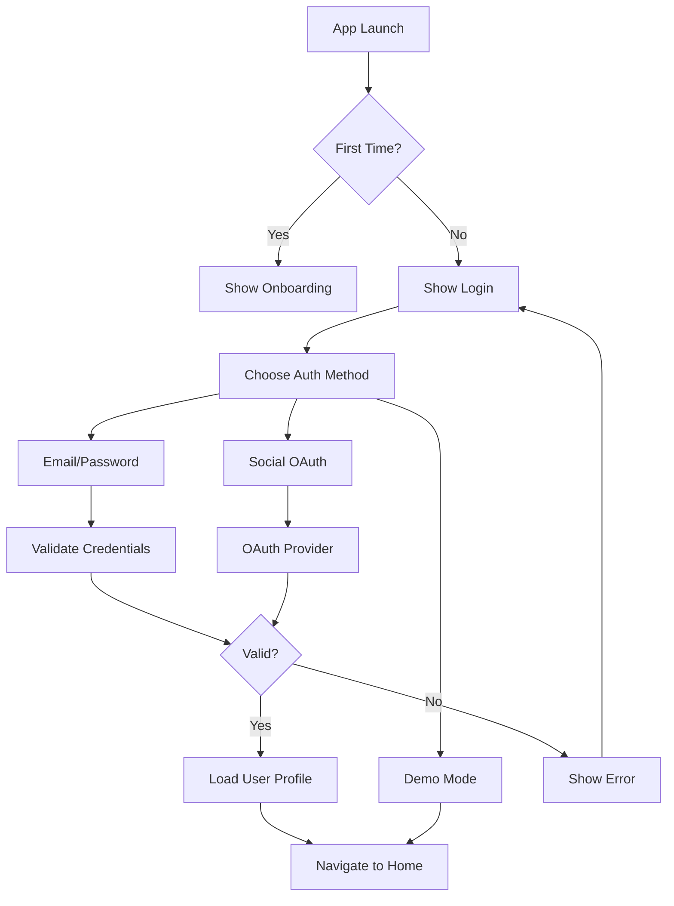

**Implementation Details:**

```typescript
// Auth Flow States
type AuthState =
  | 'checking' // Checking saved session
  | 'onboarding' // First time user
  | 'login' // Login screen
  | 'authenticating' // Processing auth
  | 'authenticated' // Success
  | 'error'; // Auth failed

// Flow Handler
const handleAuthFlow = async (method: AuthMethod) => {
  setAuthState('authenticating');

  try {
    const user = await authService.authenticate(method);
    await AsyncStorage.setItem('user', JSON.stringify(user));
    setAuthState('authenticated');
    navigation.navigate('Home');
  } catch (error) {
    setAuthState('error');
    showError(error.message);
  }
};
```

### 1.2 Registration Flow

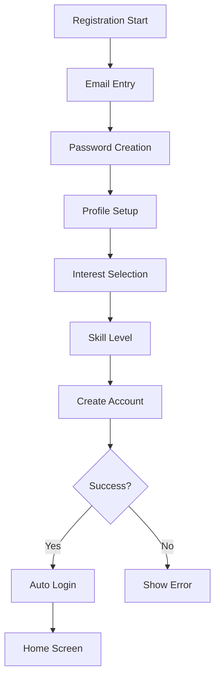

---

## 2. Quiz Taking Flows

### 2.1 Quiz Selection Flow

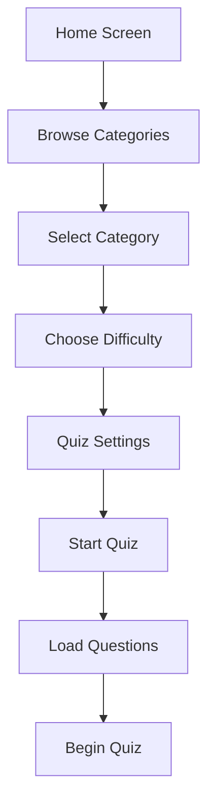

### 2.2 Quiz Gameplay Flow

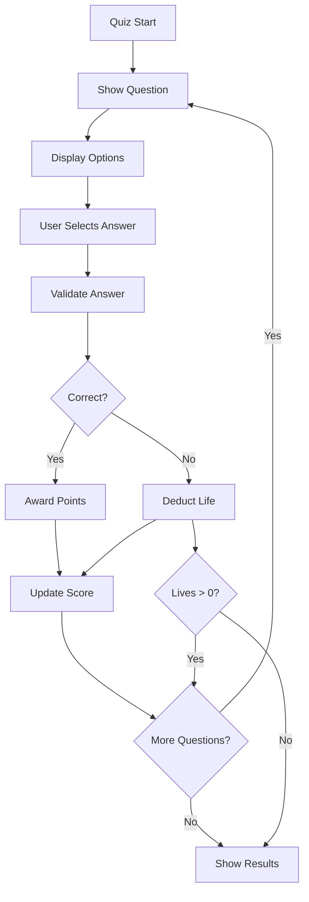

**State Management:**

```typescript
interface QuizState {
  status: 'loading' | 'playing' | 'paused' | 'completed';
  currentQuestion: number;
  score: number;
  lives: number;
  combo: number;
  timeRemaining: number;
  answers: Answer[];
}

// Quiz Flow Controller
class QuizFlowController {
  private state: QuizState;

  startQuiz(category: string) {
    this.state = {
      status: 'loading',
      currentQuestion: 0,
      score: 0,
      lives: 3,
      combo: 0,
      timeRemaining: 60,
      answers: [],
    };
    this.loadQuestions(category);
  }

  submitAnswer(answerId: string) {
    const isCorrect = this.validateAnswer(answerId);

    if (isCorrect) {
      this.state.score += 10 * (1 + this.state.combo * 0.1);
      this.state.combo++;
      this.triggerCorrectAnimation();
    } else {
      this.state.lives--;
      this.state.combo = 0;
      this.triggerWrongAnimation();
    }

    if (this.state.lives === 0) {
      this.endQuiz('failed');
    } else {
      this.nextQuestion();
    }
  }
}
```

---

## 3. Results & Analytics Flows

### 3.1 Results Display Flow

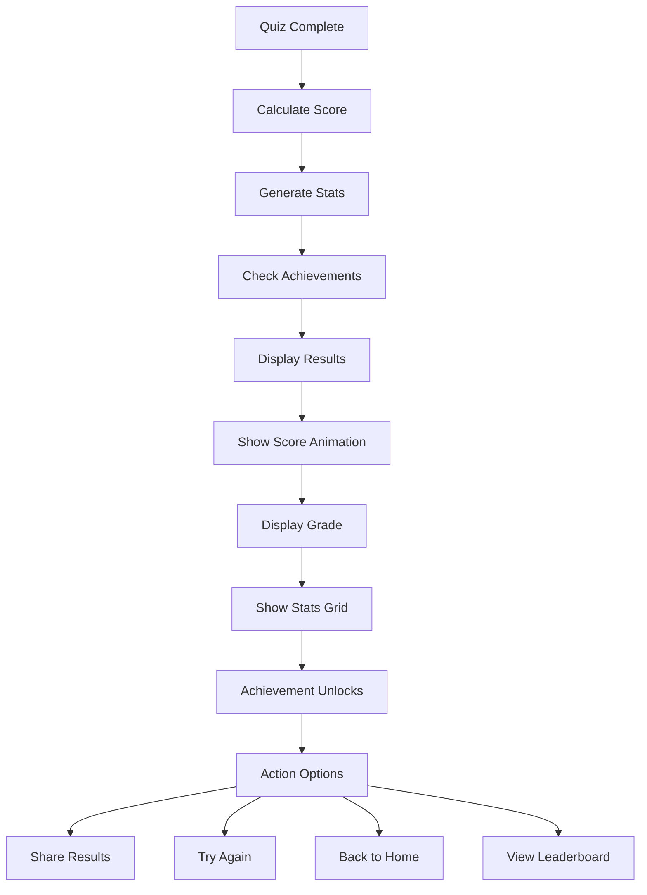

### 3.2 Analytics Dashboard Flow

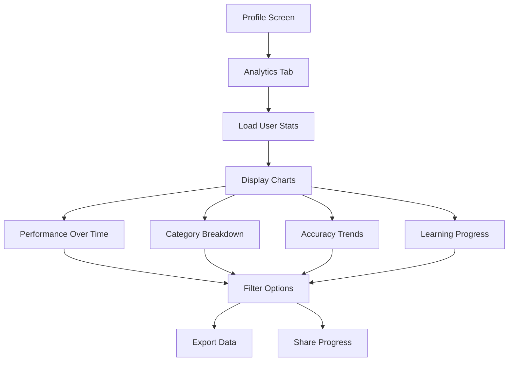

---

## 4. Social Features Flows

### 4.1 Multiplayer Flow

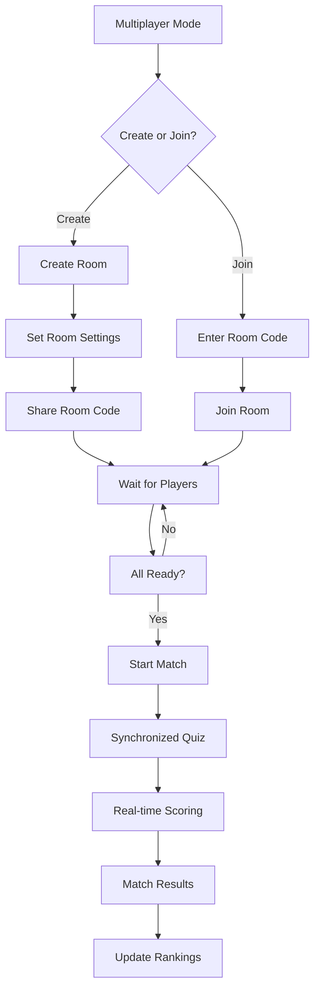

### 4.2 Leaderboard Flow

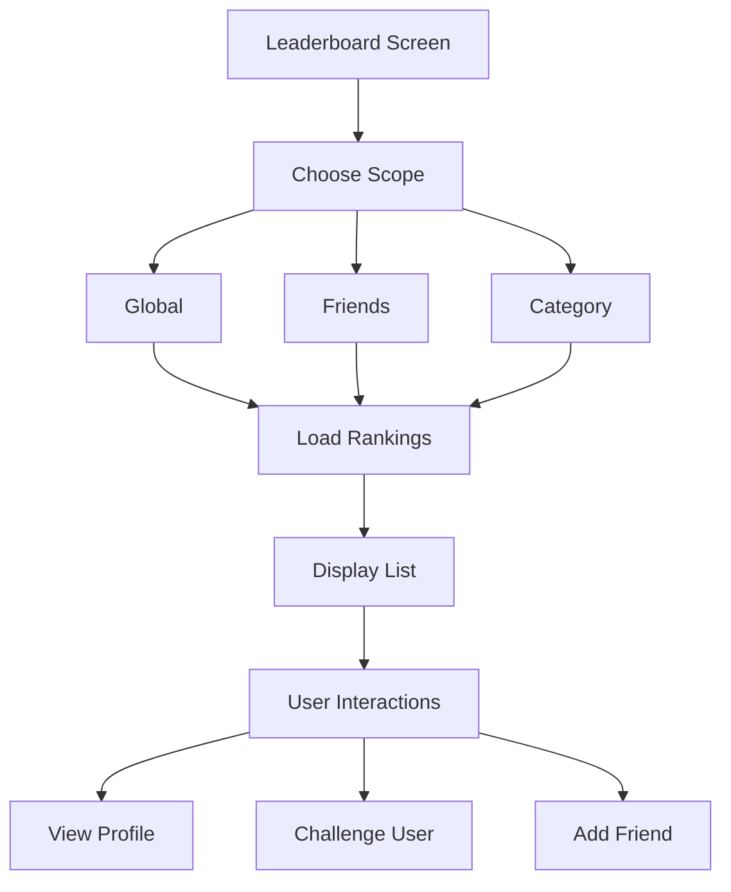

---

## 5. Premium & Monetization Flows

### 5.1 Premium Upgrade Flow

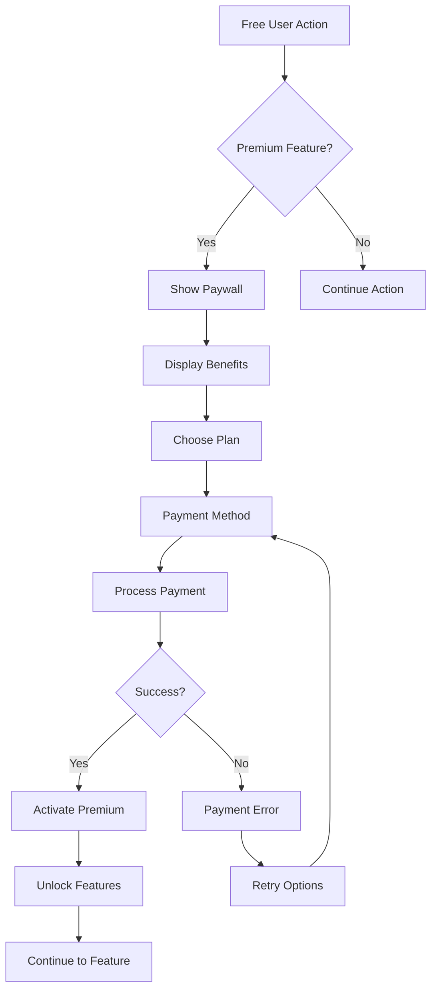

### 5.2 Ad Monetization Flow

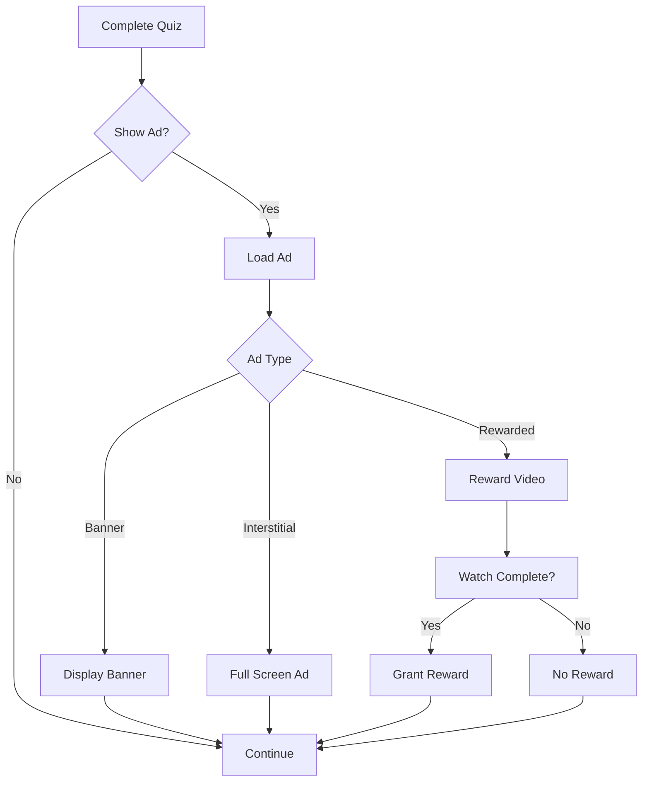

---

## 6. Settings & Profile Flows

### 6.1 Profile Management Flow

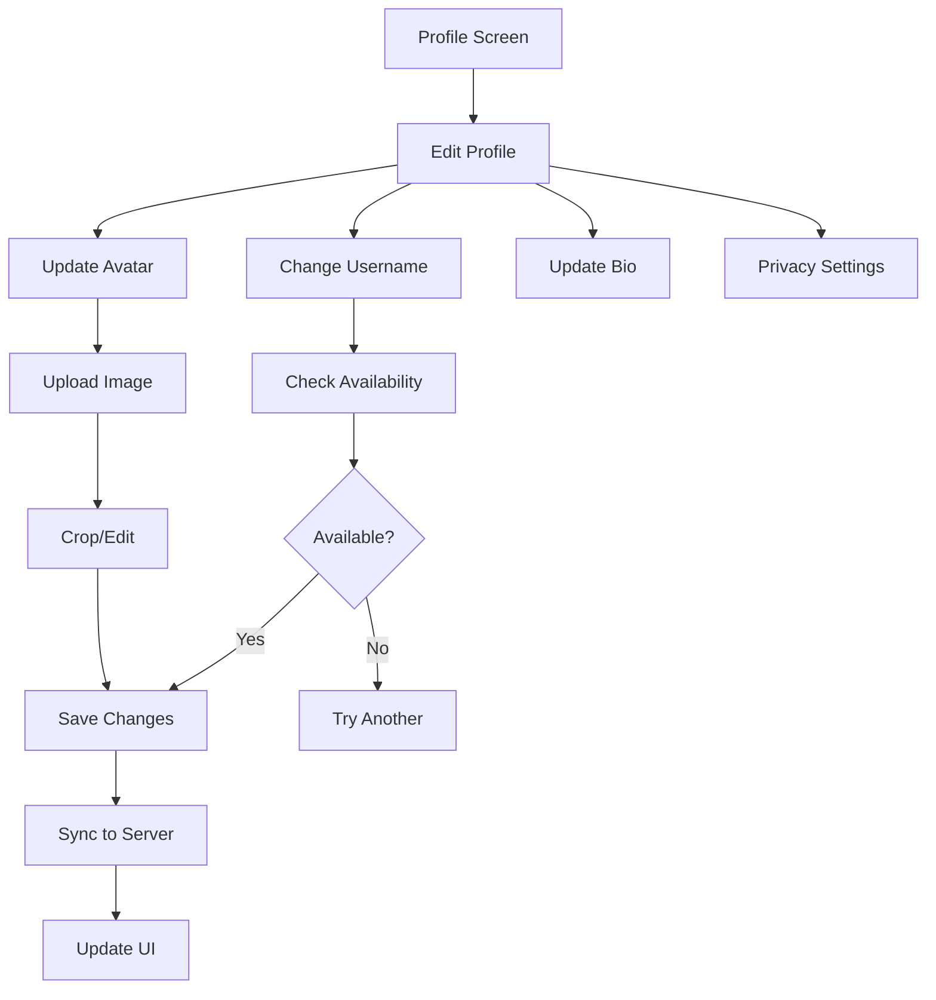

### 6.2 Settings Configuration Flow

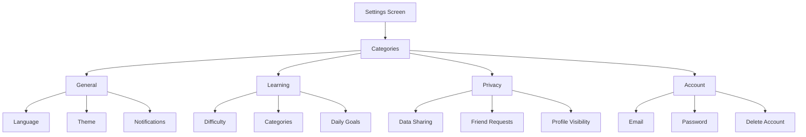

---

## 7. Error Recovery Flows

### 7.1 Network Error Flow

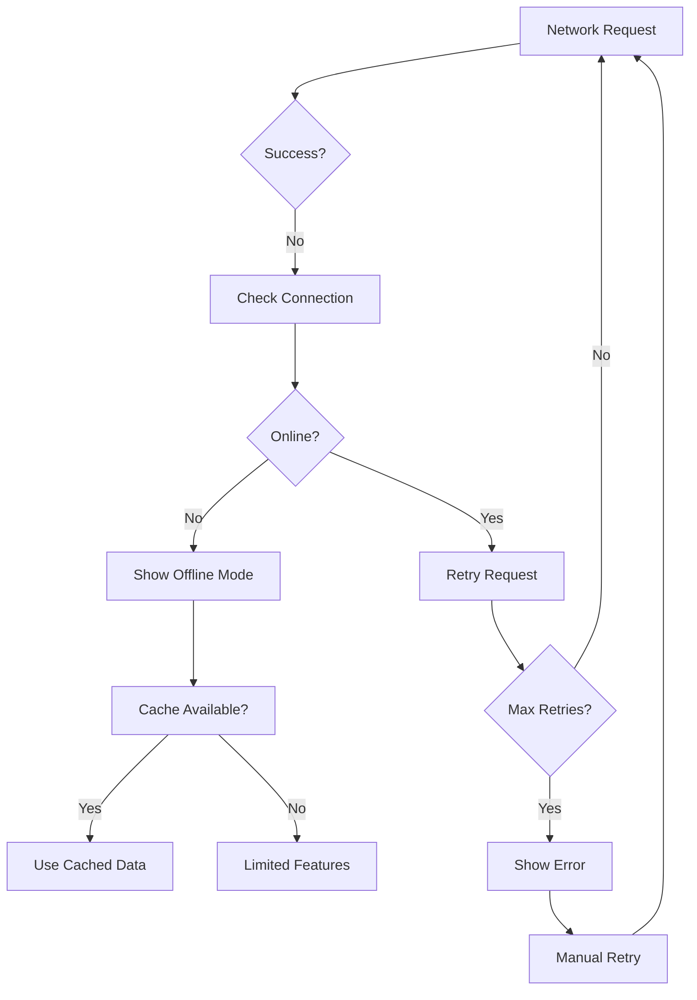

### 7.2 Crash Recovery Flow

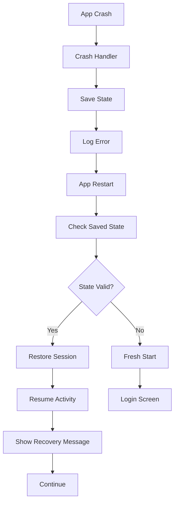

---

## 📊 Flow Analytics & Metrics

### User Journey Completion Rates

| Flow            | Start | Complete | Drop-off | Success Rate |
| --------------- | ----- | -------- | -------- | ------------ |
| Registration    | 100%  | 72%      | 28%      | 72%          |
| First Quiz      | 95%   | 88%      | 7%       | 92.6%        |
| Premium Upgrade | 35%   | 12%      | 23%      | 34.3%        |
| Social Features | 60%   | 45%      | 15%      | 75%          |
| Settings        | 40%   | 38%      | 2%       | 95%          |

### Critical Path Optimization

1. **Onboarding → First Quiz**: 3 screens max
2. **Login → Home**: < 2 seconds
3. **Quiz Start → First Question**: < 1 second
4. **Results → Share**: 2 taps

---

## 🚨 Edge Cases & Error States

### Authentication Edge Cases

- Expired tokens
- OAuth provider failures
- Network timeouts
- Invalid credentials
- Account locked
- Email not verified

### Quiz Edge Cases

- Mid-quiz disconnection
- Timer expiration
- Background/foreground transitions
- Memory warnings
- Simultaneous device usage

### Payment Edge Cases

- Payment declined
- Subscription expired
- Receipt validation failure
- Currency conversion
- Regional restrictions

---

## 🔗 Related Documentation

- [User Journey Architecture](../USER_JOURNEY_ARCHITECTURE.md)
- [API Documentation](../API_DOCUMENTATION.md)
- [Error Handling Guide](../ERROR_HANDLING_GUIDE.md)
- [Testing Scenarios](../TESTING_STRATEGY.md)
