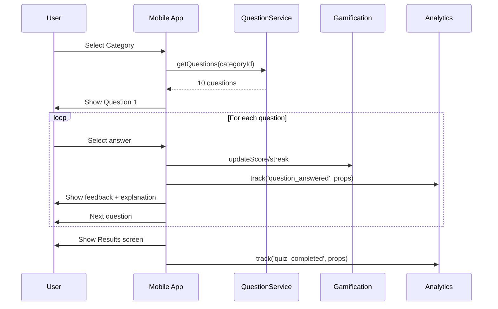

# Quiz Taking Flow

> Status: Complete | Last Updated: 2025-08-28 | Author: Docs Team | Version: 1.0
>
> Current Implementation (2025-08-28)
>
> - Questions load from local fixtures in mock mode; Supabase-backed fetch in real mode.
> - Gamification (XP, streak, stars) wired in UI; persistence via Supabase in real mode.
> - WebSocket mocks (optional) can drive multiplayer timing in demo flows.
>
> Related docs: ../..//WEBSOCKET_API.md, ../../MOCKS_OVERVIEW.md, ../../mocks/SERVICE_MOCKING_ARCHITECTURE.md

## Overview

End-to-end flow from category selection to answering questions and reaching the results screen.

## Flow Diagram

## Key States

- Loading: Fetch questions (or prepare fixtures) and initialize timers
- In-Progress: Track currentQuestionIndex, score, streak, lives
- Completed: Compute final score and navigate to Results

## Mock vs Real

- Mock: Questions come from fixtures; timers and feedback are deterministic
- Real: Questions fetched from Supabase (RLS); analytics recorded; streaks/xp persisted

## Error Handling

- Question fetch failure: fallback to local fixtures, show banner
- Timer issues: freeze timer on background, resume on foreground

## Events to Track

- quiz_start, question_answered, quiz_completed, explanation_viewed, time_spent_per_question

## Storybook Demos (web)

- API/Playground demonstrates HTTP behaviors affecting quiz flows:
  - GET /api/lessons, GET /api/quizzes base data
  - Error variants (ErrorLessons/ErrorQuizzes), timeouts, and empty states
  - Caching (GET /api/cache → ETag/304) and rate limiting (GET /api/ratelimit → 429)
- API/Swagger renders the OpenAPI spec used by the client (public/swagger.json inside Storybook)
- Dev/NetworkPlayground sets global MSW latency/error defaults and shows a request timeline; includes presets (default/slower/flaky/chaos) and a toggle to send `x-msw-no-defaults`
- Toolbar globals: Theme/Platform cosmetic toggles; WS Scenario (for multiplayer timing demos)

## Testing

- Unit: scoring logic, timer behavior, feedback rendering
- E2E: full quiz run on a category
