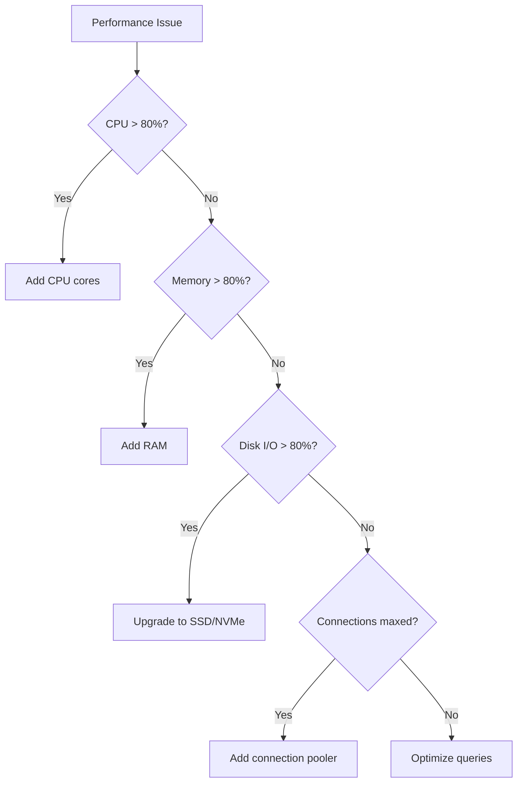

# Database Optimization Runbook

## Table of Contents

1. [Overview](#overview)
2. [Performance Baselines](#performance-baselines)
3. [Query Optimization](#query-optimization)
4. [Indexing Strategies](#indexing-strategies)
5. [Connection Pool Management](#connection-pool-management)
6. [Scaling Patterns](#scaling-patterns)
7. [Supabase-Specific Optimizations](#supabase-specific-optimizations)
8. [Monitoring and Diagnostics](#monitoring-and-diagnostics)
9. [Emergency Procedures](#emergency-procedures)
10. [Maintenance Operations](#maintenance-operations)

## Overview

This runbook provides comprehensive strategies for optimizing QuizMentor's database performance to support 1000+ concurrent users and beyond.

### Key Metrics to Track

```yaml
Performance Targets:
  - Query response time P95: < 100ms
  - Connection pool utilization: < 80%
  - CPU utilization: < 70%
  - Memory usage: < 80%
  - Disk I/O wait: < 10%
  - Replication lag: < 1s
  - Cache hit ratio: > 95%
```

## Performance Baselines

### Load Capacity Formula

```
Database Capacity = (Connections × Queries/Connection/Second) × Cache Hit Ratio

Example for 1000 users:
- Connections available: 200
- Queries per connection per second: 10
- Cache hit ratio: 0.95
- Effective capacity: 200 × 10 × 0.95 = 1900 queries/second
```

### Resource Requirements by User Scale

| Users | CPU Cores | RAM   | Storage | IOPS  | Connections |
| ----- | --------- | ----- | ------- | ----- | ----------- |
| 100   | 2         | 4 GB  | 50 GB   | 1000  | 50          |
| 500   | 4         | 8 GB  | 100 GB  | 3000  | 100         |
| 1000  | 8         | 16 GB | 200 GB  | 5000  | 200         |
| 5000  | 16        | 32 GB | 500 GB  | 10000 | 500         |
| 10000 | 32        | 64 GB | 1 TB    | 20000 | 1000        |

## Query Optimization

### 1. Identify Slow Queries

```sql
-- Find slow queries in PostgreSQL
SELECT
    query,
    calls,
    total_time,
    mean_time,
    stddev_time,
    rows,
    100.0 * shared_blks_hit / nullif(shared_blks_hit + shared_blks_read, 0) AS hit_percent
FROM pg_stat_statements
WHERE query NOT LIKE '%pg_stat_statements%'
ORDER BY mean_time DESC
LIMIT 20;

-- Find queries without indexes
SELECT
    schemaname,
    tablename,
    attname,
    n_distinct,
    correlation
FROM pg_stats
WHERE schemaname NOT IN ('pg_catalog', 'information_schema')
    AND n_distinct > 100
    AND correlation < 0.1
ORDER BY n_distinct DESC;
```

### 2. Query Optimization Patterns

#### N+1 Query Problem

```javascript
// ❌ BAD: N+1 queries
const users = await db.query('SELECT * FROM users WHERE active = true');
for (const user of users) {
  const quizzes = await db.query('SELECT * FROM quizzes WHERE user_id = ?', [user.id]);
  user.quizzes = quizzes;
}

// ✅ GOOD: Single query with JOIN
const usersWithQuizzes = await db.query(`
    SELECT 
        u.*,
        json_agg(
            json_build_object(
                'id', q.id,
                'title', q.title,
                'score', q.score
            ) ORDER BY q.created_at DESC
        ) as quizzes
    FROM users u
    LEFT JOIN quizzes q ON u.id = q.user_id
    WHERE u.active = true
    GROUP BY u.id
`);
```

#### Pagination Optimization

```sql
-- ❌ BAD: OFFSET becomes slow with large datasets
SELECT * FROM events
ORDER BY created_at DESC
LIMIT 20 OFFSET 10000;

-- ✅ GOOD: Cursor-based pagination
SELECT * FROM events
WHERE created_at < '2024-01-15 12:00:00'
ORDER BY created_at DESC
LIMIT 20;
```

#### Batch Operations

```javascript
// ❌ BAD: Individual inserts
for (const answer of answers) {
  await db.query('INSERT INTO answers (question_id, user_id, value) VALUES (?, ?, ?)', [
    answer.questionId,
    answer.userId,
    answer.value,
  ]);
}

// ✅ GOOD: Batch insert
const values = answers.map((a) => `(${a.questionId}, ${a.userId}, '${a.value}')`).join(',');
await db.query(`
    INSERT INTO answers (question_id, user_id, value) 
    VALUES ${values}
    ON CONFLICT (question_id, user_id) 
    DO UPDATE SET value = EXCLUDED.value
`);
```

### 3. Query Optimization Checklist

```markdown
## Query Optimization Checklist

### Before Optimization

- [ ] Run EXPLAIN ANALYZE on the query
- [ ] Check current execution time
- [ ] Note number of rows scanned vs returned
- [ ] Identify missing indexes
- [ ] Check for sequential scans

### Optimization Steps

- [ ] Add appropriate indexes
- [ ] Rewrite subqueries as JOINs where possible
- [ ] Use CTEs for complex queries
- [ ] Implement pagination limits
- [ ] Add query hints if necessary
- [ ] Consider materialized views
- [ ] Implement caching layer

### After Optimization

- [ ] Verify improved execution plan
- [ ] Measure new execution time
- [ ] Test with production-like data volume
- [ ] Monitor for index bloat
- [ ] Document changes
```

## Indexing Strategies

### 1. Essential Indexes for QuizMentor

```sql
-- Primary indexes for user queries
CREATE INDEX CONCURRENTLY idx_users_email ON users(email);
CREATE INDEX CONCURRENTLY idx_users_active ON users(active) WHERE active = true;

-- Quiz and question indexes
CREATE INDEX CONCURRENTLY idx_quizzes_user_id ON quizzes(user_id);
CREATE INDEX CONCURRENTLY idx_quizzes_created_at ON quizzes(created_at DESC);
CREATE INDEX CONCURRENTLY idx_questions_quiz_id ON questions(quiz_id);
CREATE INDEX CONCURRENTLY idx_questions_difficulty ON questions(difficulty);

-- Answer and performance indexes
CREATE INDEX CONCURRENTLY idx_answers_user_question ON answers(user_id, question_id);
CREATE INDEX CONCURRENTLY idx_user_performance_composite ON user_performance(user_id, topic, created_at DESC);

-- Full-text search indexes
CREATE INDEX CONCURRENTLY idx_questions_search ON questions USING gin(to_tsvector('english', question_text));

-- JSONB indexes for metadata
CREATE INDEX CONCURRENTLY idx_quiz_metadata ON quizzes USING gin(metadata);

-- Partial indexes for common queries
CREATE INDEX CONCURRENTLY idx_active_quizzes ON quizzes(created_at DESC)
WHERE status = 'active';
```

### 2. Index Maintenance

```sql
-- Check index usage
SELECT
    schemaname,
    tablename,
    indexname,
    idx_scan,
    idx_tup_read,
    idx_tup_fetch,
    pg_size_pretty(pg_relation_size(indexrelid)) as index_size
FROM pg_stat_user_indexes
ORDER BY idx_scan;

-- Find duplicate indexes
SELECT
    pg_size_pretty(sum(pg_relation_size(idx))::bigint) as size,
    (array_agg(idx))[1] as idx1,
    (array_agg(idx))[2] as idx2,
    (array_agg(idx))[3] as idx3,
    (array_agg(idx))[4] as idx4
FROM (
    SELECT indexrelid::regclass as idx,
           (indrelid::text ||E'\n'|| indclass::text ||E'\n'||
            indkey::text ||E'\n'|| coalesce(indexprs::text,'')||E'\n' ||
            coalesce(indpred::text,'')) as key
    FROM pg_index
) sub
GROUP BY key
HAVING count(*)>1
ORDER BY sum(pg_relation_size(idx)) DESC;

-- Rebuild bloated indexes
REINDEX INDEX CONCURRENTLY idx_name;
```

### 3. Index Strategy Matrix

| Query Type | Index Type | Example                        | Use Case      |
| ---------- | ---------- | ------------------------------ | ------------- |
| Equality   | B-tree     | `WHERE user_id = ?`            | Most common   |
| Range      | B-tree     | `WHERE created_at > ?`         | Time series   |
| Pattern    | B-tree/GIN | `WHERE email LIKE ?`           | Prefix search |
| Full-text  | GIN/GiST   | `WHERE to_tsvector(text) @@ ?` | Search        |
| JSON       | GIN        | `WHERE metadata @> ?`          | JSONB queries |
| Spatial    | GiST       | `WHERE location && ?`          | Geo queries   |
| Array      | GIN        | `WHERE tags @> ARRAY[?]`       | Tag filtering |

## Connection Pool Management

### 1. Optimal Pool Configuration

```javascript
// Node.js pg-pool configuration
const poolConfig = {
  // Connection settings
  host: process.env.DB_HOST,
  port: 5432,
  database: process.env.DB_NAME,
  user: process.env.DB_USER,
  password: process.env.DB_PASSWORD,

  // Pool settings for 1000 users
  max: 20, // Maximum connections per app instance
  min: 5, // Minimum idle connections
  idleTimeoutMillis: 30000, // Close idle connections after 30s
  connectionTimeoutMillis: 2000, // Timeout acquiring connection

  // Statement timeout to prevent long-running queries
  statement_timeout: 5000,
  query_timeout: 5000,

  // Connection lifetime
  maxLifetimeSeconds: 3600, // Recreate connections hourly

  // Application name for monitoring
  application_name: 'quizmentor-api',
};

// With 10 app instances: 10 × 20 = 200 total connections
```

### 2. Connection Pool Monitoring

```sql
-- Current connection stats
SELECT
    datname,
    numbackends,
    xact_commit,
    xact_rollback,
    blks_read,
    blks_hit,
    tup_returned,
    tup_fetched,
    tup_inserted,
    tup_updated,
    tup_deleted
FROM pg_stat_database
WHERE datname = 'quizmentor';

-- Active connections by state
SELECT
    state,
    count(*),
    max(now() - state_change) as max_duration
FROM pg_stat_activity
WHERE datname = 'quizmentor'
GROUP BY state;

-- Connection pool efficiency
SELECT
    wait_event_type,
    wait_event,
    count(*)
FROM pg_stat_activity
WHERE wait_event IS NOT NULL
GROUP BY wait_event_type, wait_event
ORDER BY count(*) DESC;
```

### 3. PgBouncer Configuration (Supabase)

```ini
[databases]
quizmentor = host=db.supabase.co port=5432 dbname=postgres

[pgbouncer]
# Pool mode (transaction is most efficient)
pool_mode = transaction

# Connection limits
max_client_conn = 1000        # Total client connections
default_pool_size = 25         # Per user/database pair
min_pool_size = 5
reserve_pool_size = 5

# Timeouts
server_idle_timeout = 600
server_lifetime = 3600
query_wait_timeout = 120

# Performance
pkt_buf = 8192
server_reset_query_always = 0
```

## Scaling Patterns

### 1. Vertical Scaling Decision Tree



### 2. Read Replica Implementation

```sql
-- Create read replica (Supabase)
-- This is handled via Supabase dashboard, but here's the concept:

-- Application-level read/write splitting
const writePool = new Pool({
    host: 'db.supabase.co',
    // ... write connection config
});

const readPool = new Pool({
    host: 'read-replica.supabase.co',
    // ... read connection config
});

// Route queries appropriately
async function executeQuery(query, params, isWrite = false) {
    const pool = isWrite ? writePool : readPool;
    return await pool.query(query, params);
}

// Monitor replication lag
SELECT
    now() - pg_last_xact_replay_timestamp() AS replication_lag;
```

### 3. Sharding Strategy (5000+ users)

```javascript
// User-based sharding
function getShardForUser(userId) {
  const shardCount = 4;
  return userId % shardCount;
}

const shardPools = [
  new Pool({ host: 'shard0.db.com' }),
  new Pool({ host: 'shard1.db.com' }),
  new Pool({ host: 'shard2.db.com' }),
  new Pool({ host: 'shard3.db.com' }),
];

async function queryUserData(userId, query, params) {
  const shardId = getShardForUser(userId);
  return await shardPools[shardId].query(query, params);
}

// Cross-shard queries
async function globalSearch(searchTerm) {
  const promises = shardPools.map((pool) =>
    pool.query('SELECT * FROM quizzes WHERE title ILIKE $1', [`%${searchTerm}%`]),
  );
  const results = await Promise.all(promises);
  return results.flat();
}
```

### 4. Database Scaling Roadmap

```yaml
Phase 1 (0-500 users):
  - Single database
  - Basic indexes
  - 4 CPU, 8GB RAM
  - Cost: ~$50/month

Phase 2 (500-1000 users):
  - Connection pooling (PgBouncer)
  - Read replica
  - Query optimization
  - 8 CPU, 16GB RAM
  - Cost: ~$200/month

Phase 3 (1000-5000 users):
  - Multiple read replicas
  - Materialized views
  - Redis caching layer
  - 16 CPU, 32GB RAM
  - Cost: ~$800/month

Phase 4 (5000+ users):
  - Database sharding
  - Dedicated cache clusters
  - CDC for real-time sync
  - 32+ CPU, 64GB+ RAM
  - Cost: ~$2000+/month
```

## Supabase-Specific Optimizations

### 1. Row Level Security (RLS) Optimization

```sql
-- Efficient RLS policies
-- ❌ BAD: Complex subquery in policy
CREATE POLICY user_quiz_access ON quizzes
    FOR SELECT
    USING (
        EXISTS (
            SELECT 1 FROM user_permissions up
            JOIN permission_groups pg ON up.group_id = pg.id
            WHERE up.user_id = auth.uid()
            AND pg.resource_type = 'quiz'
            AND pg.resource_id = quizzes.id
        )
    );

-- ✅ GOOD: Simplified with proper indexes
CREATE POLICY user_quiz_access ON quizzes
    FOR SELECT
    USING (
        user_id = auth.uid()
        OR
        is_public = true
        OR
        auth.uid() = ANY(shared_with_users)
    );

CREATE INDEX idx_quizzes_user_id ON quizzes(user_id);
CREATE INDEX idx_quizzes_public ON quizzes(is_public) WHERE is_public = true;
CREATE INDEX idx_quizzes_shared ON quizzes USING gin(shared_with_users);
```

### 2. Supabase Connection Optimization

```javascript
// Optimize Supabase client initialization
import { createClient } from '@supabase/supabase-js';

const supabaseClient = createClient(process.env.SUPABASE_URL, process.env.SUPABASE_ANON_KEY, {
  auth: {
    persistSession: false, // For server-side
    autoRefreshToken: false,
  },
  db: {
    schema: 'public',
  },
  global: {
    headers: {
      'x-application-name': 'quizmentor-api',
    },
  },
  realtime: {
    params: {
      eventsPerSecond: 10, // Rate limit realtime
    },
  },
});

// Use prepared statements
const preparedQueries = {
  getUser: supabaseClient.rpc('get_user_with_stats'),
  getQuizzes: supabaseClient.rpc('get_user_quizzes'),
};
```

### 3. Supabase Performance Settings

```sql
-- Optimize Supabase database settings
ALTER DATABASE postgres SET statement_timeout = '5s';
ALTER DATABASE postgres SET lock_timeout = '2s';
ALTER DATABASE postgres SET idle_in_transaction_session_timeout = '10s';

-- Configure autovacuum for high-traffic tables
ALTER TABLE quizzes SET (
    autovacuum_vacuum_scale_factor = 0.1,
    autovacuum_analyze_scale_factor = 0.05,
    autovacuum_vacuum_cost_delay = 10
);

-- Enable query performance insights
CREATE EXTENSION IF NOT EXISTS pg_stat_statements;
```

## Monitoring and Diagnostics

### 1. Key Metrics Dashboard

```sql
-- Create monitoring view
CREATE OR REPLACE VIEW db_health_metrics AS
SELECT
    -- Connection metrics
    (SELECT count(*) FROM pg_stat_activity) as active_connections,
    (SELECT count(*) FROM pg_stat_activity WHERE state = 'idle') as idle_connections,
    (SELECT count(*) FROM pg_stat_activity WHERE wait_event_type IS NOT NULL) as waiting_connections,

    -- Performance metrics
    (SELECT sum(xact_commit) FROM pg_stat_database WHERE datname = current_database()) as total_commits,
    (SELECT sum(xact_rollback) FROM pg_stat_database WHERE datname = current_database()) as total_rollbacks,
    (SELECT sum(blks_hit)::float / (sum(blks_hit) + sum(blks_read))::float * 100
     FROM pg_stat_database WHERE datname = current_database()) as cache_hit_ratio,

    -- Table metrics
    (SELECT pg_size_pretty(pg_database_size(current_database()))) as database_size,
    (SELECT count(*) FROM pg_stat_user_tables WHERE n_dead_tup > 1000) as tables_need_vacuum,

    -- Replication metrics (if applicable)
    (SELECT CASE
        WHEN pg_is_in_recovery()
        THEN extract(epoch from (now() - pg_last_xact_replay_timestamp()))
        ELSE 0
     END) as replication_lag_seconds;
```

### 2. Performance Monitoring Queries

```sql
-- Top queries by total time
SELECT
    query,
    calls,
    total_time,
    mean_time,
    max_time,
    stddev_time
FROM pg_stat_statements
ORDER BY total_time DESC
LIMIT 10;

-- Lock monitoring
SELECT
    blocked_locks.pid AS blocked_pid,
    blocked_activity.usename AS blocked_user,
    blocking_locks.pid AS blocking_pid,
    blocking_activity.usename AS blocking_user,
    blocked_activity.query AS blocked_statement,
    blocking_activity.query AS current_statement_in_blocking_process
FROM pg_catalog.pg_locks blocked_locks
JOIN pg_catalog.pg_stat_activity blocked_activity ON blocked_activity.pid = blocked_locks.pid
JOIN pg_catalog.pg_locks blocking_locks
    ON blocking_locks.locktype = blocked_locks.locktype
    AND blocking_locks.database IS NOT DISTINCT FROM blocked_locks.database
    AND blocking_locks.relation IS NOT DISTINCT FROM blocked_locks.relation
    AND blocking_locks.page IS NOT DISTINCT FROM blocked_locks.page
    AND blocking_locks.tuple IS NOT DISTINCT FROM blocked_locks.tuple
    AND blocking_locks.virtualxid IS NOT DISTINCT FROM blocked_locks.virtualxid
    AND blocking_locks.transactionid IS NOT DISTINCT FROM blocked_locks.transactionid
    AND blocking_locks.classid IS NOT DISTINCT FROM blocked_locks.classid
    AND blocking_locks.objid IS NOT DISTINCT FROM blocked_locks.objid
    AND blocking_locks.objsubid IS NOT DISTINCT FROM blocked_locks.objsubid
    AND blocking_locks.pid != blocked_locks.pid
JOIN pg_catalog.pg_stat_activity blocking_activity ON blocking_activity.pid = blocking_locks.pid
WHERE NOT blocked_locks.granted;
```

### 3. Alerting Thresholds

```yaml
alerts:
  - name: high_connection_usage
    condition: active_connections > 180 # 90% of max
    severity: warning

  - name: critical_connection_usage
    condition: active_connections > 190 # 95% of max
    severity: critical

  - name: low_cache_hit_ratio
    condition: cache_hit_ratio < 90
    severity: warning

  - name: high_replication_lag
    condition: replication_lag_seconds > 10
    severity: critical

  - name: long_running_query
    condition: query_duration > 30000 # 30 seconds
    severity: warning

  - name: high_lock_waits
    condition: waiting_connections > 10
    severity: warning
```

## Emergency Procedures

### 1. Database Overload Response

```bash
#!/bin/bash
# emergency-db-response.sh

echo "🚨 Database Emergency Response Initiated"

# Step 1: Identify and kill long-running queries
psql -c "
SELECT pg_terminate_backend(pid)
FROM pg_stat_activity
WHERE datname = 'quizmentor'
  AND state != 'idle'
  AND query_start < now() - interval '5 minutes'
  AND query NOT ILIKE '%pg_stat_activity%';
"

# Step 2: Clear idle connections
psql -c "
SELECT pg_terminate_backend(pid)
FROM pg_stat_activity
WHERE datname = 'quizmentor'
  AND state = 'idle'
  AND state_change < now() - interval '10 minutes';
"

# Step 3: Emergency VACUUM
psql -c "VACUUM ANALYZE;"

# Step 4: Reset connection pool
supervisorctl restart pgbouncer

# Step 5: Scale up (if using cloud)
doctl databases resize <db-id> --size db-s-8vcpu-16gb --wait

echo "✅ Emergency response complete"
```

### 2. Runaway Query Mitigation

```sql
-- Find and kill problematic queries
WITH long_queries AS (
    SELECT
        pid,
        now() - query_start AS duration,
        query,
        state
    FROM pg_stat_activity
    WHERE state != 'idle'
    AND query_start < now() - interval '2 minutes'
    ORDER BY duration DESC
)
SELECT
    pg_terminate_backend(pid),
    duration,
    query
FROM long_queries
LIMIT 5;

-- Prevent future issues
ALTER DATABASE quizmentor SET statement_timeout = '30s';
```

### 3. Connection Exhaustion Recovery

```javascript
// Circuit breaker for database connections
class DatabaseCircuitBreaker {
  constructor(pool) {
    this.pool = pool;
    this.failures = 0;
    this.threshold = 5;
    this.timeout = 60000; // 1 minute
    this.state = 'CLOSED';
    this.nextAttempt = Date.now();
  }

  async query(text, params) {
    if (this.state === 'OPEN') {
      if (Date.now() < this.nextAttempt) {
        throw new Error('Circuit breaker is OPEN');
      }
      this.state = 'HALF_OPEN';
    }

    try {
      const result = await this.pool.query(text, params);
      this.onSuccess();
      return result;
    } catch (error) {
      this.onFailure();
      throw error;
    }
  }

  onSuccess() {
    this.failures = 0;
    this.state = 'CLOSED';
  }

  onFailure() {
    this.failures++;
    if (this.failures >= this.threshold) {
      this.state = 'OPEN';
      this.nextAttempt = Date.now() + this.timeout;
      console.error('Circuit breaker opened due to failures');
    }
  }
}
```

## Maintenance Operations

### 1. Regular Maintenance Schedule

```yaml
daily:
  - task: 'VACUUM ANALYZE high_traffic_tables'
    time: '02:00 UTC'
    impact: 'minimal'

  - task: 'Update table statistics'
    time: '03:00 UTC'
    impact: 'none'

weekly:
  - task: 'REINDEX CONCURRENTLY bloated_indexes'
    time: 'Sunday 04:00 UTC'
    impact: 'minimal'

  - task: 'Full database backup'
    time: 'Sunday 05:00 UTC'
    impact: 'minimal'

monthly:
  - task: 'VACUUM FULL low_traffic_tables'
    time: 'First Sunday 06:00 UTC'
    impact: 'moderate'

  - task: 'Analyze slow query log'
    time: 'First Monday'
    impact: 'none'

quarterly:
  - task: 'Review and update indexes'
    time: 'First week'
    impact: 'varies'

  - task: 'Capacity planning review'
    time: 'Second week'
    impact: 'none'
```

### 2. Vacuum Strategy

```sql
-- Identify tables needing vacuum
SELECT
    schemaname,
    tablename,
    n_live_tup,
    n_dead_tup,
    round(n_dead_tup::numeric / NULLIF(n_live_tup, 0), 4) AS dead_ratio,
    last_vacuum,
    last_autovacuum
FROM pg_stat_user_tables
WHERE n_dead_tup > 1000
ORDER BY dead_ratio DESC;

-- Custom autovacuum settings for hot tables
ALTER TABLE user_sessions SET (
    autovacuum_vacuum_threshold = 50,
    autovacuum_vacuum_scale_factor = 0.05,
    autovacuum_analyze_threshold = 50,
    autovacuum_analyze_scale_factor = 0.02
);
```

### 3. Backup and Recovery

```bash
#!/bin/bash
# backup-database.sh

# Backup with parallel jobs
pg_dump \
    --dbname=$DATABASE_URL \
    --jobs=4 \
    --format=directory \
    --verbose \
    --file=/backups/$(date +%Y%m%d_%H%M%S) \
    --exclude-table-data='audit_logs' \
    --exclude-table-data='temporary_*'

# Point-in-time recovery setup
postgres -c wal_level=replica \
         -c archive_mode=on \
         -c archive_command='aws s3 cp %p s3://backups/wal/%f'

# Restore procedure
pg_restore \
    --dbname=$DATABASE_URL \
    --jobs=4 \
    --verbose \
    --clean \
    --if-exists \
    /backups/20240115_120000
```

## Performance Testing

### 1. Database Load Test

```sql
-- Generate test load
DO $$
DECLARE
    i INTEGER;
BEGIN
    FOR i IN 1..1000 LOOP
        PERFORM * FROM quizzes
        WHERE user_id = (random() * 1000)::int
        ORDER BY created_at DESC
        LIMIT 10;

        PERFORM pg_sleep(0.01); -- 10ms between queries
    END LOOP;
END $$;
```

### 2. Connection Pool Test

```javascript
// Test connection pool limits
async function testConnectionPool() {
  const promises = [];
  const concurrency = 100;

  for (let i = 0; i < concurrency; i++) {
    promises.push(
      pool
        .query('SELECT pg_sleep(1)')
        .then(() => ({ success: true, id: i }))
        .catch((err) => ({ success: false, id: i, error: err.message })),
    );
  }

  const results = await Promise.all(promises);
  const failures = results.filter((r) => !r.success);

  console.log(`Success: ${results.length - failures.length}/${concurrency}`);
  console.log(`Failures: ${failures.length}`);

  return results;
}
```

## Best Practices Summary

1. **Monitor continuously** - Set up alerts before issues occur
2. **Index strategically** - Don't over-index, maintain regularly
3. **Pool connections** - Never connect directly from application
4. **Cache aggressively** - Reduce database load with Redis
5. **Optimize queries** - Profile and improve slow queries
6. **Plan capacity** - Scale before hitting limits
7. **Backup regularly** - Test restore procedures
8. **Document changes** - Track all optimizations
9. **Use read replicas** - Distribute read load
10. **Implement circuit breakers** - Fail fast when overloaded
