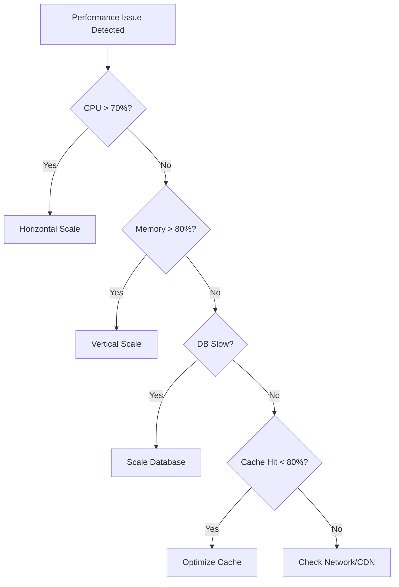

# QuizMentor Scaling Runbook

## Table of Contents

1. [Scaling Triggers](#scaling-triggers)
2. [Horizontal Scaling](#horizontal-scaling)
3. [Vertical Scaling](#vertical-scaling)
4. [Database Scaling](#database-scaling)
5. [Caching Strategy](#caching-strategy)
6. [Cost Optimization](#cost-optimization)
7. [Performance Monitoring](#performance-monitoring)

---

## Scaling Triggers

### Automatic Scaling Metrics

```yaml
# Scaling triggers configuration
scaling_triggers:
  cpu_threshold: 70% # Scale when CPU > 70% for 5 minutes
  memory_threshold: 80% # Scale when Memory > 80% for 5 minutes
  request_rate: 1000 req/s # Scale when RPS > 1000
  response_time: 500ms # Scale when p95 latency > 500ms
  error_rate: 1% # Alert when error rate > 1%
```

### Manual Scaling Decision Tree



---

## Horizontal Scaling

### DigitalOcean App Platform Auto-Scaling

```yaml
# .do/app-autoscale.yaml
name: quizmentor-api
region: nyc

services:
  - name: api
    github:
      repo: your-org/quizmentor
      branch: main

    # Auto-scaling configuration
    instance_size: professional-xs
    instance_count_min: 2
    instance_count_max: 10

    # Scaling rules
    autoscaling_rules:
      - metric: CPU_UTILIZATION
        target_value: 70
        scale_up_rate: 1
        scale_down_rate: 0.5

      - metric: RPS
        target_value: 500
        scale_up_rate: 2
        scale_down_rate: 1

    # Health check for proper scaling
    health_check:
      http_path: /health
      initial_delay_seconds: 10
      period_seconds: 10
      timeout_seconds: 5
      success_threshold: 1
      failure_threshold: 3
```

### Manual Horizontal Scaling

```bash
#!/bin/bash
# horizontal-scale.sh

CURRENT_COUNT=$(doctl apps get $APP_ID --format Spec.Services[0].InstanceCount --no-header)
NEW_COUNT=$((CURRENT_COUNT + $1))

echo "Scaling from $CURRENT_COUNT to $NEW_COUNT instances"

# Update instance count
doctl apps update $APP_ID --spec <(cat <<EOF
services:
  - name: api
    instance_count: $NEW_COUNT
EOF
)

# Wait for new instances to be healthy
sleep 60

# Verify scaling
doctl apps get $APP_ID --format Spec.Services[0].InstanceCount
```

### Load Balancer Configuration

```nginx
# nginx.conf for custom load balancing
upstream quizmentor_backend {
    least_conn;  # Use least connections algorithm

    server api-1.quizmentor.app:8080 weight=1 max_fails=3 fail_timeout=30s;
    server api-2.quizmentor.app:8080 weight=1 max_fails=3 fail_timeout=30s;
    server api-3.quizmentor.app:8080 weight=1 max_fails=3 fail_timeout=30s;

    # Health check
    keepalive 32;
    keepalive_timeout 60s;
}

server {
    listen 80;
    server_name api.quizmentor.app;

    location / {
        proxy_pass http://quizmentor_backend;
        proxy_next_upstream error timeout http_500 http_502 http_503;
        proxy_connect_timeout 5s;
        proxy_send_timeout 60s;
        proxy_read_timeout 60s;

        # Headers for proper proxying
        proxy_set_header Host $host;
        proxy_set_header X-Real-IP $remote_addr;
        proxy_set_header X-Forwarded-For $proxy_add_x_forwarded_for;
        proxy_set_header X-Forwarded-Proto $scheme;
    }
}
```

---

## Vertical Scaling

### DigitalOcean Droplet Sizes

```bash
# Current size mapping
DROPLET_SIZES=(
  "s-1vcpu-1gb"    # $6/month
  "s-1vcpu-2gb"    # $12/month
  "s-2vcpu-2gb"    # $18/month
  "s-2vcpu-4gb"    # $24/month
  "s-4vcpu-8gb"    # $48/month
  "c-2"            # $42/month (CPU optimized)
  "c-4"            # $84/month (CPU optimized)
  "m-2vcpu-16gb"   # $84/month (Memory optimized)
)
```

### Vertical Scaling Process

```bash
#!/bin/bash
# vertical-scale.sh

# 1. Create snapshot before scaling
doctl compute droplet-action snapshot $DROPLET_ID --snapshot-name "pre-scale-$(date +%Y%m%d)"

# 2. Power off droplet
doctl compute droplet-action power-off $DROPLET_ID --wait

# 3. Resize droplet
doctl compute droplet-action resize $DROPLET_ID --size $NEW_SIZE --wait

# 4. Power on droplet
doctl compute droplet-action power-on $DROPLET_ID --wait

# 5. Verify new size
doctl compute droplet get $DROPLET_ID --format Size

# 6. Run health checks
./scripts/health-check.sh
```

### App Platform Vertical Scaling

```yaml
# Scale instance sizes
sizes:
  basic-xxs: # 1 vCPU, 512MB RAM - $5/month
  basic-xs: # 1 vCPU, 1GB RAM - $12/month
  basic-s: # 1 vCPU, 2GB RAM - $25/month
  professional-xs: # 1 vCPU, 1GB RAM - $20/month
  professional-s: # 2 vCPU, 4GB RAM - $40/month
  professional-m: # 2 vCPU, 8GB RAM - $80/month
  professional-l: # 4 vCPU, 16GB RAM - $160/month
```

---

## Database Scaling

### Supabase Database Tiers

```yaml
# Supabase scaling options
database_tiers:
  free:
    storage: 500MB
    monthly_cost: $0

  pro:
    storage: 8GB
    dedicated_cpu: 2
    memory: 8GB
    monthly_cost: $25

  team:
    storage: 100GB
    dedicated_cpu: 4
    memory: 16GB
    monthly_cost: $599

  custom:
    storage: unlimited
    dedicated_cpu: 32+
    memory: 128GB+
    monthly_cost: custom
```

### Database Optimization Scripts

```sql
-- 1. Analyze query performance
EXPLAIN (ANALYZE, BUFFERS)
SELECT * FROM questions
WHERE topic = 'science'
AND difficulty = 'hard';

-- 2. Create optimized indexes
CREATE INDEX CONCURRENTLY idx_questions_topic_difficulty
ON questions(topic, difficulty)
WHERE is_active = true;

-- 3. Partition large tables
CREATE TABLE user_sessions_2024 PARTITION OF user_sessions
FOR VALUES FROM ('2024-01-01') TO ('2025-01-01');

-- 4. Connection pooling configuration
ALTER SYSTEM SET max_connections = 200;
ALTER SYSTEM SET shared_buffers = '4GB';
ALTER SYSTEM SET effective_cache_size = '12GB';
ALTER SYSTEM SET work_mem = '16MB';

-- 5. Vacuum and analyze
VACUUM (VERBOSE, ANALYZE) questions;
REINDEX TABLE questions;
```

### Read Replica Setup

```bash
#!/bin/bash
# setup-read-replica.sh

# 1. Create read replica in Supabase
REPLICA_URL=$(supabase db replicas create \
  --project-ref $PROJECT_REF \
  --region us-west-1 \
  --size medium)

# 2. Update application to use read replica
cat > config/database.yml <<EOF
production:
  primary:
    url: $PRIMARY_DATABASE_URL
  replica:
    url: $REPLICA_URL

# Read/write splitting
read_preference: :replica
write_preference: :primary
EOF

# 3. Test replica connectivity
psql $REPLICA_URL -c "SELECT pg_is_in_recovery();"
```

### Database Connection Pooling

```javascript
// db-pool-config.js
const { Pool } = require('pg');
const pgBouncer = require('pgbouncer');

// PgBouncer configuration
const poolConfig = {
  // Connection settings
  max: 100, // Maximum connections
  min: 10, // Minimum connections
  idleTimeoutMillis: 30000, // Close idle connections after 30s
  connectionTimeoutMillis: 2000, // Timeout acquiring connection

  // Statement pooling
  statement_timeout: 60000, // 60 second statement timeout
  query_timeout: 30000, // 30 second query timeout

  // Health checks
  keepAlive: true,
  keepAliveInitialDelayMillis: 10000,
};

// Initialize pool
const pool = new Pool({
  connectionString: process.env.DATABASE_URL,
  ...poolConfig,
});

// Monitor pool
pool.on('connect', () => {
  console.log('New client connected to pool');
});

pool.on('error', (err) => {
  console.error('Unexpected pool error', err);
});

module.exports = pool;
```

---

## Caching Strategy

### Multi-Layer Cache Architecture

```javascript
// cache-strategy.js

class CacheManager {
  constructor() {
    this.layers = {
      L1: new MemoryCache({ maxSize: '100MB', ttl: 60 }), // In-memory
      L2: new RedisCache({ url: process.env.REDIS_URL }), // Redis
      L3: new CDNCache({ provider: 'cloudflare' }), // CDN
      L4: new DatabaseCache(), // Database
    };
  }

  async get(key) {
    // Try each layer
    for (const [name, cache] of Object.entries(this.layers)) {
      const value = await cache.get(key);
      if (value) {
        console.log(`Cache hit at ${name} for ${key}`);
        // Promote to higher layers
        this.promote(key, value, name);
        return value;
      }
    }
    return null;
  }

  async set(key, value, ttl = 3600) {
    // Set in all layers with different TTLs
    await this.layers.L1.set(key, value, ttl / 60); // 1 minute
    await this.layers.L2.set(key, value, ttl); // 1 hour
    await this.layers.L3.set(key, value, ttl * 24); // 1 day
    await this.layers.L4.set(key, value, ttl * 24 * 7); // 1 week
  }
}
```

### Redis Scaling Configuration

```bash
#!/bin/bash
# scale-redis.sh

# 1. Enable Redis cluster mode
redis-cli CONFIG SET cluster-enabled yes

# 2. Add Redis nodes
for i in {1..3}; do
  doctl databases create redis-node-$i \
    --engine redis \
    --version 7 \
    --size db-s-2vcpu-4gb \
    --region nyc1
done

# 3. Create cluster
redis-cli --cluster create \
  redis-node-1.db.ondigitalocean.com:25061 \
  redis-node-2.db.ondigitalocean.com:25061 \
  redis-node-3.db.ondigitalocean.com:25061 \
  --cluster-replicas 1

# 4. Configure eviction policy
redis-cli CONFIG SET maxmemory-policy allkeys-lru
redis-cli CONFIG SET maxmemory 4gb
```

### CDN Cache Rules

```javascript
// cloudflare-cache-rules.js
const cacheRules = {
  // Static assets - cache forever
  '/assets/*': {
    browserTTL: 31536000, // 1 year
    edgeTTL: 31536000, // 1 year
    cacheEverything: true,
  },

  // API responses - cache briefly
  '/api/questions': {
    browserTTL: 60, // 1 minute
    edgeTTL: 300, // 5 minutes
    respectOrigin: true,
  },

  // User-specific - no cache
  '/api/user/*': {
    browserTTL: 0,
    edgeTTL: 0,
    bypassCache: true,
  },

  // Admin - no cache
  '/admin/*': {
    browserTTL: 0,
    edgeTTL: 0,
    bypassCache: true,
  },
};
```

---

## Cost Optimization

### Resource Monitoring

```bash
#!/bin/bash
# cost-monitor.sh

# Get current costs
TOTAL_COST=0

# DigitalOcean costs
DO_APPS=$(doctl apps list --format ID --no-header)
for app in $DO_APPS; do
  COST=$(doctl apps get $app --format "LiveDomain" | calculate_cost)
  TOTAL_COST=$((TOTAL_COST + COST))
done

# Supabase costs
SUPABASE_COST=25  # Pro plan

# Calculate projected monthly cost
PROJECTED_MONTHLY=$((TOTAL_COST * 30))

# Alert if over budget
if [ $PROJECTED_MONTHLY -gt 200 ]; then
  ./scripts/notify-slack.sh "⚠️ Monthly cost projection: \$$PROJECTED_MONTHLY (Budget: \$200)"
fi
```

### Automatic Cost Optimization

```javascript
// cost-optimizer.js

class CostOptimizer {
  async optimizeResources() {
    const metrics = await this.getMetrics();

    // 1. Downscale during off-peak hours
    if (this.isOffPeak() && metrics.cpu < 30) {
      await this.scaleDown();
    }

    // 2. Use spot instances for batch jobs
    if (metrics.batchJobsPending > 0) {
      await this.useSpotInstances();
    }

    // 3. Clean up unused resources
    await this.cleanupUnused();

    // 4. Optimize database
    if (metrics.dbSize > 5000000000) {
      // 5GB
      await this.archiveOldData();
    }

    // 5. Compress assets
    await this.compressAssets();
  }

  async scaleDown() {
    const minInstances = this.isWeekend() ? 1 : 2;
    await doctl.apps.update({
      instance_count: minInstances,
    });
  }

  async archiveOldData() {
    // Move old data to cheaper storage
    await db.query(`
      INSERT INTO archived_sessions 
      SELECT * FROM user_sessions 
      WHERE created_at < NOW() - INTERVAL '90 days'
    `);

    await db.query(`
      DELETE FROM user_sessions 
      WHERE created_at < NOW() - INTERVAL '90 days'
    `);
  }
}
```

### Scheduled Scaling

```yaml
# .github/workflows/scheduled-scaling.yml
name: Scheduled Scaling

on:
  schedule:
    # Scale up at 7 AM EST (12 PM UTC) on weekdays
    - cron: '0 12 * * 1-5'
    # Scale down at 10 PM EST (3 AM UTC)
    - cron: '0 3 * * *'
    # Weekend scaling
    - cron: '0 12 * * 0,6'

jobs:
  scale:
    runs-on: ubuntu-latest
    steps:
      - name: Determine scaling action
        id: scaling
        run: |
          HOUR=$(date +%H)
          DAY=$(date +%u)

          if [ $HOUR -ge 7 ] && [ $HOUR -le 22 ] && [ $DAY -le 5 ]; then
            echo "::set-output name=action::scale-up"
            echo "::set-output name=count::3"
          else
            echo "::set-output name=action::scale-down"
            echo "::set-output name=count::1"
          fi

      - name: Scale application
        env:
          DIGITALOCEAN_ACCESS_TOKEN: ${{ secrets.DO_TOKEN }}
        run: |
          doctl apps update ${{ secrets.APP_ID }} \
            --spec <(echo "services: [{name: api, instance_count: ${{ steps.scaling.outputs.count }}}]")
```

---

## Performance Monitoring

### Key Performance Indicators (KPIs)

```yaml
# monitoring-config.yaml
kpis:
  availability:
    target: 99.9%
    measurement: uptime / total_time
    alert_threshold: 99.5%

  response_time:
    target:
      p50: 100ms
      p95: 500ms
      p99: 1000ms
    alert_threshold:
      p95: 750ms

  error_rate:
    target: < 0.1%
    measurement: errors / total_requests
    alert_threshold: 0.5%

  throughput:
    target: 1000 req/s
    measurement: requests / second
    alert_threshold: 800 req/s

  cache_hit_ratio:
    target: > 80%
    measurement: cache_hits / total_requests
    alert_threshold: 70%
```

### Monitoring Dashboard Queries

```sql
-- Real-time performance metrics
CREATE OR REPLACE VIEW performance_metrics AS
WITH request_stats AS (
  SELECT
    date_trunc('minute', created_at) as minute,
    COUNT(*) as request_count,
    AVG(response_time) as avg_response_time,
    PERCENTILE_CONT(0.95) WITHIN GROUP (ORDER BY response_time) as p95_response_time,
    PERCENTILE_CONT(0.99) WITHIN GROUP (ORDER BY response_time) as p99_response_time,
    SUM(CASE WHEN status_code >= 400 THEN 1 ELSE 0 END)::float / COUNT(*) as error_rate
  FROM api_requests
  WHERE created_at > NOW() - INTERVAL '1 hour'
  GROUP BY minute
)
SELECT
  minute,
  request_count,
  round(avg_response_time::numeric, 2) as avg_response_ms,
  round(p95_response_time::numeric, 2) as p95_response_ms,
  round(p99_response_time::numeric, 2) as p99_response_ms,
  round(error_rate::numeric * 100, 2) as error_percent
FROM request_stats
ORDER BY minute DESC;

-- Database performance
CREATE OR REPLACE VIEW database_performance AS
SELECT
  query,
  calls,
  round(mean_exec_time::numeric, 2) as avg_ms,
  round(max_exec_time::numeric, 2) as max_ms,
  round((total_exec_time / calls)::numeric, 2) as avg_total_ms
FROM pg_stat_statements
WHERE query NOT LIKE '%pg_stat%'
ORDER BY mean_exec_time DESC
LIMIT 20;
```

### Alert Configuration

```javascript
// alerts-config.js

const alerts = [
  {
    name: 'High CPU Usage',
    query: 'avg(cpu_usage) > 80',
    duration: '5m',
    severity: 'warning',
    action: 'horizontal_scale',
  },
  {
    name: 'High Memory Usage',
    query: 'avg(memory_usage) > 90',
    duration: '5m',
    severity: 'critical',
    action: 'vertical_scale',
  },
  {
    name: 'High Error Rate',
    query: 'rate(errors[5m]) > 0.01',
    duration: '2m',
    severity: 'critical',
    action: 'page_oncall',
  },
  {
    name: 'Slow Response Time',
    query: 'histogram_quantile(0.95, response_time) > 500',
    duration: '5m',
    severity: 'warning',
    action: 'investigate',
  },
  {
    name: 'Database Connection Pool Exhausted',
    query: 'db_connections_available < 5',
    duration: '1m',
    severity: 'critical',
    action: 'scale_database',
  },
];

// Alert handler
async function handleAlert(alert) {
  console.log(`Alert triggered: ${alert.name}`);

  switch (alert.action) {
    case 'horizontal_scale':
      await scaleHorizontally(1);
      break;
    case 'vertical_scale':
      await scaleVertically('next_size');
      break;
    case 'page_oncall':
      await pagerDuty.trigger(alert);
      break;
    case 'scale_database':
      await scaleDatabase();
      break;
    default:
      await notifySlack(alert);
  }
}
```

---

## Scaling Scenarios

### Scenario 1: Viral Growth (10x traffic spike)

```bash
#!/bin/bash
# handle-viral-growth.sh

# 1. Immediately scale horizontally
doctl apps update $API_APP_ID --spec <(cat <<EOF
services:
  - name: api
    instance_count: 10
    instance_size: professional-m
EOF
)

# 2. Enable aggressive caching
redis-cli SET cache_ttl 3600
redis-cli SET cache_everything true

# 3. Enable CDN for all endpoints
curl -X PUT "https://api.cloudflare.com/client/v4/zones/$ZONE_ID/settings/cache_level" \
  -H "Authorization: Bearer $CF_TOKEN" \
  -d '{"value":"aggressive"}'

# 4. Scale database
supabase db resize --project-ref $PROJECT_REF --size large

# 5. Enable read replicas
./scripts/enable-read-replicas.sh

# 6. Monitor and adjust
watch -n 10 './scripts/monitor-metrics.sh'
```

### Scenario 2: Gradual Growth (2x per month)

```javascript
// gradual-growth-handler.js

class GrowthHandler {
  async handleMonthlyGrowth() {
    const currentMetrics = await this.getMetrics();
    const projectedMetrics = this.projectGrowth(currentMetrics, 2.0);

    // Plan scaling
    const scalingPlan = {
      week1: {
        instances: Math.ceil(projectedMetrics.instances * 1.2),
        cache: 'standard',
      },
      week2: {
        instances: Math.ceil(projectedMetrics.instances * 1.5),
        cache: 'aggressive',
      },
      week3: {
        instances: Math.ceil(projectedMetrics.instances * 1.8),
        database: 'add_replica',
      },
      week4: {
        instances: Math.ceil(projectedMetrics.instances * 2.0),
        database: 'scale_primary',
        cache: 'multi_region',
      },
    };

    // Schedule scaling
    for (const [week, plan] of Object.entries(scalingPlan)) {
      await this.scheduleScaling(week, plan);
    }
  }
}
```

### Scenario 3: Seasonal Traffic (School year)

```yaml
# seasonal-scaling.yaml
scaling_calendar:
  # Back to school (September)
  september:
    baseline_instances: 5
    peak_instances: 10
    cache_strategy: aggressive

  # Mid-terms (October-November)
  october_november:
    baseline_instances: 8
    peak_instances: 15
    cache_strategy: aggressive
    read_replicas: 2

  # Finals (December, May)
  finals:
    baseline_instances: 10
    peak_instances: 20
    cache_strategy: maximum
    read_replicas: 3
    cdn_regions: [us-east, us-west, eu-west]

  # Summer (June-August)
  summer:
    baseline_instances: 2
    peak_instances: 5
    cache_strategy: standard
    cost_optimization: aggressive
```

---

## Capacity Planning

### Growth Projection Model

```python
# capacity_planning.py

import pandas as pd
import numpy as np
from datetime import datetime, timedelta

class CapacityPlanner:
    def __init__(self):
        self.historical_data = self.load_historical_data()

    def predict_capacity_needs(self, months_ahead=6):
        # Analyze growth rate
        growth_rate = self.calculate_growth_rate()

        # Current capacity
        current = {
            'users': 10000,
            'requests_per_second': 100,
            'storage_gb': 50,
            'instances': 3
        }

        # Project future needs
        projections = []
        for month in range(1, months_ahead + 1):
            multiplier = (1 + growth_rate) ** month
            projection = {
                'month': month,
                'users': int(current['users'] * multiplier),
                'rps': int(current['requests_per_second'] * multiplier),
                'storage': int(current['storage_gb'] * multiplier * 1.2),  # Extra for logs
                'instances': max(3, int(current['instances'] * multiplier)),
                'estimated_cost': self.calculate_cost(multiplier)
            }
            projections.append(projection)

        return pd.DataFrame(projections)

    def calculate_cost(self, multiplier):
        base_costs = {
            'compute': 85,
            'database': 25,
            'storage': 10,
            'bandwidth': 20
        }

        scaled_costs = {
            k: v * multiplier for k, v in base_costs.items()
        }

        # Apply volume discounts
        if multiplier > 5:
            scaled_costs = {k: v * 0.8 for k, v in scaled_costs.items()}
        elif multiplier > 2:
            scaled_costs = {k: v * 0.9 for k, v in scaled_costs.items()}

        return sum(scaled_costs.values())
```

### Load Testing for Capacity Validation

```yaml
# artillery-load-test.yml
config:
  target: 'https://api.quizmentor.app'
  phases:
    # Warm up
    - duration: 60
      arrivalRate: 10
      name: 'Warm up'

    # Ramp up to expected load
    - duration: 300
      arrivalRate: 100
      name: 'Expected Load'

    # Peak load test
    - duration: 300
      arrivalRate: 500
      name: 'Peak Load'

    # Stress test
    - duration: 120
      arrivalRate: 1000
      name: 'Stress Test'

  processor: './load-test-processor.js'

scenarios:
  - name: 'User Journey'
    flow:
      # Login
      - post:
          url: '/auth/login'
          json:
            email: 'test@example.com'
            password: 'password'
          capture:
            json: '$.token'
            as: 'token'

      # Get quiz
      - get:
          url: '/api/quiz'
          headers:
            Authorization: 'Bearer {{ token }}'

      # Submit answers
      - post:
          url: '/api/quiz/submit'
          headers:
            Authorization: 'Bearer {{ token }}'
          json:
            answers: [0, 1, 2, 3, 0]

      # Get results
      - get:
          url: '/api/quiz/results'
          headers:
            Authorization: 'Bearer {{ token }}'
```

---

## Emergency Scaling Procedures

### Rapid Response Playbook

```bash
#!/bin/bash
# emergency-scale.sh

echo "🚨 EMERGENCY SCALING INITIATED 🚨"

# 1. Maximum horizontal scale
doctl apps update $API_APP_ID --spec <(cat <<EOF
services:
  - name: api
    instance_count: 20
    instance_size: professional-l
EOF
)

# 2. Enable all caching
redis-cli FLUSHALL
redis-cli SET cache_ttl 7200
curl -X POST $CDN_API/purge_cache

# 3. Database emergency mode
psql $DATABASE_URL << EOF
-- Kill slow queries
SELECT pg_terminate_backend(pid)
FROM pg_stat_activity
WHERE state != 'idle'
AND query_start < now() - interval '30 seconds';

-- Disable expensive features temporarily
UPDATE feature_flags SET enabled = false
WHERE key IN ('advanced_analytics', 'ai_recommendations');
EOF

# 4. Enable static mode for frontend
echo '{"maintenance": false, "static_mode": true}' > /tmp/config.json
aws s3 cp /tmp/config.json s3://quizmentor/emergency/config.json

# 5. Alert all teams
./scripts/notify-all.sh "Emergency scaling active. All hands on deck!"

echo "Emergency scaling complete. Monitor: https://status.quizmentor.app"
```

---

## Scaling Checklist

```markdown
## Pre-Scaling Checklist

- [ ] Current metrics documented
- [ ] Scaling plan reviewed
- [ ] Budget approved
- [ ] Rollback plan prepared
- [ ] Team notified

## During Scaling

- [ ] Backup created
- [ ] Scaling initiated
- [ ] Health checks running
- [ ] Metrics being monitored
- [ ] Error rates acceptable

## Post-Scaling Verification

- [ ] All services healthy
- [ ] Performance improved
- [ ] No data loss
- [ ] Costs within budget
- [ ] Documentation updated

## Sign-off

- [ ] DevOps Lead: **\_\_\_**
- [ ] Finance: **\_\_\_**
- [ ] CTO: **\_\_\_**
```
