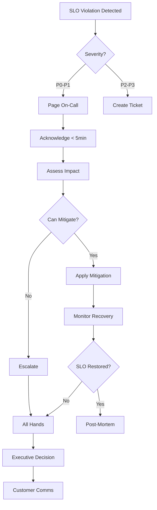

# SLO Monitoring and Management Runbook

## Table of Contents

1. [SLO Definitions](#slo-definitions)
2. [Understanding SLIs vs SLOs vs SLAs](#understanding-slis-vs-slos-vs-slas)
3. [QuizMentor SLO Targets](#quizmentor-slo-targets)
4. [Monitoring Implementation](#monitoring-implementation)
5. [Error Budget Management](#error-budget-management)
6. [Alert Configuration](#alert-configuration)
7. [Dashboard Requirements](#dashboard-requirements)
8. [Incident Response](#incident-response)
9. [SLO Review Process](#slo-review-process)
10. [Reporting and Communication](#reporting-and-communication)

## SLO Definitions

### What is an SLO?

**Service Level Objective (SLO)** = A target value or range for a service level that is measured by an SLI.

```
SLI (Indicator) → What we measure (e.g., latency)
SLO (Objective) → Our target (e.g., P95 < 400ms)
SLA (Agreement) → Contract with users (e.g., 99.9% uptime or refund)
```

### The SLO Pyramid

```
        User Experience
             /\
            /  \
           / SLA \  ← External promise (legal/financial)
          /______\
         /  SLO   \  ← Internal target (engineering)
        /__________\
       /    SLI     \  ← Measurements (metrics)
      /______________\
```

## Understanding SLIs vs SLOs vs SLAs

### Service Level Indicators (SLIs)

**Definition**: Quantitative measures of service behavior

```javascript
// Example SLI Calculations
const availabilitySLI = (successfulRequests / totalRequests) * 100;
const latencySLI = percentile(allRequestLatencies, 95);
const throughputSLI = totalRequests / timeWindow;
```

### Service Level Objectives (SLOs)

**Definition**: Target values for SLIs

```yaml
SLOs:
  availability: '>= 99.9%'
  latency_p95: '< 400ms'
  latency_p99: '< 1000ms'
  error_rate: '< 0.5%'
  throughput: '> 10 RPS'
```

### Service Level Agreements (SLAs)

**Definition**: Legal contracts with penalties

```markdown
If availability < 99.9%:

- 99.0-99.9%: 10% credit
- 95.0-99.0%: 25% credit
- < 95.0%: 50% credit
```

## QuizMentor SLO Targets

### Tier 1: Critical User Journey SLOs

| Service                  | SLI          | SLO Target | Measurement Window | Business Impact              |
| ------------------------ | ------------ | ---------- | ------------------ | ---------------------------- |
| API Availability         | Success rate | 99.9%      | 30 days rolling    | High - blocks all features   |
| Quiz Loading             | P95 latency  | < 400ms    | 5 minutes          | High - user abandonment      |
| Answer Submission        | P99 latency  | < 1000ms   | 5 minutes          | High - data loss risk        |
| Learning Plan Generation | Success rate | 99.5%      | 24 hours           | Medium - feature degradation |

### Tier 2: Performance SLOs

| Service               | SLI             | SLO Target  | Measurement Window | Business Impact            |
| --------------------- | --------------- | ----------- | ------------------ | -------------------------- |
| Search                | P95 latency     | < 500ms     | 5 minutes          | Medium - user frustration  |
| Analytics Dashboard   | P95 latency     | < 2000ms    | 1 hour             | Low - admin function       |
| Recommendation Engine | Success rate    | 99.0%       | 24 hours           | Low - graceful degradation |
| Background Jobs       | Processing time | < 5 minutes | 1 hour             | Medium - delayed features  |

### Tier 3: Dependency SLOs

| Dependency        | SLI                | SLO Target | Measurement Window | Fallback Strategy        |
| ----------------- | ------------------ | ---------- | ------------------ | ------------------------ |
| OpenAI API        | Success rate       | 95%        | 1 hour             | Cache + simplified model |
| Supabase Database | Connection success | 99.9%      | 5 minutes          | Read replica failover    |
| Redis Cache       | Hit ratio          | > 70%      | 1 hour             | Direct DB queries        |
| CDN               | Cache hit ratio    | > 90%      | 1 hour             | Origin server            |

## Monitoring Implementation

### 1. Metrics Collection

```javascript
// Example: Express middleware for SLI collection
const sloMiddleware = (req, res, next) => {
  const startTime = Date.now();

  res.on('finish', () => {
    const duration = Date.now() - startTime;
    const labels = {
      method: req.method,
      route: req.route?.path || 'unknown',
      status: res.statusCode,
      status_class: `${Math.floor(res.statusCode / 100)}xx`,
    };

    // Record metrics for SLI calculation
    metrics.httpRequestDuration.observe(labels, duration);
    metrics.httpRequestTotal.inc(labels);

    // Track SLO violations
    if (duration > 400 && labels.route in CRITICAL_ROUTES) {
      metrics.sloViolations.inc({
        slo: 'latency_p95',
        route: labels.route,
      });
    }
  });

  next();
};
```

### 2. SLI Calculation Queries

```sql
-- Availability SLI (Prometheus)
sum(rate(http_requests_total{status!~"5.."}[5m]))
/
sum(rate(http_requests_total[5m])) * 100

-- P95 Latency SLI
histogram_quantile(0.95,
  sum(rate(http_request_duration_bucket[5m])) by (le)
)

-- Error Rate SLI
sum(rate(http_requests_total{status=~"5.."}[5m]))
/
sum(rate(http_requests_total[5m])) * 100
```

### 3. Multi-Window Monitoring

```yaml
# Different time windows for different purposes
windows:
  real_time:
    duration: 1m
    purpose: 'Immediate detection'
    alert: true

  short_term:
    duration: 5m
    purpose: 'Operational awareness'
    alert: true

  medium_term:
    duration: 1h
    purpose: 'Trend detection'
    alert: false

  long_term:
    duration: 30d
    purpose: 'SLO compliance'
    alert: false
```

## Error Budget Management

### Understanding Error Budgets

```javascript
// Error Budget Calculation
const errorBudget = {
  // Monthly budget (30 days)
  totalMinutes: 30 * 24 * 60, // 43,200 minutes
  sloTarget: 0.999, // 99.9%

  // Allowed downtime
  allowedDowntime: 43200 * (1 - 0.999), // 43.2 minutes

  // Current consumption
  actualDowntime: 15, // minutes this month
  budgetRemaining: 43.2 - 15, // 28.2 minutes
  budgetConsumed: (15 / 43.2) * 100, // 34.7%

  // Burn rate
  daysElapsed: 10,
  expectedConsumption: (10 / 30) * 100, // 33.3%
  burnRate: 34.7 / 33.3, // 1.04x (slightly fast)
};
```

### Error Budget Policy

```markdown
## Budget Consumption Thresholds

🟢 0-50% consumed: Normal operations

- Continue feature development
- Standard deployment pace

🟡 50-75% consumed: Caution

- Reduce deployment frequency
- Focus on reliability improvements
- Increase monitoring

🔴 75-90% consumed: High risk

- Feature freeze
- Only critical fixes deployed
- Incident post-mortems required

⛔ 90-100% consumed: Emergency

- Complete feature freeze
- All hands on reliability
- Executive escalation

💀 >100% consumed: SLO violation

- Incident response mode
- Customer communication
- SLA credit calculations
```

### Burn Rate Alerts

```yaml
# Fast burn: Consumes monthly budget in hours/days
fast_burn_alert:
  window: 1h
  burn_rate: 14.4 # Would consume budget in 3 days
  action: 'Page on-call immediately'

# Slow burn: Consumes budget faster than expected
slow_burn_alert:
  window: 6h
  burn_rate: 3 # Would consume budget in 10 days
  action: 'Ticket for investigation'
```

## Alert Configuration

### Alert Priority Matrix

| Severity      | SLO Impact        | Response Time | Examples             | Action                  |
| ------------- | ----------------- | ------------- | -------------------- | ----------------------- |
| P0 - Critical | >10% budget/hour  | < 5 min       | API down, DB failure | Page on-call + incident |
| P1 - High     | 5-10% budget/hour | < 15 min      | P95 > 2x SLO         | Page on-call            |
| P2 - Medium   | 1-5% budget/hour  | < 1 hour      | P95 > SLO            | Slack alert             |
| P3 - Low      | <1% budget/hour   | < 4 hours     | Degraded performance | Ticket                  |

### Alert Fatigue Prevention

```yaml
# Smart alerting configuration
alerts:
  api_availability:
    conditions:
      - metric: 'availability'
        operator: '<'
        threshold: 99.5 # Alert before SLO breach
        duration: 5m # Must persist for 5 minutes

    deduplication:
      group_by: ['service', 'region']
      group_wait: 30s
      group_interval: 5m
      repeat_interval: 12h

    suppression:
      - during_deployment: true
      - scheduled_maintenance: true
      - dependent_alerts: ['database_down', 'network_issue']
```

## Dashboard Requirements

### Executive Dashboard

```
┌─────────────────────────────────────────────┐
│           Monthly SLO Compliance            │
├─────────────────────────────────────────────┤
│ Availability    [████████████░░] 99.92%  ✅ │
│ Latency P95     [████████████░░] 385ms   ✅ │
│ Latency P99     [███████████░░░] 945ms   ✅ │
│ Error Rate      [████████████░░] 0.42%   ✅ │
│                                             │
│ Error Budget    [██████░░░░░░░░] 42% used  │
│ Days Remaining: 20                         │
└─────────────────────────────────────────────┘
```

### Operations Dashboard

```
┌─────────────────────────────────────────────┐
│          Real-time SLO Monitoring           │
├─────────────────────────────────────────────┤
│ Last 5 minutes:                            │
│ ├─ Requests: 12,456                        │
│ ├─ Errors: 23 (0.18%)                      │
│ ├─ P50: 95ms  | P95: 342ms | P99: 891ms   │
│ └─ RPS: 156                                │
│                                             │
│ SLO Violations (last hour): 2              │
│ ├─ 14:23 - P95 spike to 523ms (2 min)     │
│ └─ 14:45 - Error rate 0.8% (1 min)        │
│                                             │
│ Budget Burn Rate: 1.2x ⚠️                  │
└─────────────────────────────────────────────┘
```

### Detailed Analysis Dashboard

```
┌─────────────────────────────────────────────┐
│         SLO Breakdown by Endpoint           │
├─────────────────────────────────────────────┤
│ Endpoint               | SLO  | Status      │
│ /api/quiz/submit       | P95  | 423ms ⚠️    │
│ /api/learning/plan     | P95  | 312ms ✅    │
│ /api/questions/validate| P95  | 234ms ✅    │
│ /api/analytics         | P95  | 1823ms ❌   │
│                                             │
│         Error Budget Consumption            │
│ Week 1: ████░ 8%                           │
│ Week 2: ██████ 12%                         │
│ Week 3: ███ 6%                             │
│ Week 4: ████████ 16% (projected)           │
└─────────────────────────────────────────────┘
```

## Incident Response

### SLO Violation Incident Template

```markdown
## Incident: SLO Violation - [Service Name]

**Severity**: P[0-3]
**Started**: [Timestamp]
**Detected**: [Timestamp]
**Mitigated**: [Timestamp]
**Resolved**: [Timestamp]

### Impact

- SLO violated: [Which SLO]
- Budget consumed: [X]% of monthly budget
- Users affected: [Estimated number]
- Business impact: [Revenue/user experience]

### Timeline

1. [Time]: Initial degradation observed
2. [Time]: SLO breach threshold crossed
3. [Time]: Alert fired
4. [Time]: On-call engineer acknowledged
5. [Time]: Root cause identified
6. [Time]: Mitigation applied
7. [Time]: Service restored to SLO

### Root Cause

[Detailed explanation]

### Resolution

[What was done to fix]

### Action Items

- [ ] Update monitoring
- [ ] Fix root cause
- [ ] Update runbooks
- [ ] Customer communication
```

### Incident Response Flow



## SLO Review Process

### Monthly SLO Review Meeting

```markdown
## Agenda: Monthly SLO Review

1. **SLO Performance Review** (10 min)
   - Achievement vs targets
   - Trends and patterns
   - Error budget status

2. **Incident Analysis** (15 min)
   - SLO violations
   - Root causes
   - Action items status

3. **SLO Adjustments** (10 min)
   - Are targets realistic?
   - New services to monitor?
   - Retired services?

4. **Customer Feedback** (10 min)
   - Complaints aligned with SLOs?
   - Hidden problems?

5. **Next Month Planning** (15 min)
   - Deployment freeze dates?
   - Maintenance windows?
   - Feature vs reliability balance
```

### Quarterly SLO Calibration

```python
# SLO Calibration Analysis
def analyze_slo_calibration(quarter_data):
    return {
        "over_achieving": [
            slo for slo in quarter_data
            if slo.achievement > slo.target + 0.005  # >0.5% over
        ],
        "under_achieving": [
            slo for slo in quarter_data
            if slo.achievement < slo.target
        ],
        "recommendations": {
            "tighten": [  # SLOs we're easily beating
                slo for slo in quarter_data
                if slo.achievement > slo.target + 0.01  # >1% over
            ],
            "loosen": [  # SLOs we can't meet
                slo for slo in quarter_data
                if slo.violations > 3  # Failed >3 times
            ],
            "add": identify_blind_spots(quarter_data),
            "remove": identify_unused_slos(quarter_data)
        }
    }
```

## Reporting and Communication

### Stakeholder Communication Matrix

| Stakeholder | Frequency | Format        | Content             |
| ----------- | --------- | ------------- | ------------------- |
| Engineering | Real-time | Dashboard     | All metrics         |
| Product     | Daily     | Slack summary | Violations + trends |
| Leadership  | Weekly    | Email report  | Budget + compliance |
| Customers   | Monthly   | Status page   | Public SLOs only    |
| Board       | Quarterly | Presentation  | Strategic metrics   |

### Weekly SLO Report Template

```markdown
# QuizMentor SLO Report - Week [X]

## Executive Summary

- Overall SLO Compliance: 99.8% ✅
- Error Budget Remaining: 68%
- Significant Incidents: 1 (P2)

## SLO Performance

| Metric       | Target  | Actual | Status |
| ------------ | ------- | ------ | ------ |
| Availability | 99.9%   | 99.94% | ✅     |
| P95 Latency  | <400ms  | 367ms  | ✅     |
| P99 Latency  | <1000ms | 923ms  | ✅     |
| Error Rate   | <0.5%   | 0.31%  | ✅     |

## Error Budget Consumption

- Week consumption: 7.2%
- Month-to-date: 32%
- Burn rate: 0.96x (on track)

## Actions Taken

- Deployed cache improvements (+5% hit rate)
- Added index to slow query (-200ms P95)
- Scaled workers 2→4 for peak hours

## Upcoming Risks

- Black Friday traffic (3x normal)
- Database maintenance window
- OpenAI API deprecation

## Recommendations

1. Pre-scale for Black Friday
2. Increase cache TTL
3. Implement OpenAI response caching
```

### Customer-Facing Status Page

```html
<!-- Public SLO Dashboard -->
<div class="status-page">
  <h1>QuizMentor Service Status</h1>

  <div class="current-status">
    <span class="status-indicator green">●</span>
    All Systems Operational
  </div>

  <div class="slo-commitments">
    <h2>Our Commitments (30-day)</h2>
    <table>
      <tr>
        <td>Uptime</td>
        <td>99.9%</td>
        <td class="actual">99.94% ✓</td>
      </tr>
      <tr>
        <td>API Response Time</td>
        <td><500ms</td>
        <td class="actual">387ms ✓</td>
      </tr>
      <tr>
        <td>Success Rate</td>
        <td>>99.5%</td>
        <td class="actual">99.7% ✓</td>
      </tr>
    </table>
  </div>

  <div class="historical">
    <h2>Historical Performance</h2>
    <!-- Chart showing last 90 days -->
  </div>
</div>
```

## Automation Scripts

### SLO Monitoring Setup

```bash
#!/bin/bash
# setup-slo-monitoring.sh

# Install Prometheus for metrics
helm install prometheus prometheus-community/kube-prometheus-stack \
  --set prometheus.prometheusSpec.retention=30d \
  --set prometheus.prometheusSpec.scrapeInterval=15s

# Configure SLO rules
kubectl apply -f - <<EOF
apiVersion: v1
kind: ConfigMap
metadata:
  name: slo-rules
data:
  slo.rules: |
    groups:
    - name: slo
      interval: 30s
      rules:
      - record: slo:availability:rate5m
        expr: |
          sum(rate(http_requests_total{status!~"5.."}[5m]))
          /
          sum(rate(http_requests_total[5m]))

      - alert: SLOAvailabilityBreach
        expr: slo:availability:rate5m < 0.999
        for: 5m
        labels:
          severity: critical
          slo: availability
        annotations:
          summary: "Availability SLO breach: {{ \$value | humanizePercentage }}"
EOF

# Setup Grafana dashboards
curl -X POST http://grafana:3000/api/dashboards/db \
  -H "Content-Type: application/json" \
  -d @slo-dashboard.json
```

### Error Budget Calculator

```javascript
// calculate-error-budget.js
const calculateErrorBudget = (sloTarget, timeWindow, downtime) => {
  const totalMinutes = timeWindow * 24 * 60;
  const allowedDowntime = totalMinutes * (1 - sloTarget);
  const budgetRemaining = allowedDowntime - downtime;
  const budgetConsumed = (downtime / allowedDowntime) * 100;

  return {
    totalMinutes,
    allowedDowntime: allowedDowntime.toFixed(2),
    actualDowntime: downtime,
    budgetRemaining: budgetRemaining.toFixed(2),
    budgetConsumed: budgetConsumed.toFixed(2),
    status:
      budgetConsumed > 100
        ? 'VIOLATED'
        : budgetConsumed > 75
          ? 'CRITICAL'
          : budgetConsumed > 50
            ? 'WARNING'
            : 'HEALTHY',
  };
};

// Example usage
console.log(calculateErrorBudget(0.999, 30, 15));
// Output: { budgetRemaining: 28.2, budgetConsumed: 34.7%, status: 'HEALTHY' }
```

## Best Practices

1. **Start with fewer, important SLOs** - Better to nail 3 SLOs than fail at 10
2. **Use percentiles, not averages** - P95/P99 better represent user experience
3. **Set SLOs slightly tighter than SLAs** - Internal target > external promise
4. **Monitor from the user's perspective** - Synthetic monitoring from outside
5. **Automate everything** - Calculations, alerts, reports, responses
6. **Review and adjust quarterly** - SLOs should evolve with your service
7. **Communicate proactively** - Tell users before they notice
8. **Celebrate success** - Meeting SLOs consistently is an achievement
9. **Learn from failures** - Every violation is a learning opportunity
10. **Balance features vs reliability** - Use error budget to guide decisions
