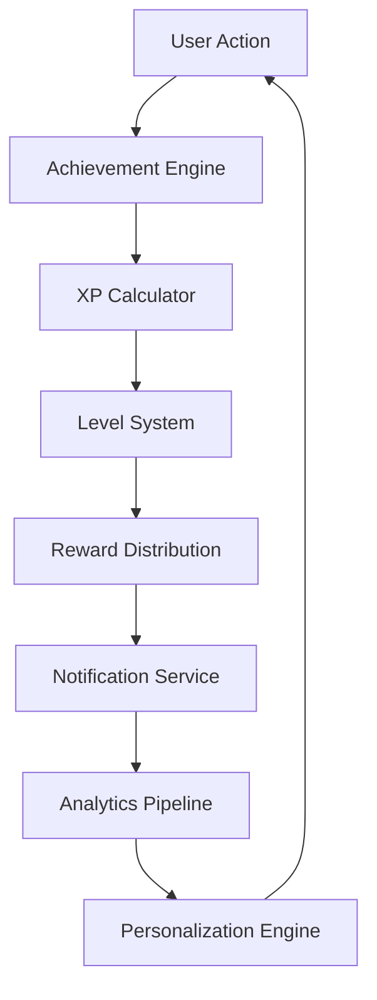

# Gamification Journey & S2S Orchestration

_Last Updated: 2025-08-29_
_Status: Architecture Design_

## 🎯 Overview

This document maps the complete gamification user journey with Service-to-Service (S2S) orchestration patterns, showing how multiple backend services collaborate to create engaging user experiences.

## 🎮 Core Gamification Loop



## 📊 User Journey Orchestration

### Journey 1: First-Time User Onboarding

**Goal**: Hook user in first 5 minutes

#### S2S Flow

```typescript
POST /api/journey/onboarding/start
├── ProfileService.createNewUser()
├── AchievementService.grantWelcomeBonus()
├── QuestService.assignStarterQuests()
├── NotificationService.scheduleOnboardingTips()
├── AnalyticsService.trackOnboardingStart()
└── PersonalizationService.calculateInitialProfile()
```

#### Orchestration Steps

1. **User Registration** (0-30s)

   ```json
   {
     "services": ["auth", "profile", "gamification"],
     "triggers": {
       "auth.signup": {
         "profile.create": { "xp": 50, "achievement": "welcome" },
         "gamification.initialize": { "starter_pack": true }
       }
     }
   }
   ```

2. **First Quiz Selection** (30s-2m)

   ```json
   {
     "services": ["quiz", "recommendation", "gamification"],
     "triggers": {
       "quiz.categorySelected": {
         "recommendation.recordPreference": {},
         "gamification.trackProgress": { "quest": "explorer" }
       }
     }
   }
   ```

3. **Complete First Quiz** (2-5m)
   ```json
   {
     "services": ["quiz", "scoring", "achievement", "leaderboard"],
     "triggers": {
       "quiz.completed": {
         "scoring.calculate": {},
         "achievement.check": ["first_quiz", "perfect_score"],
         "leaderboard.update": {},
         "notification.celebrate": { "type": "first_completion" }
       }
     }
   }
   ```

### Journey 2: Daily Active User

**Goal**: Build habit through daily engagement

#### S2S Flow

```typescript
POST /api/journey/daily/check-in
├── StreakService.checkContinuity()
├── DailyBonusService.calculateRewards()
├── QuestService.refreshDailies()
├── LeaderboardService.updatePositions()
├── NotificationService.queueStreakReminder()
└── PredictionService.calculateChurnRisk()
```

#### Daily Engagement Loop

```yaml
6:00 AM:
  - notification.send: 'Your streak is at risk!'
  - quest.refresh: daily_challenges

12:00 PM:
  - notification.send: 'Lunch break quiz?'
  - powerup.offer: '2x XP for next hour'

6:00 PM:
  - leaderboard.update: friend_activity
  - notification.send: 'Friend beat your score!'

9:00 PM:
  - streak.check: final_warning
  - reward.preview: tomorrow_bonus
```

### Journey 3: Competitive Player

**Goal**: Drive engagement through competition

#### S2S Flow

```typescript
POST /api/journey/competitive/match
├── MatchmakingService.findOpponents()
├── RoomService.createBattleRoom()
├── WebSocketService.establishConnections()
├── ScoringService.trackRealtime()
├── AchievementService.checkCompetitive()
├── LeaderboardService.updateRankings()
└── ReplayService.saveHighlight()
```

#### Battle Mode Orchestration

```javascript
// Real-time competitive flow
const battleOrchestration = {
  matchmaking: {
    service: 'matchmaking-engine',
    criteria: ['skill_level', 'recent_activity', 'connection_quality'],
    timeout: 30000,
  },

  room_creation: {
    service: 'room-manager',
    config: {
      max_players: 4,
      time_limit: 120,
      question_pool: 'adaptive',
    },
  },

  live_scoring: {
    service: 'scoring-engine',
    events: ['answer.submitted', 'combo.achieved', 'powerup.used', 'streak.extended'],
  },

  post_match: {
    services: ['achievement', 'leaderboard', 'analytics'],
    actions: [
      'calculate_final_scores',
      'award_achievements',
      'update_rankings',
      'save_replay',
      'trigger_rematch_prompt',
    ],
  },
};
```

## 🏆 Achievement System S2S

### Achievement Check Pipeline

```typescript
interface AchievementCheck {
  trigger: string;
  services: string[];
  conditions: Condition[];
  rewards: Reward[];
}

const achievementPipeline = {
  // Triggered after EVERY quiz completion
  'quiz.completed': {
    services: [
      'statistics-service', // Get user stats
      'achievement-engine', // Check all conditions
      'reward-service', // Distribute rewards
      'notification-service', // Notify user
    ],

    checks: [
      {
        id: 'streak_achievements',
        query: 'SELECT current_streak FROM user_stats WHERE user_id = ?',
        conditions: [
          { streak: 3, grant: 'first_streak' },
          { streak: 7, grant: 'week_warrior' },
          { streak: 30, grant: 'unstoppable' },
          { streak: 100, grant: 'legendary' },
        ],
      },
      {
        id: 'performance_achievements',
        query: 'SELECT score, time_taken FROM quiz_results WHERE id = ?',
        conditions: [
          { score: 100, grant: 'perfect_score' },
          { time_taken: '<30', grant: 'speed_demon' },
        ],
      },
      {
        id: 'milestone_achievements',
        query: 'SELECT COUNT(*) as total FROM quiz_results WHERE user_id = ?',
        conditions: [
          { total: 1, grant: 'first_quiz' },
          { total: 100, grant: 'quiz_master' },
          { total: 1000, grant: 'knowledge_seeker' },
        ],
      },
    ],
  },
};
```

### Reward Distribution Flow

```typescript
POST /api/rewards/distribute
{
  "achievement_id": "week_warrior",
  "user_id": "user_123",
  "timestamp": "2025-08-29T10:00:00Z"
}

// S2S calls
1. RewardService → UserService: Add 150 XP
2. RewardService → BadgeService: Grant Silver Badge
3. RewardService → NotificationService: Send celebration
4. RewardService → LeaderboardService: Update rankings
5. RewardService → AnalyticsService: Track achievement
6. RewardService → SocialService: Broadcast to friends
```

## 🎯 Quest System Orchestration

### Daily Quest Generation

```typescript
// Runs at midnight UTC for each timezone
CRON 0 0 * * * generateDailyQuests()

async function generateDailyQuests(userId: string) {
  // S2S Flow
  const userProfile = await ProfileService.get(userId);
  const history = await HistoryService.getRecent(userId, 7);
  const recommendations = await AIService.generateQuests({
    skill_level: userProfile.level,
    preferences: userProfile.categories,
    recent_activity: history,
    engagement_score: userProfile.engagement
  });

  // Create personalized quests
  const quests = await QuestService.create([
    {
      type: 'daily',
      name: 'Quick Learner',
      requirement: { type: 'quiz_complete', count: 3 },
      reward: { xp: 100, powerup: 'xp_boost' },
      expires: Date.now() + 86400000
    },
    {
      type: 'daily',
      name: 'Perfect Day',
      requirement: { type: 'perfect_score', count: 1 },
      reward: { xp: 200, badge: 'daily_perfect' },
      expires: Date.now() + 86400000
    },
    ...recommendations
  ]);

  // Notify user
  await NotificationService.send({
    userId,
    type: 'daily_quests_ready',
    data: quests
  });
}
```

## 💊 Dark Patterns & Engagement Mechanics

### Loss Aversion System

```typescript
// Streak Protection Service
const streakProtection = {
  warning_thresholds: [
    { hours_remaining: 4, notification: 'urgent', message: 'Only 4 hours to save your streak!' },
    { hours_remaining: 2, notification: 'critical', message: '⚠️ Streak ending soon!' },
    { hours_remaining: 1, notification: 'final', message: '🔥 Last chance to keep your streak!' },
  ],

  protection_items: [
    { id: 'streak_freeze', cost: 100, description: 'Freeze streak for 1 day' },
    { id: 'streak_repair', cost: 500, description: 'Restore lost streak' },
  ],
};
```

### Variable Reward Schedule

```typescript
const rewardSchedule = {
  base_xp: 10,

  // Variable multipliers (slot machine mechanics)
  multipliers: {
    distribution: [1, 1, 1, 1, 1.5, 1.5, 2, 2, 3, 5], // 10% chance of 5x
    animation: 'slot_machine_spin',
  },

  // Mystery boxes
  mystery_box: {
    drop_rate: 0.1, // 10% after each quiz
    contents: [
      { weight: 50, reward: { xp: 100 } },
      { weight: 30, reward: { powerup: 'random' } },
      { weight: 15, reward: { currency: 50 } },
      { weight: 5, reward: { rare_badge: true } },
    ],
  },
};
```

### FOMO Events

```typescript
// Limited-time event orchestration
const eventOrchestration = {
  flash_challenge: {
    duration: 3600000, // 1 hour
    announcement: '🚨 FLASH CHALLENGE: Double XP for Science category!',
    services: [
      'notification.broadcast',
      "xp.setMultiplier(2, 'science')",
      "leaderboard.createEvent('flash_science')",
      'analytics.trackEngagement',
    ],
  },

  weekend_tournament: {
    start: 'Friday 6PM',
    end: 'Sunday 11PM',
    prizes: {
      top_1: { xp: 5000, badge: 'champion', title: 'Weekend Warrior' },
      top_10: { xp: 2000, badge: 'elite' },
      top_100: { xp: 500, badge: 'competitor' },
    },
  },
};
```

## 🔄 Real-time Engagement Loop

### WebSocket Event Flow

```javascript
// Client subscribes to personal channel
ws.subscribe(`user:${userId}`, (event) => {
  switch (event.type) {
    case 'friend_beat_score':
      showNotification('Sarah just beat your score in React!');
      pulseLeaderboardIcon();
      break;

    case 'achievement_unlocked':
      playAchievementAnimation(event.achievement);
      updateXPBar(event.xp);
      checkLevelUp();
      break;

    case 'streak_warning':
      showStreakWarning(event.hours_remaining);
      offerStreakFreeze();
      break;

    case 'challenge_received':
      showChallengeModal(event.challenger, event.category);
      startCountdown(event.expires_in);
      break;
  }
});
```

### Background Services

```yaml
services:
  engagement_monitor:
    interval: 300000 # 5 minutes
    checks:
      - user_activity
      - streak_status
      - quest_progress
      - rank_changes

  notification_scheduler:
    smart_timing: true # ML-based optimal send time
    channels: [push, in_app, email]
    frequency_cap: 5 # Max per day

  churn_predictor:
    model: 'gradient_boost'
    features:
      - days_since_last_login
      - streak_length
      - achievement_count
      - friend_count
    interventions:
      high_risk: 'send_win_back_offer'
      medium_risk: 'increase_rewards'
      low_risk: 'standard_engagement'
```

## 📈 Analytics & Personalization

### Event Tracking Pipeline

```typescript
// Every user action triggers analytics
const analyticsFlow = {
  user_action: 'quiz.answered',

  pipeline: [
    {
      service: 'event-collector',
      action: 'capture',
      data: {
        user_id: 'user_123',
        question_id: 'q_456',
        answer: 'B',
        time_taken: 8500,
        correct: true,
        streak: 5,
        combo: 3,
      },
    },
    {
      service: 'stream-processor',
      action: 'enrich',
      enrichments: [
        'user_profile',
        'question_difficulty',
        'category_performance',
        'peer_comparison',
      ],
    },
    {
      service: 'ml-pipeline',
      action: 'update_models',
      models: [
        'difficulty_adjuster',
        'question_recommender',
        'churn_predictor',
        'engagement_optimizer',
      ],
    },
    {
      service: 'personalization-engine',
      action: 'adjust_experience',
      adjustments: {
        next_question_difficulty: '+0.2',
        xp_multiplier: '1.5x',
        powerup_offer: 'hint',
      },
    },
  ],
};
```

## 🎨 UI/UX Integration Points

### Gamification UI Components

```typescript
// Reusable gamification components
const GamificationUI = {
  // XP Bar with animations
  XPBar: {
    current: 2450,
    next_level: 3000,
    animation: 'pulse_on_gain',
    particles: 'gold_sparkles',
  },

  // Combo indicator
  ComboMeter: {
    current: 5,
    max: 10,
    effect: 'screen_shake',
    sound: 'combo_building',
  },

  // Achievement toast
  AchievementToast: {
    style: 'slide_in_top',
    duration: 5000,
    haptic: 'success',
    confetti: true,
  },

  // Streak indicator
  StreakFlame: {
    days: 7,
    animation: 'flame_intensity',
    warning_state: 'pulsing_red',
  },
};
```

## 🚀 Implementation Priorities

### Phase 1: Core Loop (Week 1)

1. XP and Level calculation
2. Basic achievements (first_quiz, perfect_score)
3. Simple daily quests
4. Streak tracking

### Phase 2: Engagement (Week 2)

1. Push notifications for streaks
2. Variable rewards
3. Mystery boxes
4. Leaderboard integration

### Phase 3: Social (Week 3)

1. Friend challenges
2. Achievement broadcasting
3. Competitive modes
4. Team quests

### Phase 4: Optimization (Week 4)

1. ML-based personalization
2. Churn prediction
3. A/B testing framework
4. Advanced analytics

## 📊 Success Metrics

### Engagement KPIs

- **DAU/MAU**: Target 40%
- **D7 Retention**: Target 25%
- **Avg Session Length**: Target 12 minutes
- **Quizzes per Session**: Target 5

### Gamification Metrics

- **Achievement Unlock Rate**: 80% unlock at least one
- **Streak Length**: Average 5 days
- **Quest Completion**: 60% complete daily
- **Social Interactions**: 2 per session

---

_This architecture provides a complete gamification system with S2S orchestration for maximum engagement and retention._
