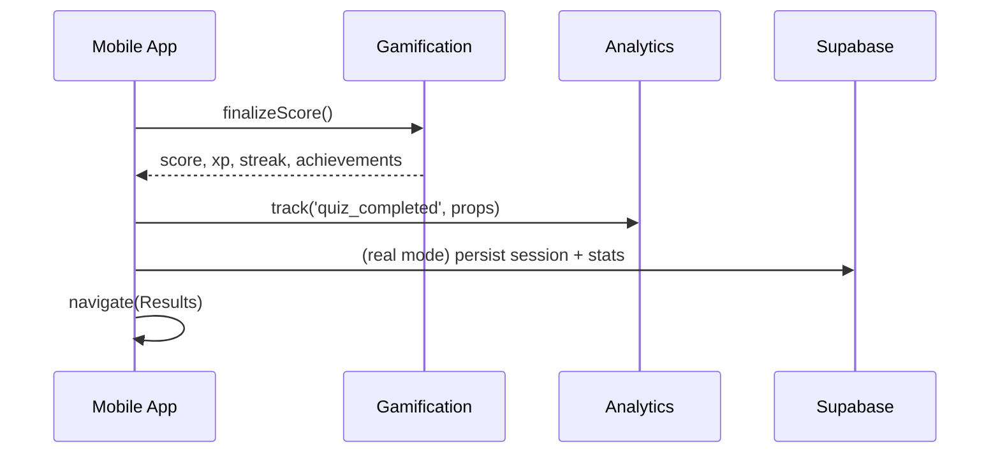

# Results & Analytics Flow

> Status: Complete | Last Updated: 2025-08-28 | Author: Docs Team | Version: 1.0
>
> Current Implementation (2025-08-28)
>
> - Results screen computes score locally; analytics emitted; persistence to Supabase planned.
> - Achievements and XP calculations displayed; stored in Supabase in real mode.
>
> Related docs: ../../API_DOCUMENTATION.md, ../../mocks/SERVICE_MOCKING_ARCHITECTURE.md

## Overview

Flow from last question to score computation, results display, and analytics tracking.

## Flow Diagram

## Results Screen Elements

- Score and grade badge
- Accuracy and time
- XP and streak changes
- Achievements unlocked
- CTA: Share, Retry, Next category

## Mock vs Real

- Mock: XP/achievements simulated; no DB write
- Real: Insert quiz_sessions row; update user_progress; recalc leaderboards

## Analytics

- quiz_completed, achievement_unlocked, share_clicked, retry_clicked

## Storybook & Mocks

- API/Playground: simulate HTTP responses that may affect results (e.g., caching 304s, rate limiting 429s) and observe downstream analytics triggers
- API/Swagger: browse the OpenAPI spec inside Storybook to cross-check endpoints and payloads
- Dev/NetworkPlayground: adjust MSW latency/error defaults and view a live request timeline; toggle `x-msw-no-defaults` when needed

## Testing

- Unit: score calculation and grade mapping
- Integration: results serialization and analytics dispatch
- E2E: end-to-end from last question to results and back
